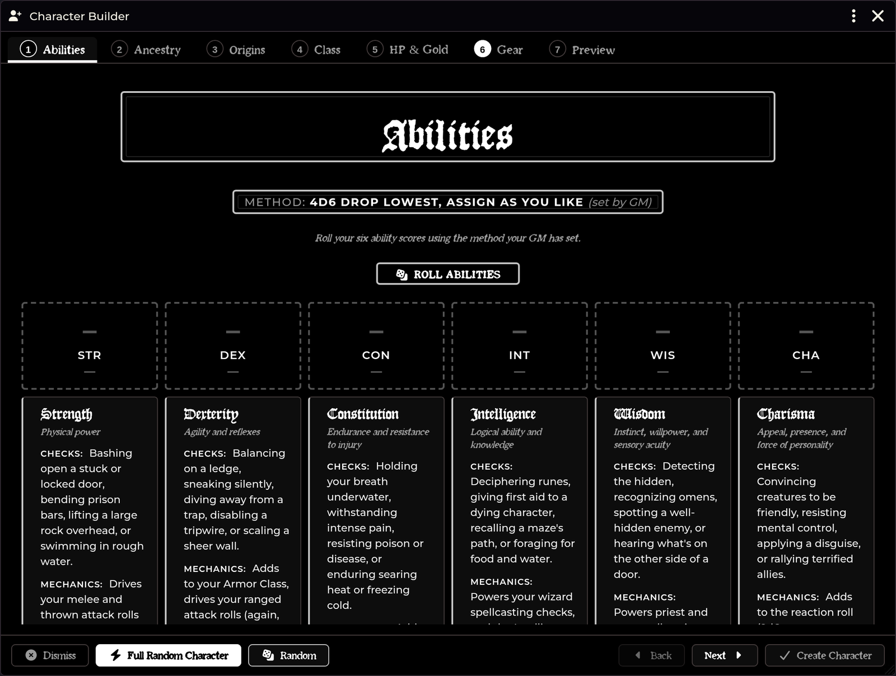

# Character Builder

[← Wiki home](Home.md)

A guided, ordered character-creation wizard — a step-by-step replacement for the
system's all-random generator. It builds a **complete level-1 character**,
including rolled hit points and the chosen class talent, so the sheet never
re-prompts you with the system's level-up dialog afterwards.

---

## Opening it

| Route | How |
|---|---|
| **Actors sidebar** | The **Character Builder** button in the header — **shown to every user**, not just the GM |
| **API** | `game.shadowdarkEnhancer.charBuilder.open()` |
| **Build onto an existing sheet** | `game.shadowdarkEnhancer.charBuilder.open({ actor })` |

**Players can use it.** A player without actor-create permission is handed off to
the GM over the system socket automatically — they don't need to ask.

---

## The seven steps

Freely navigable — jump between them in any order. Each carries a completion
check mark, every section that can be randomised has a **Random** button, and the
first step offers **full random** for a one-click character.

### 1. Abilities

**The generation method is GM-dictated.** It is a world setting, shown read-only
to players, who cannot change it in the builder.

| Method | What it does |
|---|---|
| `3d6` down the line | Straight down, no choices |
| **`3d6`, reroll if none ≥ 14** | The core-rules full-array reroll. **Default.** |
| `3d6`, assign as you like | Roll a visible pool, place each die |
| `4d6` drop lowest, down the line | |
| `4d6` drop lowest, assign as you like | |

Assign methods roll a **visible dice pool** — click a die, then click a stat to
place it.

**Every roll posts a chat card** as an audit trail, so nobody has to take a
player's word for a 17. The 3D Dice So Nice animation is off by default and can
be turned on separately; the audit card posts either way.

The step also carries a plain-language reference for what each ability actually
does in Shadowdark.

### 2. Ancestry

A list/detail browser with bundled portrait art, sourced live from every
installed compendium.

- Multi-talent ancestries (Elf, for example) present their talent choice right
  on the step.
- **Name** and **Trinket** each offer three routes: pick from the ancestry's roll
  table, roll it, or type your own.

### 3. Origins

Background, Alignment, and Deity on one step. The Deity random pick is
**weighted toward your chosen alignment**.

### 4. Class

The heaviest step, because creation owes you a lot:

- The class's level-1 features, shown up front
- The **`2d6` class talent table roll**, posted to chat
- **Talent effect choices** — Weapon Mastery weapon, Armor Mastery, spell
  advantage — made **inline**, instead of through the system's pop-up dialog
- **Bonus creation rolls**: the Human *Ambitious* extra talent, *Black Lotus*,
  patron boons
- **Patron selection**, where the class wants one
- A per-tier **spell picker** that enforces the class's spells-known counts
- **Language choices** — fixed languages, plus choose-N picks from the common,
  rare, and select pools

### 5. HP & Gold

Roll the class hit die with Constitution applied. Talent HP bonuses (Dwarf
*Stout*, for instance) are handled **without double-counting**.

| Setting | Effect |
|---|---|
| Max Level-1 HP | Sets HP to hit-die maximum + CON instead of rolling |
| Fixed starting gold (gp) | A flat amount. `0` rolls the standard `2d6 × 5 gp` |

### 6. Gear

A shop: browse Armor, Weapons, and Basic gear from every installed pack. Items
your class **can't use are flagged**. The cart is tracked against both your
starting gold and your carry slots, and its cost is deducted from your starting
coins on creation.

GMs can grant **extra gear** beyond the curated starting stock — magic items,
potions, anything — via **Configure Settings → Character Builder — extra gear →
Manage Extra Gear**. Extra weapons and armour still respect each class's usable
list.

### 7. Preview

A read-only summary of every choice, plus an **Artwork** card.

#### Four ways to set art

Ordered by how much permission they need:

| Route | Permission needed |
|---|---|
| **Use Suggested Art** — the bundled class/ancestry portrait, one click | **None** |
| **From URL…** — paste a link to any image | **None**, and no GM required |
| **Curated gallery** — pick from a GM-nominated folder | **None** — the browse runs on the GM's client |
| **File browser** — the normal Foundry picker | `FILES_BROWSE` |

Art is optional. Leave it and the system defaults stand.

The gallery folders are set by **Character Builder — portrait/token art folders**
(comma-separated). It defaults to the module's own bundled portrait art, so it
works with nothing else installed; add your own folders (e.g. Tokenizer's save
locations) to the list. Missing folders are skipped. Blank disables the gallery.

**Finish** commits through the system's own creation path: ancestry, class,
background and deity are stored as references; talents, abilities, spells and
gear are embedded as real items.

---

## Content discovery

Name, Trinket, Background, and Deity rolls draw from installed roll tables
**automatically** — the builder discovers any table named for a known ancestry
(Names / Trinkets) or a Background / Deity table. **There is no setting to
configure.** Imported Western Reaches or homebrew tables just work.

The builder also refreshes **live** when the [Importer Hub](Importer-Hub.md)
unlocks new content — import a class while the builder is open and it appears
without a close-and-reopen.

Imported character content is gated on its `system.source.title` slug, which the
importer stamps at commit. See [Class & Spell Importers](Class-and-Spell-Importers.md).

---

## Troubleshooting

**A player can't change the ability method.**
Correct — it is GM-dictated. Change it in **Configure Settings → Character
Builder — ability roll method**.

**An imported class doesn't appear.**
The builder filters on `system.source.title`. Confirm the class was committed
with a source label rather than landing under *Custom*.

**An imported caster class offers no spells.**
It probably imported as a non-caster — its Spellcasting paragraph got glued into
the talent table. See
[Class & Spell Importers](Class-and-Spell-Importers.md#troubleshooting).

**A player has no gallery art to choose from.**
Either the art-folder setting is blank, or the configured folders don't exist.
Missing folders are skipped silently.

**A player gets a file-permission error picking art.**
They used the file browser route, which needs `FILES_BROWSE`. Point them at
**Use Suggested Art**, **From URL…**, or the curated gallery — none of those
require any file permission.

**The sheet still prompts a level-up dialog after finishing.**
It shouldn't — the builder rolls HP and picks the class talent up front precisely
to avoid that. If it happens, the class item is likely missing its level-1
features.

**Dwarf Stout gave too much HP.**
Talent HP bonuses are applied once, deliberately. If you see double-counting,
[report it](https://github.com/DimitroffVodka/shadowdark-enhancer/issues).

**A player without create permission clicked Finish and nothing happened.**
The request is relayed to the GM over the socket. A GM must be connected.

**The system's "Searching Distant Lands…" spinner is stuck.**
A known system-side issue where an item sheet's data preparation throws and the
loading dialog is never closed — most often right after importing a class. The
module installs a guard that closes it and logs the underlying error.

---

**Related:** [Class & Spell Importers](Class-and-Spell-Importers.md) · [Export to PDF](Export-to-PDF.md) · [Settings Reference](Settings-Reference.md)
