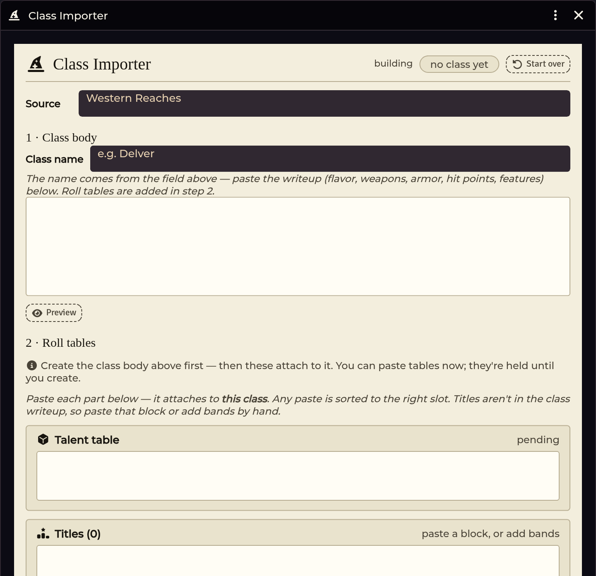
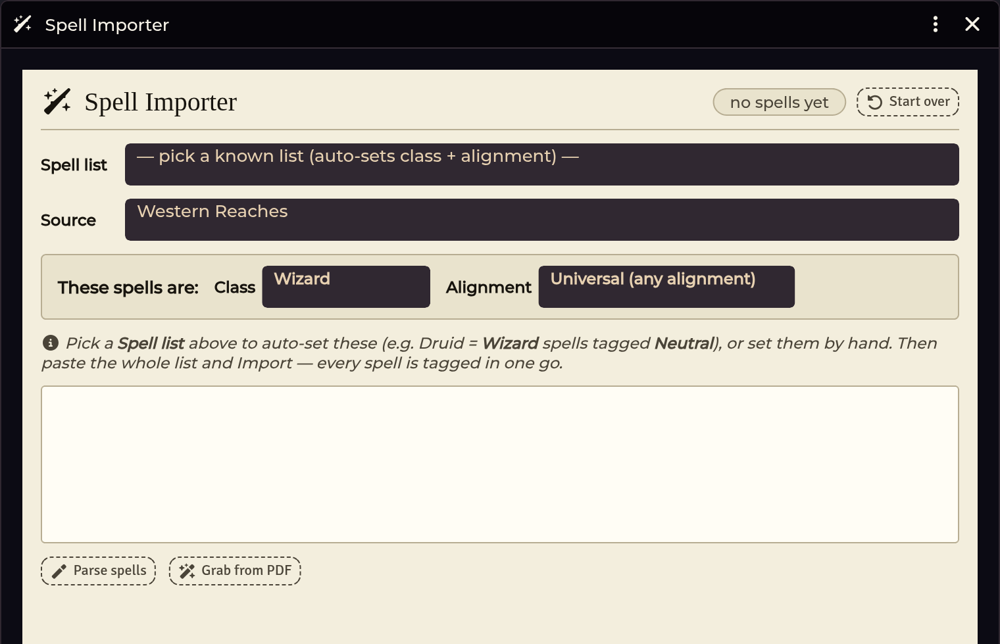

# Class & Spell Importers

[← Wiki home](Home.md)

Classes and spells are the two hardest content types to import, so each gets its
own workspace rather than sharing the generic paste box.

---

## The Class Importer



A class is not one block of text. It is a writeup, a talent table, a titles
table, a spells-known table, and sometimes extra tables — printed on different
pages, sometimes in a different appendix entirely.

The workspace pins the class you're building at the top and gives you a paste
zone per part.

### Stage 1 — the writeup

Paste the class's main text. This gives you the class item itself: hit die,
weapons and armour, level-1 features, and the talents that come with them.

### Stage 2 — the parts

Separate paste zones for:

| Part | What it is |
|---|---|
| **Talent table** | The class's `2d6` talent table |
| **Titles** | The level-title band table — usually printed in a separate appendix, in columns, sliced per class. Editable in a band editor. |
| **Spells known** | Per-tier spells-known counts, for casters |
| **Extra tables** | Anything else the class references |

**Any paste is routed to the right slot automatically** — you don't have to tell
it which zone you're filling.

> **Re-importing the writeup no longer erases attached tables.** This was a real
> bug; the workspace keeps the parts you've already attached when you re-paste
> stage 1.

### What a finished class needs

For a class to work end-to-end in the [Character Builder](Character-Builder.md):

- the class item, with its level-1 features
- talents as real Talent items, referenced from `system.talents[]`
- activated or grouped powers (things with a roll, a DC, and per-day uses) as
  **Class Ability** items in `system.classAbilities[]` — the importer detects
  which is which and wires both
- a talent RollTable resolvable by name (`<Class> Talent`, or `<Talent> Table`)
  **or** linked by `@UUID` from the talent description

A bare name in a talent description does not resolve — it needs the table name
convention or an explicit link.

---

## The Spell Importer



Spells import organised by **Class → Tier → Alignment**.

The alignment axis matters because of how Shadowdark models spell lists: *druid
spells are Wizard spells with Neutral alignment*. The importer writes the
alignment flag that the character builder's spell picker filters on, so the right
spells reach the right casters.

### Where spells are filed

Imported spells land one folder level deep:

```
Spells / <Class> (<Variant>)
```

with Wizard variants being **Druid**, **Mage**, and **Sorcerer**. There are no
per-tier folders — tier is a field, not a folder.

### Own-list casters vs borrowed-list casters

This is the subtlety worth understanding before importing a homebrew or Western
Reaches caster.

**Own-list casters** have their own spell list. They link up automatically — the
spell↔class relink sweep runs on class import, on world load, and after each
commit, so it doesn't matter which you import first.

**Borrowed-list casters** (a class that casts from another class's list, like the
Green Knight casting druid spells) must **not** be given the lender's class slug.
The system's spellbook has no alignment filter, so slugging a Green Knight as
`wizard` hands them the entire Wizard list (~108 spells) and the wrong casting
stat.

The correct shape is:

- give the class its **own slug** (`green-knight`),
- leave the spells' `class` field empty,
- **tag the specific borrowed spells** to the borrowing class.

The importer does this for you when it recognises the pattern.

---

## Troubleshooting

**An imported caster class came in as a non-caster.**
The Spellcasting paragraph was printed *after* the talents box in your book, so
the parser glued it into the talent table and never saw the enabler talent —
which leaves `isSpellCaster` false and the level-up dialog offering no spells.
Paste the Spellcasting paragraph into stage 1 separately, or check that the class
item ends up with its spellcasting talent.

**A class's talent table doesn't roll from the sheet.**
The table name must match `<Class> Talent` or `<Talent> Table`, **or** the talent
description must carry an `@UUID` link to it. Which pack the table lives in does
not matter. A bare name in the description never resolves.

**The character builder doesn't offer my imported class.**
The builder gates on `system.source.title`. Confirm the class was committed with
a source label — an unlabelled import files under *Custom* and may not match your
builder's source filters.

**A borrowed-list caster got the wrong spells or the wrong casting stat.**
It was slugged as the lending class. See the section above — it needs its own
slug plus per-spell tagging.

**Spells imported before the class exists.**
That's fine. The relink sweep runs on every world load and links them as soon as
both sides are present.

---

**Related:** [Importer Hub](Importer-Hub.md) · [Character Builder](Character-Builder.md) · [Table Import & Shapes](Table-Import-and-Shapes.md)
