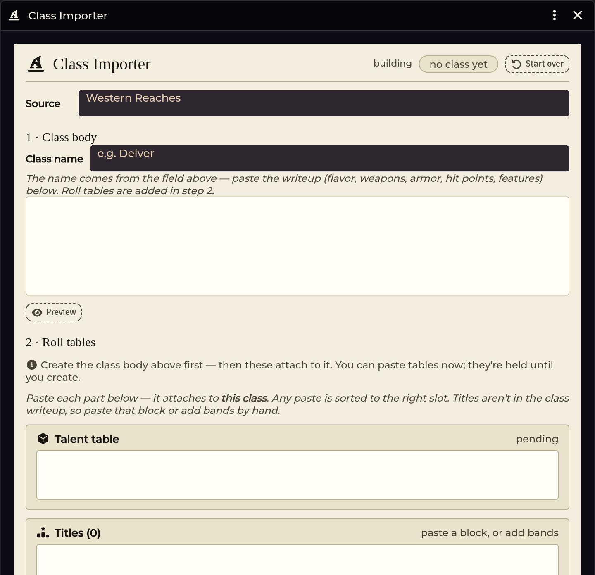
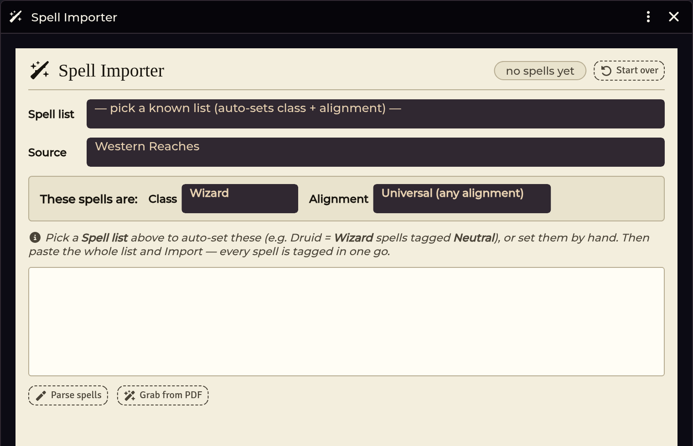

# Class & Spell Importers

[← Wiki home](index.md)

Classes and spells are the two most structured content types to import, so each
gets its own dedicated workspace instead of sharing the generic paste box.

---

## The Class Importer



A class is rarely a single block of text in a rulebook. It is a main writeup,
a talent table, a titles table, a spells-known progression, and sometimes
extra tables printed across multiple pages or appendices.

The workspace pins the class you are building at the top and provides
dedicated paste zones for each component.

### Stage 1: The writeup

Paste the main class text here. This generates the core Class item: hit die,
armor and weapon proficiencies, level 1 features, and initial talent references.

### Stage 2: The parts

Paste secondary sections into their respective zones:

| Part | What it is |
|---|---|
| **Talent table** | The class's `2d6` talent roll table. |
| **Titles** | Level-and-title bands, often printed in an appendix across columns. Editable in the band editor. |
| **Spells known** | Per-tier spells-known counts for spellcasting classes. |
| **Extra tables** | Any supplementary roll tables referenced by class features. |

Pastes route to the appropriate slot automatically based on content layout.
Re-importing or updating stage 1 keeps any parts you already attached.

### What a finished class needs

For a class to work seamlessly in the [Character Builder](Character-Builder.md),
ensure it has:

- The core **Class** item with its level 1 features.
- Talents linked as **Talent** items in `system.talents[]`.
- Activated or limited-use abilities (features requiring rolls, DCs, or daily
  uses) wired as **Class Ability** items in `system.classAbilities[]`. The
  importer distinguishes and routes both types.
- A talent RollTable named according to convention (`<Class> Talent` or
  `<Talent> Table`), or explicitly linked via an `@UUID` in the talent
  description.

Bare table names without standard conventions or explicit `@UUID` links will
not resolve from the character sheet.

---

## The Spell Importer



Spells import structured by **Class → Tier → Alignment**.

The alignment axis is essential for Shadowdark spell lists (for example, Druid
spells are modeled as Neutral Wizard spells). The importer sets the alignment
flag that the character builder's spell picker uses to filter available spells.

### Where spells are filed

Imported spells are filed one folder level deep:

```
Spells / <Class> (<Variant>)
```

Wizard variants include **Druid**, **Mage**, and **Sorcerer**. Tiers are
stored as document fields rather than sub-folders.

### Curated spell icons

Imported spells receive reviewed, Foundry-native icons matched to the visual
description of each spell rather than relying on a single generic casting hand.
The mapping lives in `scripts/shared/curated-icon-maps/spell-icons.mjs`.

If a spell does not match a curated entry, the importer selects an icon based
on keywords in the spell description. If you assign custom art to any spell,
your choice is preserved on future re-imports.

### Own-list casters vs borrowed-list casters

Supported and homebrew spellcasters fall into two categories:

- **Own-list casters** have their own distinct spell list. Spells and classes
  link automatically during import, on world load, or after commit sweeps.
- **Borrowed-list casters** cast from another class's list (such as a Green
  Knight casting Druid spells). Do not give the borrower the lender's class slug;
  doing so would assign them the entire lender list and casting stat.

To configure borrowed-list casters correctly:

1. Give the class its own slug (e.g. `green-knight`).
2. Leave the spell's `class` field empty.
3. Tag the specific borrowed spells to the borrowing class.

The importer handles this structure automatically when it detects borrowed lists.

---

## Troubleshooting

**Re-importing a class replaces unchanged talents or abilities with ActiveEffects.**  
The importer normalizes core and system changes separately, treating them as
identical when both lists match. Unchanged items retain their existing
document IDs, timestamps, and effects.

**Re-importing a class with no talent table replaces the class document every time.**  
Classes without talent tables store `null` as their canonical empty value,
matching Foundry field round-trips. Blank references and `null` values compare
as equal, avoiding redundant document updates.

**Re-importing a class overwrote the icon I picked for a Talent.**  
The Class Importer tracks art provenance for all `Class`, `Talent`,
`Class Ability`, and overlay `Item` documents. Custom icons you assign are
marked `custom` and never overwritten, while untouched module-curated icons
upgrade when updated maps ship. Corrected descriptions update normally while
preserving your chosen icons.

**An imported caster class came in as a non-caster.**  
If the Spellcasting heading appeared after the talents table in your PDF, the
parser may have bundled it into the talent table. Paste the Spellcasting
paragraph into Stage 1 on its own — that is what marks the class as a caster.

**The Paladin's Lance is missing Charge, Devastating, or Mounted properties.**  
Core Shadowdark has no built-in entries for that Western Reaches property
triple. The class overlay materializes canonical `Property` items under
`Western Reaches / Weapon Properties` in the managed items pack, linking them
to the Lance. Rules text remains in your book; only standard labels appear on
the item. Re-imports safely reuse existing property documents.

**A class's talent table doesn't roll from the sheet.**  
The table must be named `<Class> Talent` or `<Talent> Table`, or the talent
description must contain an explicit `@UUID` link to the table. Pack location
does not matter.

**The character builder doesn't offer my imported class.**  
The builder filters classes by `system.source.title`. Ensure you committed the
class with the correct source label (such as `western-reaches`). Unlabeled
imports default to `Custom`.

**A borrowed-list caster got the wrong spells or casting stat.**  
The class was assigned the lender's slug instead of its own. Use the class's
unique slug and tag individual borrowed spells instead.

**Spells were imported before the class exists.**  
This is fully supported. The automatic relink sweep runs on world load and
whenever imports finish, connecting spells and classes as soon as both exist.

---

**Related:** [Importer Hub](Importer-Hub.md) · [Character Builder](Character-Builder.md) · [Table Import & Shapes](Table-Import-and-Shapes.md)
