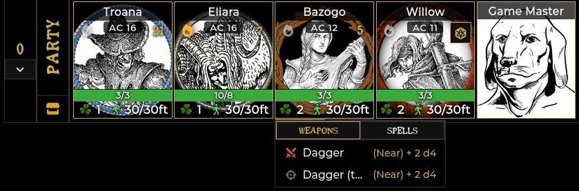
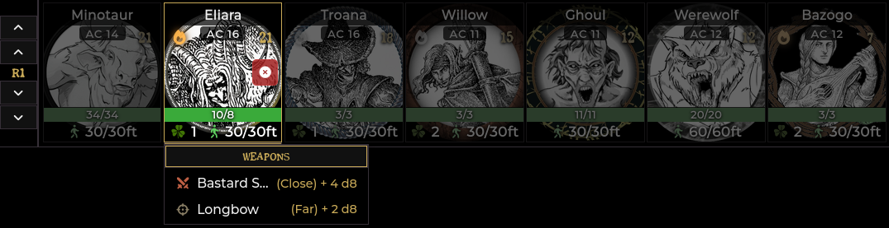
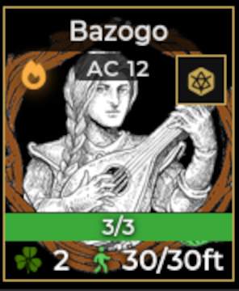

# Crawl Strip & Crawl Bar

[← Wiki home](Home.md)

The always-on party display pinned to the top of the canvas, and the control bar
every other tool launches from. This is the part of the module you look at all
session.

---

## What it does

The **Crawl Strip** is a row of cards, one per party member, showing live HP,
movement, Luck, AC and active effects without opening a single sheet. The
**Crawl Bar** underneath it changes shape depending on whether you are crawling
or fighting, and holds the launchers for the rest of the suite.

There are two modes, and the strip switches between them automatically:

| Mode | Cards shown | Ordering |
|---|---|---|
| **Crawl** (out of combat) | The crawl roster: party members you added | Out-of-combat initiative, once rolled |
| **Combat** | One card per combatant | Foundry's initiative order, live from the tracker |

The module respects the Shadowdark system's *Clockwise Initiative* setting
automatically. You do not configure ordering twice.

## Opening it

You don't. The strip and bar install themselves at world load and stay put.
The strip hides itself when there is nothing to show.

---

## The Crawl Bar

### In crawl mode

| Control | Left-click | Right-click |
|---|---|---|
| **Crawl · Round #** | *(badge: the current crawl round)* | — |
| **Next Round** | Advance the crawl round. Refills every member's movement budget. | — |
| **Add Tokens** | Add the selected tokens to the crawl roster | **Reset Initiative**, clearing all out-of-combat initiative rolls |
| **Combat** | Start a combat encounter from the current state | — |
| **Encounter** | Open the [Encounter Roller](Random-Encounters.md) | Encounter menu: run a check, set the threshold, see/clear the active table |
| **Forge & Loot** | Menu (same on either click): [Loot Generator](Loot-and-Treasure.md) · [Magic Item Forge](Magic-Item-Forge.md) · [Merchant Shop](Merchant-Shop.md) · [Party XP](Party-XP.md) · [Downtime](Downtime.md) · [Renown](Renown.md) · [Session Recap](Session-Recap.md) | Same menu |
| **Importer** | Open the [Importer Hub](Importer-Hub.md) | — |
| **Start / End** | Begin or end the crawl session | — |

You can also **drag a RollTable from the sidebar onto the Encounter button** to
make it the active encounter table.

> **Add Tokens only adds Player actors to the crawl roster.** Select NPC tokens
> and they are skipped with a notice. Membership is keyed by **actor id, not
> token id**, so a member stays on the strip when you switch scenes.

### In combat mode

| Control | What it does |
|---|---|
| **Begin Encounter** / **End Encounter** | Start or end the combat round structure |
| **Add Tokens** | Add the selected tokens to the combat tracker |
| **Delete Encounter** | Delete the combat encounter *without* running the end-of-combat flow |

The strip switches to one card per combatant, in initiative order:

Dead enemies don't get a card: an NPC that is marked defeated or sits at 0 HP
is dropped from the strip (but stays in the combat tracker, so end-of-combat
loot and the session recap still count it). Healing it above 0 HP, or
clearing the defeated marker, brings the card back. PC cards always stay.

## Starting and ending a crawl

**Start** begins a crawl session. This also begins (or continues) a
[Session Recap](Session-Recap.md). The recap is tied to the crawl, so you get
session tracking for free without a second button to remember.

**End** ends the crawl and offers to save, pause, or discard the recap.

**Next Round** advances the crawl round counter and resets every member's
out-of-combat movement budget. See [Movement Budgets](Movement-Budgets.md).

### Rolling initiative for the whole party

Each card carries its own d20, and out of combat the GM gets one more: a **dice
button above the round number** on the left of the strip, in the same column as
**Next Round**. One click rolls out-of-combat initiative for **every member who
hasn't rolled yet** — one chat card each, in the system's own roll style, using
that character's DEX modifier and initiative bonus exactly as the per-card dice
does. Members who already have a number are skipped, so it is safe to press
after a latecomer joins the roster.

| | |
|---|---|
| **Who sees it** | The GM only. Players roll their own card's d20. |
| **When it appears** | In crawl mode, while at least one member still owes a roll |
| **When it goes** | The moment the last member has rolled — there is nothing left for it to do, the same reason each card's d20 gives way to its rolled number |
| **How to get it back** | **Reset Initiative** (right-click **Add Tokens** on the bar), which clears the order and restores every card's dice |

Clicking it twice does not roll anyone twice: a second click while the batch is
still landing is refused rather than queued.

---

## The party cards

Each card renders, from the actor's live data:

| Element | Detail |
|---|---|
| **Portrait & name** | From the actor |
| **HP bar** | `attributes.hp.value / max`, with the numbers written on the bar. Colour bands: **ok** > 75%, **mid** ≤ 75%, **low** ≤ 50%, **critical** ≤ 25%, **dead** at 0 or below |
| **AC** | Shown as `AC n` when the actor has one |
| **Luck pill** | PCs only. **Left-click** to spend a Luck token (posts to chat). **Right-click** (GM only) to grant a token. **Left-click another PC's pill** to offer one of your own Luck tokens to them. Greys out at zero. |
| **Movement pill** | `remaining / budget ft`. Turns **red when over budget**, greys out when exhausted. NPCs in combat show this without a Luck pill, since NPCs don't carry Luck. |
| **Active effects** | A row of effect icons. Hover for the label and remaining duration |
| **Light source** | PC cards only, in both modes. Click to toggle the actor's light source. It reuses the system character sheet's own toggle. |
| **Initiative** | A **d20 button** when nothing is rolled yet, then the rolled **value badge** once it is. Works in both combat and out-of-combat. |
| **Current turn** | The active combatant's card is outlined in the accent colour. In combat only that card is lit, the rest are dimmed |
| **Skull** | Marks a defeated PC. (Defeated NPCs don't show a skull. They leave the strip entirely, see above.) |
| **Eye-slash** | Marks a combatant hidden from players |

### The GM card

The strip carries a **Game Master** card. The GM can **click its
portrait to change the image** (opens a FilePicker), or set it in
**Configure Settings → Game Master avatar**. Leave it blank for the default
cowled icon.

### The Merchant Shop button

In crawl mode the **PARTY** plate down the left of the roster carries a shop
button beneath the word. One click opens the
[Merchant Shop](Merchant-Shop.md). The GM always sees it, and players see it
only while the shop is available to them.

**It disappears in combat.** Shopping isn't a combat action, and the strip is
the initiative board there. It returns when the encounter ends.

### The activate button (GM, in combat)

In combat, each card carries a GM-only button that **activates that combatant's
turn**, or ends it if it is already active. Useful when initiative order needs
overriding at the table.

---

## The action menu

Cards you own carry a **tab strip below the card**, in crawl mode as well as
combat. Hovering a tab opens a floating panel built from that actor's own items,
laid out in Shadowdark stat-block order. Players get this on their own
characters, so they can cast and attack without opening a sheet.

The tabs differ by actor type, and a tab only appears if the actor has anything
to put in it:

| Actor | Tabs | Contents |
|---|---|---|
| **NPC** | Actions · Abilities | `NPC Attack` / `NPC Special Attack` · `NPC Feature` |
| **PC** | Weapons · Spells · Abilities | **Equipped** weapons · `Spell` items, plus `Wand` and `Scroll` spells · `Class Ability` items |

- **Weapons and attacks** show damage inline (e.g. `Claws  2d6 piercing`), with a
  small icon distinguishing melee from ranged. A thrown weapon appears twice:
  once as itself, once as a `(thrown)` variant. Clicking rolls through the
  system's own `rollAttack`, falling back to opening the item sheet.
- **Spells** are the memorised ones plus anything castable off an item. A wand
  lists each spell it holds; a scroll lists the one it carries. Those rows are
  named for the *spell* and marked with a small wand or scroll icon, with the
  item's own name in the tooltip — so `Fireball` off a Wand of Wonder and
  `Fireball` off a scroll are told apart at a glance. Clicking casts through
  the system's `castSpell` with the item attached, so the normal rules apply:
  the scroll is spent, and a wand can break on a critical failure. A
  non-caster may use a wand or scroll only when the GM has ticked that
  character's **Allow all magic items** box — Shadowdark refuses the cast
  otherwise. The Spells tab follows the same rule the character sheet uses, so
  it appears for spellcasters, and for anyone else only with that box ticked.
- **What the Spells tab hides**, matching the character sheet exactly: lost
  spells, burned-out wand charges, broken wands, and anything **stashed** or
  **unidentified** — an unknown stick doesn't advertise what it casts.
- **Abilities and features** open the item sheet for the description. Talents
  are deliberately excluded. They are passive, not actions.

> **Spend Luck** is the Luck pill on the card itself, not a menu entry.
> **Rollback to turn start** is a button on Foundry's **token HUD** (right-click
> the token), not on the strip. See [Movement Budgets](Movement-Budgets.md).

## Hidden combatants

The module keeps `token.hidden` and `combatant.hidden` **synced in both
directions**, which Foundry does not do on its own. Adding a hidden token to
combat normally produces a *visible* combatant. Two things follow:

- A combatant hidden either way stays suppressed from players through Foundry's
  own visibility rules.
- Hidden combatants' initiative rolls are **not** posted to players. Foundry
  rolls them as a private GM roll, but the roll message itself still shows
  players a "someone rolled something" placeholder, which gives away that an
  unseen combatant exists. The module drops those messages for players entirely.

There is **no setting** for this. It is always on.

---

## Troubleshooting

**The strip is empty in crawl mode.**
The crawl roster is opt-in. Select your player tokens and click **Add Tokens**.
Only actors of type `Player` are added.

**A player's card vanished when I changed scenes.**
It shouldn't. Membership is stored by actor id, not token id. If a card is
missing, the actor has no token placed on the current scene. That is expected,
since the card needs a token to report movement against.

**An enemy disappeared from the strip mid-fight.**
It died. NPCs at 0 HP (or marked defeated in the tracker) are removed from
the strip on purpose. The combatant is still in the combat tracker, so heal it
above 0 HP or clear its defeated marker and the card returns.

**Two party strips are showing.**
`shadowdark-crawl-helper` is still enabled. Disable it. See
[Installation & Setup](Installation-and-Setup.md).

**Initiative order looks wrong at the start of round 1.**
Foundry re-sorts `combat.turns` as initiative comes in, but keeps the turn
pointer where it was. The module watches for this and, once every combatant in
round 1 has an initiative, snaps the pointer back to the top of the order. If
you see it mid-settle, it will correct itself.

**Clicking a Luck pip does nothing.**
The pill is only clickable when the character actually has Luck tokens left, and
only on PCs. A greyed pill means zero remaining.

**Granting or giving a Luck token says the character already has one.**
Outside Pulp mode, Shadowdark tracks a single Luck token per character as a
yes/no flag, so there is nowhere to put a second and one banked anyway could
never be spent. In classic mode both the GM's right-click grant and a player's
give are refused when the receiver already holds their token. Turn on Pulp mode
if your table wants Luck to stack.

**The strip renders unstyled / as plain blocks.**
Your browser is serving a cached copy of the module stylesheet. Hard-reload with
`Ctrl+Shift+R`.

---

**Related:** [Movement Budgets](Movement-Budgets.md) · [Random Encounters](Random-Encounters.md) · [Session Recap](Session-Recap.md) · [Settings Reference](Settings-Reference.md)
