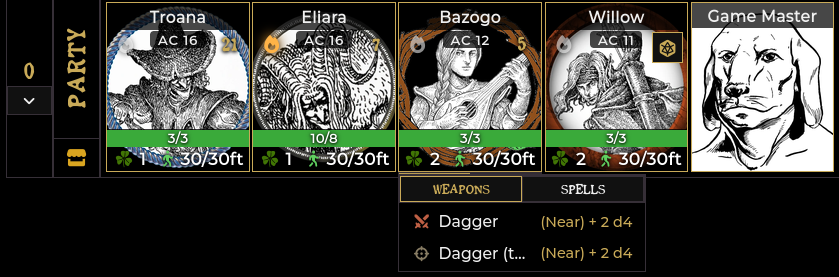
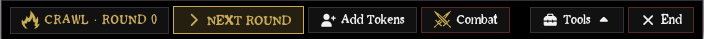
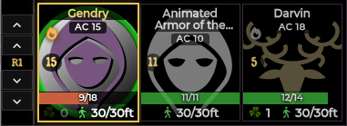
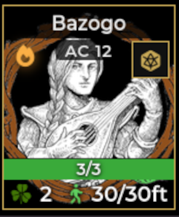

# Crawl Strip & Crawl Bar

[← Wiki home](index.md)

The always-on party display pinned to the top of your canvas, and the control
bar that launches the rest of the suite.

---

## What it does

The **Crawl Strip** is a horizontal row of cards—one per party member—showing
live HP, movement budgets, Luck tokens, AC, and active status effects without
opening a character sheet.

The **Crawl Bar** sits directly underneath, changing controls based on whether
you are exploring or in combat.

The strip switches modes automatically:

| Mode | Cards shown | Order |
|---|---|---|
| **Crawl** (out of combat) | Party members added to the roster | Out-of-combat initiative order |
| **Combat** | All active combatants | Foundry initiative tracker order |

The module honors the Shadowdark system's *Clockwise Initiative* setting
automatically.

## Opening it

You do not need to open it manually. The strip and bar install themselves when
your world loads and stay pinned to the top of the canvas. The strip hides
itself when there are no active members to show.

---

## The Crawl Bar

### In crawl mode

| Control | Left-click | Right-click |
|---|---|---|
| **Crawl · Round #** | Shows current crawl round | — |
| **Next Round** | Advances round and refills movement budgets | — |
| **Add Tokens** | Adds selected tokens to crawl roster | **Reset Initiative** (clears roll order) |
| **Combat** | Starts a combat encounter from current state | — |
| **Encounter** | Opens [Encounter Roller](Random-Encounters.md) | Encounter menu (check, threshold, frequency, table) |
| **Forge & Loot** | Opens the tools menu: [Loot Generator](Loot-and-Treasure.md), [Magic Item Forge](Magic-Item-Forge.md), [Merchant Shop](Merchant-Shop.md), [Party XP](Party-XP.md), [Downtime](Downtime.md), [Pit Fighting](Pit-Fighting.md), [Regional Training](Regional-Training.md), [Renown](Renown.md), [Give Rumors](Rumors.md), [Session Recap](Session-Recap.md) | Same menu |
| **Importer** | Opens [Importer Hub](Importer-Hub.md) | — |
| **Start / End** | Starts or ends the crawl session | — |

You can also **drag a RollTable from the sidebar directly onto the Encounter
button** to set it as your active random encounter table.

> **Add Tokens adds only Player actors to the crawl roster.** Selected NPC
> tokens are ignored with a notice. Membership is stored by **actor ID**, so
> characters remain on the strip when switching scenes.

### In combat mode

| Control | What it does |
|---|---|
| **Begin / End Encounter** | Starts or ends combat round structure |
| **Add Tokens** | Adds selected tokens to combat tracker |
| **Delete Encounter** | Deletes the combat and throws the fight away: no Hunter XP, no loot drops, no Session Recap entry |

In combat, the strip displays one card per combatant in initiative order:

- **Dead enemies leave the strip:** Defeated NPCs and monsters dropped to 0 HP
  are removed from the strip automatically. They remain in the combat tracker so
  loot generators and session recaps can still count them. Healing an enemy
  above 0 HP returns its card.
- **Downed PCs stay on the strip:** A player character at 0 HP shows a
  **Dying** badge with its death timer (or **Stable**), and a dead one a skull.
  See [Dying and Death Timers](Dying-and-Death-Timers.md).
- **Dead PCs' turns are skipped:** A dead character keeps its card but no
  longer takes a turn.
- **Dead turns are skipped automatically:** When an enemy dies, the module
  skips their turn in the tracker automatically to keep combat moving.

---

## Starting and ending a crawl

- **Start:** Begins a crawl session and starts (or resumes) a
  [Session Recap](Session-Recap.md).
- **End:** Ends the crawl and prompts you to save, pause, or discard the recap.
- **Next Round:** Advances the round counter and refills out-of-combat movement
  budgets. See [Movement Budgets](Movement-Budgets.md).

### Rolling party initiative

Each card displays a d20 button when initiative is unrolled.

In crawl mode, GMs get a **group dice button** above the round number on the
left of the strip. One click rolls out-of-combat initiative for **all members
who have not rolled yet**. Characters who already rolled are skipped.

| Detail | Behavior |
|---|---|
| **Visibility** | GM only. Players roll using their own card's d20 button. |
| **When shown** | In crawl mode while at least one member still owes a roll. |
| **When hidden** | Hides once all roster members have rolled. |
| **Resetting** | Click **Reset Initiative** (↺) at the bottom of the same column to clear rolls. Right-clicking **Add Tokens** on the bar does the same. |

Once everyone has rolled, the GM's column also gets **Previous player's
turn** (⏪) above the round number and **Next player's turn** (⏩) below it,
like Previous Turn and Next Turn in combat. Stepping back past the top of the
order steps the crawl round back too.

### The Crawl Order sidebar tab

During a crawl, a **Crawl Order** tab appears in Foundry's sidebar directly
beneath the Combat tracker icon. It functions like an out-of-combat turn
tracker:

| Section | Content |
|---|---|
| **Header** | Group roll button, round title, and Reset Initiative |
| **Rows** | Portrait, name, and initiative value or roll button |
| **Footer** | Turn and round controls (players see a single **End Turn** button) |
| **Popout** | Right-click sidebar icon for a floating window |

Clicking a row selects that token; players get a pan-to control on their row.

Differences from combat:

- **Next round** advances the crawl round, rolls the wandering encounter check
  when [Check Frequency](Random-Encounters.md#setting-the-frequency) says the
  round is due, and refills movement budgets.
- **Previous round** adjusts the round counter back without reverting rolls.

---

## Overland travel

On a hex map the Crawl Bar also offers **Travel**. A hex map is any scene with
a hex grid, of either orientation: one you drew by hand, one built with
Shadowdark Extras' hex creator, or a print tagged with the Hex Tagger. Nothing
has to be tagged first. It starts overland travel instead of a crawl. Overland is being built in pieces (#192). So far it
switches the mode, keeps the travel state, rolls the weather, charges each
move of the travel token against the day's hexes, moving the clock with it,
rolls the day's encounter checks as the clock reaches them, and ends the day
with forage and camp.

- **The travel plate.** While travelling, the [clock bar](Clock-and-Calendar.md)
  at the top shows the hexes left today, and its party icon opens the
  **Travel** panel:
  - the season and climate, the weather, and the travel method;
  - the day's budget;
  - each member's rations, and who has foraged today, with a **Forage** button
    on each character you own.

  The GM also sees the day's check hours and results, and the Start day,
  Weather, Make camp, Continue and End travel buttons. Players never see the
  check hours.
- **Terrain is optional.** A tag from the Hex Tagger, or the terrain Extras
  records on its hex maps, gives each hex its move cost and its encounter
  table. A hex map with neither still travels: every hex costs 1 point and
  encounters use the active table. **Start travel** says so once, when it
  starts. Without a printed number the hex's region and the hex fog's
  numbering are not known, so those parts of the encounter check are skipped.
- **No Crawl Strip on a hex map** outside a combat: the party travels there as
  one token, and the clock bar holds the top of the screen. The Crawl Strip is
  for every other scene. During a combat its combat display still takes over
  on a hex map, as everywhere.
- **Which token travels.** The party token: the Shadowdark Extras party's, when
  exactly one is on the map, or the module's own **Party**. With no party token
  on the map, Start travel puts the Party in the hex at the centre of your view.
  A player's own token never travels. The travel token wears the black party
  hex on the hex map (only there: its actor keeps its portrait).
- **Click to travel.** Select the party token: hovering a hex draws the
  cheapest route there, each hex with what it costs, and a tooltip gives the
  hexes, miles, points and hours. Click to walk the party there, one hex at a
  time, the clock moving with each. It stops at an encounter, a bounce, or the
  end of the day's points. Dragging the token still works as before.
- **Hex rules, not light and sight.** On a hex map (any scene with a hex grid)
  no token gives light and no token sees: a torch carried there reveals
  nothing, and players see the map as a map, with Extras' hex fog hiding what
  the party hasn't seen. The same character keeps its torch and its sight on a
  dungeon map. A 5 ft hex battle map is a hex map like any other, so it has no
  token light or sight either.
- **Who travels.** That party's members, or every player-owned character.
- **While travelling** the Crawl Strip is off and the crawl's movement isn't
  tracked. The bar shows **Overland**, today's weather once it's rolled, and the
  hexes left, followed by **Start day**, **Weather** and **End travel**. A combat started while travelling takes over as usual and
  hands back to travel when it ends.
- **Weather** rolls today's weather and posts it to chat. It holds until the
  next dawn, so pressing it again the same day only reminds you what it is.
  While you travel the weather rolls at each dawn the clock crosses, by
  itself: one roll and one card, however many days a jump skips (a camp rolls
  its own dawn). You only press it to roll early or to reroll.
  When the weather changes and the party token is on a hex map whose Shadowdark Extras Hex Fog is on, the
  hexes around the party are revealed at once for the new day, without a move.
  With the Western Reaches rule (the default) a 1 is stormy and a 6 is
  excellent, which gives the next day's roll advantage. With the core rule a 1
  is a storm for 1d4 days, with no roll while it lasts. Pick the rule under
  **Configure Settings → Shadowdark Enhancer → Overland**. A storm makes
  normal terrain difficult, and a storm in a harsh climate stops travel
  altogether. Both come from [Rules Data](Rules-Data.md): difficult terrain
  from the terrain costs, stopped travel from the climate table. The storm
  card says only what the imported rules give a storm, and says so when they
  give it nothing; the GM alone also gets a whispered card, once per table per
  session, saying which table to import and where.
- **Start day** opens a travel day, and pressing **Travel** opens it for you
  straight away. Nothing is asked: the method is read from the party (mounted
  when every member rides a mount, from the riders on each mount's sheet;
  sailing when every member is aboard one boat; else walking), and the pace is
  the standing one from the Travel panel's **Speed** step, **Normal** or
  **Push** (half as many hexes again, at the same rate). It holds every dawn
  until it's changed; changed before the party has moved or foraged, it counts
  today as well. The weather is rolled first if today's hasn't been. Every
  mount carrying the party eats a ration at camp.
- **Hexes today**: only when nothing says how many hexes a day the party
  makes (Hexes per day isn't in the [Rules Data](Rules-Data.md) yet, and no
  boat), Start day asks, with the method and the push to confirm. Its hint says
  what to press: import it once from your GM Guide (**Importer Hub > Rules Data
  > Import from GM Guide**), or type today's hexes there. The **Open Rules Data**
  button under the hint opens that step. Once the table is filled, or when
  sailing aboard a boat actor with a speed, Start day doesn't ask.
- **Moving the travel token** costs each hex's terrain cost from the day's
  hexes, and moves the world clock: a travel day is 8 hours, so walking costs
  2 hours per point. Following a path from one path hex to the next costs 1.
  A move the day can't pay for bounces, with a message saying why. To
  reposition the token without spending anything, move it with the
  **Displace** movement action.
- **End travel** stops travelling but keeps where the party is and the day's
  progress, so **Travel** later picks up where it left off.
- **Start** still begins a crawl, for example when the party reaches a dungeon.
  To travel again after a crawl, end the crawl first.

- **Encounter checks.** Start day sets the day's check hours, listed for you
  alone in the Travel panel's Encounters step: by the book two by day between
  06:00 and 17:00, and two at night between 18:00 and 05:00, at 1 in 6, one
  more on a pushed day. **Adjust** there (or **Settings → Overland**) changes
  the chance and how many checks by day and by night; see
  [Clock and Calendar](Clock-and-Calendar.md#encounters-while-travelling-gm).
  When a move's clock passes a check's hour, it's rolled quietly
  at that hour on the table for the party's hex, day or night columns and the
  moon included. A hit stops the clock at that hour and opens the clock bar's
  [Encounter panel](Clock-and-Calendar.md#encounters-while-travelling-gm):
  run the encounter, then press **Continue** to finish the rest of the move.
  The token can't move on until you do, except by **Displace**. A check whose
  hour had passed before you started the day is rolled at once.

- **Forage** lets travelling characters look for food: tick who forages.
  - Each character's player rolls INT: DC 12, or 18 in a harsh climate. When
    the player isn't connected, you roll it.
  - A success adds a ration to their Rations.
  - Once a day, only after Start day, never on a pushed day, and nothing is
    found in a storm in a harsh climate.
  - A player can forage for their own character from a macro:
    `game.shadowdarkEnhancer.overland.forage("<actor id>")`.
- **Make camp** ends the day:
  - First the camp, in the book's order. When the travel token is a
    Shadowdark Extras party, Extras' camp window opens for the tasks.
    Firewood rolls first. With no fire after it, you're asked whether to burn
    3 torches before the starred tasks. Then everyone eats a ration, or two
    on a harsh night. Anyone without one takes 1 CON damage, and mounts eat
    what's left. Closing Extras' window makes no camp.
  - Then carried lights go out, keeping their time, as with the off-duty move.
  - The clock runs to dawn, rolling the rest of the day's checks and the
    night's. A hit stops the night until you press **Continue**.
  - A creature met in the night's checks interrupts the rest; a rockslide
    doesn't, nor does a creature from a day check still to roll when you
    made camp early. The
    Encounter panel says so. At dawn, anyone who ate rolls CON (DC 12) to
    still benefit from the rest, unless their Bed Down succeeded. Extras
    rolls these checks. Without Extras, the chat reminds you to call for them.
  - The next day's weather is rolled, and you press **Start day** when the
    party sets out.
- **The sky.** Outdoor scenes darken with the clock:
  - Darkness is 0 by day. It deepens over the hour after sunset, to a night
    that a full moon lightens, and lifts over the hour before sunrise.
  - A storm shows as rain, or as a blizzard in a cold climate. A fair day
    shows the season, and the rules for a fair day are unchanged:

    | Today's weather | Winter | Autumn | Spring | Summer |
    |---|---|---|---|---|
    | Stormy | rain storm (blizzard in a cold climate) | same | same | same |
    | Fair | snow | falling leaves | nothing | nothing |
    | Excellent | nothing | nothing | nothing | nothing |

    Overland only ever changes or clears an effect it put there; one you
    picked on the scene yourself is left alone.
  - A hex map (any hex grid) counts as outdoors and only darkens to a readable
    tint. Any other scene joins in when you set **Follows the sky** to Yes in
    its Scene Configuration, on the Environment tab; dungeons are left alone.
  - The sky is written to the active scene and to the scene the travel token
    is on, so the map darkens and shows the weather even while a dungeon is the
    world's active scene. Each of the two must follow the sky.
  - Weather changes redraw the whole scene on every screen that shows it,
    which is slow on a very large map or a weak device. Each device has a
    **Show weather effects** setting (see [Settings Reference](Settings-Reference.md));
    turned off, that device draws no weather while the scene keeps it for
    everyone else.
  - A scene whose darkness is locked is left alone, and so is a weather effect
    you picked yourself. No calendar module is needed.
  - On the Isles of Andrik, the summer sun never sets and the winter night
    never lifts.
- **Deep tunnels.** When a season changes while the party's last hex is deep
  tunnels, each member makes a DC 12 CHA check (their player rolls), and a
  failure costs 1d4 CHA. That happens whether or not they're travelling.

## The party cards

Each card displays live actor data:

| Element | Detail |
|---|---|
| **Portrait & name** | Drawn from the actor document |
| **HP bar** | Current/Max HP with color bands (Green >75%, Yellow ≤75%, Orange ≤50%, Red ≤25%, Black ≤0) |
| **AC** | Displayed as `AC n` |
| **Luck pill** | PCs only. On your own PC: left-click spends a token, right-click adds one (the GM can do both on any PC). On another player's PC: left- or right-click gives them one of yours. Each posts a chat card. |
| **Movement pill** | `remaining / budget ft`. Turns red when over budget. |
| **Active effects** | Icons for current effects with hover tooltips for duration |
| **Light source** | PC cards: click to toggle character light source |
| **Initiative** | d20 button when unrolled; badge showing result once rolled |
| **Current turn** | Active combatant card is outlined in accent color; others dim |
| **Dying badge** | A PC at 0 HP: **Dying** with the rounds left (no count for players under hidden timers) or **Stable**. Click it to stabilize with your selected character, or, as GM, for the dying buttons |
| **Skull** | Marks a dead PC, or a defeated combatant |
| **Eye-slash** | Marks a combatant hidden from players |

Players see only the HP bar on a hostile NPC's card: no HP numbers, no AC, and
no movement pill. The same applies to an NPC whose token disposition is
**Secret**. The GM always sees the full card.

### The GM card

The strip includes a **Game Master** card. Click its portrait to open a file
picker and set your avatar, or configure it under **Configure Settings → Shadowdark Enhancer → Crawl Strip →
Game Master avatar**.

### The Merchant Shop button

In crawl mode, the **PARTY** plate on the left includes a shop button. Click it
to open [Merchant Shop](Merchant-Shop.md). This button disappears in combat.

### Activating turns (GM)

In combat, each card includes a GM-only button to activate or end that
combatant's turn manually.

---

## The action menu

Cards you own display an action tab strip underneath. Hovering a tab opens a
panel organized in Shadowdark stat-block layout so players can act without
opening their sheets:

| Actor type | Tabs available | Contents |
|---|---|---|
| **NPC** | Actions · Abilities | Attacks, special attacks, and features |
| **PC** | Weapons · Spells · Abilities | Equipped weapons, spells/wands/scrolls, and class abilities |

- **Weapons & attacks:** Shows damage inline with melee/ranged icons. Click to
  roll using standard system attack rolls.
- **Spells:** Lists memorized spells, wands, and scrolls. Wand charges and
  scroll consumption follow system rules.
- **Hidden items:** The menu automatically hides lost spells, spent wand
  charges, broken wands, and stashed or unidentified items.
- **Abilities & features:** Click to open the item sheet for full rules text.

---

## Hidden combatants

The module automatically synchronizes `token.hidden` and `combatant.hidden`:

- Tokens hidden on the canvas produce hidden tracker combatants.
- Initiative rolls for hidden combatants are suppressed entirely from player
  chat, avoiding spoiler roll notifications.

---

## Troubleshooting

**The strip is empty in crawl mode.**  
Select your player tokens on the canvas and click **Add Tokens** on the crawl
bar. Only `Player` actors are added.

**A player card disappeared after changing scenes.**  
Cards require an active token on the current scene to calculate movement
budgets. Place the player's token on the scene.

**An enemy disappeared from the strip during combat.**  
Monsters and NPCs at 0 HP or marked defeated leave the strip automatically.
Healing them or clearing the defeated marker brings them back.

**The combat tracker jumped past a turn automatically.**  
The module automatically advances past dead combatants. Use the strip's
**Previous Turn** button if you need to take an action on that turn.

**No card is highlighted and it looks like nobody's turn.**  
The active turn pointer landed on a defeated combatant. On GM screens, this
advances automatically. If all enemies are dead, end the combat encounter.

**Two party strips appear on screen.**  
Disable the legacy `shadowdark-crawl-helper` module in your world.

**Clicking a Luck pill does nothing.**  
The character has 0 Luck tokens remaining, or the world is in classic mode where
Luck caps at 1.

---

**Related:** [Movement Budgets](Movement-Budgets.md) · [Random Encounters](Random-Encounters.md) · [Session Recap](Session-Recap.md) · [Settings Reference](Settings-Reference.md)
