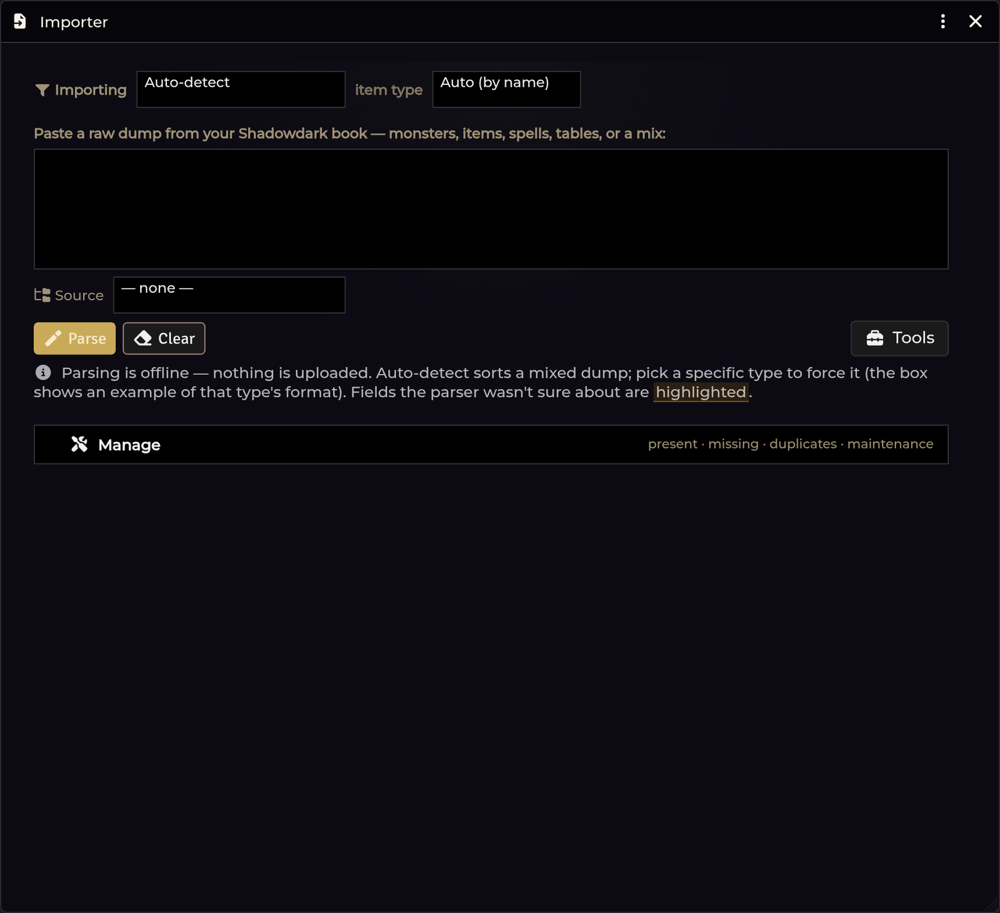
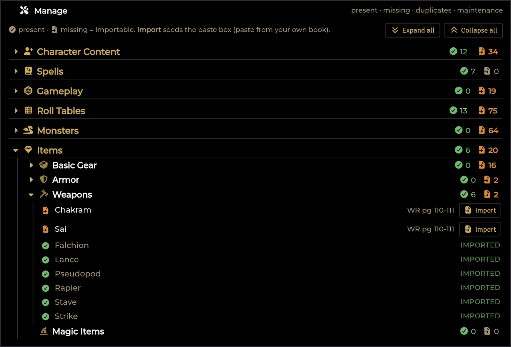

# Importer Hub

[← Wiki home](Home.md)

The single front door for getting Shadowdark content into your world. Paste text
from your own PDF, see what it parsed into, fix anything wrong in place, and
commit it into the managed compendium packs.

---

## Bring your own books

This is the part people ask about, so it is worth stating plainly.

**The module ships no sourcebook prose.** For the *Cursed Scrolls* (CS1–CS6), the
Core rules, and the *Player's Guide to the Western Reaches*, it knows the
**structure** of the content you own — entry names, source and page citations,
dice formulas, and table layout — and nothing else. There is no encryption and
no hidden payload; there is simply no text to ship.

**You supply every word** by pasting the matching section from your own PDF. What
the module contributes is the parsing: recognising what kind of content the paste
is, applying the right recipe, remapping links, and filing the result correctly.

Two consequences worth knowing:

- Content printed in more than one book — the Delver and Wyrdling classes, the
  *Cursed Scroll* spells reprinted in *Western Reaches* — can be imported from
  **either** book's paste.
- Content the Shadowdark **system already ships** (core spells, the base
  bestiary, the legacy Bard) is deliberately skipped. You already have it.

## Opening it

| Route | How |
|---|---|
| **Crawl Bar** | The **Importer** button |
| **API** | `game.shadowdarkEnhancer.tables.openHub()` |

One window, one scrolling view, no tabs. Opening it does **not** scan your world —
the census work is lazy and only runs when you expand the Manage strip.

---

## Importing: the basic loop

### 1. Choose a type (or don't)

The type selector has two groups. **Paste & parse here:**

`Auto-detect` · `Monsters` · `Items` · `Tables` · `Backgrounds` · `Talents` ·
`Ancestry` · `Compound generator` · `Cartesian table`

**Guided workspaces:** `Spells…` and `Classes…` — picking either opens the
dedicated [Spell or Class Importer](Class-and-Spell-Importers.md) instead of
parsing in the hub.

Leave it on **Auto-detect** and the paste is run through a segmenter that splits
a mixed dump into typed buckets. Choose a specific type and only that recogniser
runs — which is what you want when auto guesses wrong.

Items can additionally be forced to a specific **item subtype**.

### 2. Paste

Paste the section from your PDF into the box. Anything the parser can't claim
lands in a **Skipped** list rather than being silently dropped, so you can see
what didn't make it.

### 3. Review the preview

<!-- TODO screenshot: images/importer-preview.png — The import preview with a flagged row
     How: Paste a stat block from your own PDF into the hub and Parse; screenshot the preview with a flagged row. -->

Each parsed entry appears as an editable preview. **Field edits apply in place
with no re-render**, so the cursor doesn't jump while you're typing. Structural
changes — adding or removing a row — re-render.

**Rows the parser is unsure about are marked directly on the row** — highlighted,
with an inline *review* tag and the reason on hover. You are never told "something
in this card needs review" without being shown which line.

### 4. Commit

Commit is **GM-only**. Each type gets a conflict dialog before anything is
written, and the result report tells you what was **created**, **replaced**, and
**skipped**.

| Content | Lands in |
|---|---|
| Monsters | `sde-actors` |
| Items, spells, character content | `sde-items` |
| Tables | `sde-tables` |
| Classes, talents, ancestries, backgrounds | The Character Options packs |

**Commit All** runs monsters → items → spells → tables in order.

The **Source** dropdown — *— none —*, *Core Rulebook*, *Cursed Scroll 1–6*,
*Western Reaches* — becomes the per-source folder inside each pack.

> **Nothing is ever silently overwritten or deleted.** Re-importing the same
> content is idempotent. The conflict dialog's default is to *rename the
> newcomer*; choosing *replace* keeps the same document UUID so existing links
> stay valid; choosing *skip* leaves the existing document byte-identical.

### After a commit, automatically

- **Table re-linking** — imported tables get `@UUID` monster/item links and
  inline roll counts, swept automatically after each commit.
- **Spell ↔ class linking** — spells find their caster class whichever was
  imported first.

There are no manual maintenance buttons to press. This is deliberate: the fix
belongs in the import flow, not in a repair tool you have to remember.

---

## The Manage review tree

A collapsible `
` strip holding a browsable folder tree that reconciles a
manifest of what each book contains against what your world actually has.

- Every entry is marked **have** or **gap**.
- **Scanning is lazy** — the first expand triggers the scan, so opening the hub
  is always instant.
- Expansion state is tracked per node, so a big tree doesn't collapse on you.
- Every missing entry carries an **Import** button that **seeds the paste box**
  with the right type, source label, and entry name — so you paste and commit
  without configuring anything.

The tree covers monsters, items, and the **character-content unlock** rows:
the classes, talents, spells, backgrounds, and gear from CS4–CS6 and Western
Reaches that the core system doesn't ship. The manifest holds names, types and
sources only — no rules text.

Character content committed here is stamped with a `system.source.title` slug
(e.g. `western-reaches`), because the character builder filters what it offers on
exactly that field. Import a Western Reaches class and it shows up in the builder.

---

## Source PDFs

You can register **your own uploaded PDF** for each book. Once registered:

- **Import buttons deep-link** to the cited page of the cited book, opening in
  Foundry's native PDF viewer.
- **Grab text** pulls the text out of the open page for you, using Foundry's own
  bundled PDF.js — no external tool, and column-aware, so two-column book pages
  come out in reading order rather than interleaved.

Your PDFs stay in your world. **Nothing leaves your machine.**

Manage them from the hub's Tools menu → **Source PDFs**.

---

## Bundle export / import

Also under Tools. Exports the whole suite — every pack the module manages — as a
single JSON file, and imports it back.

The import **validates, skips anything that already exists, and never
overwrites**. It is a way to move your imported library to another world, not a
sync.

---

## Troubleshooting

**Auto put my content in the wrong bucket.**
Set the type explicitly instead of `auto`. The recogniser order is fixed
(hexcrawl → spell → monster → item → table), so an ambiguous block goes to the
first that claims it.

**Half my paste ended up in Skipped.**
Usually a PDF copy artifact — page headers, footers, or column interleaving mixed
into the text. If you registered a source PDF, use **Grab text** instead of
copying from your PDF reader; it is column-aware.

**A table parsed into nonsense rows.**
Messy PDF tables need a parsing recipe. See
[Table Import & Shapes](Table-Import-and-Shapes.md).

**The Manage tree still shows a gap after I imported it.**
The census matches on name and source folder. Confirm the source label you
committed with matches the book — importing a CS1 monster under a blank source
files it under *Custom*, and the CS1 node stays at zero.

**Re-importing created duplicates.**
It shouldn't. Check the conflict dialog choice — the default *rename the
newcomer* creates a second copy on purpose. Choose *skip* to leave the existing
one alone.

**The hub is slow to open.**
It shouldn't be — nothing scans until you expand Manage. If it is, collapse the
Manage strip and reopen.

**Class import lost the tables I attached.**
Use the dedicated class workspace rather than a plain paste — see
[Class & Spell Importers](Class-and-Spell-Importers.md).

---

**Related:** [Class & Spell Importers](Class-and-Spell-Importers.md) · [Table Import & Shapes](Table-Import-and-Shapes.md) · [Compendium Packs](Compendium-Packs.md) · [Character Builder](Character-Builder.md)
