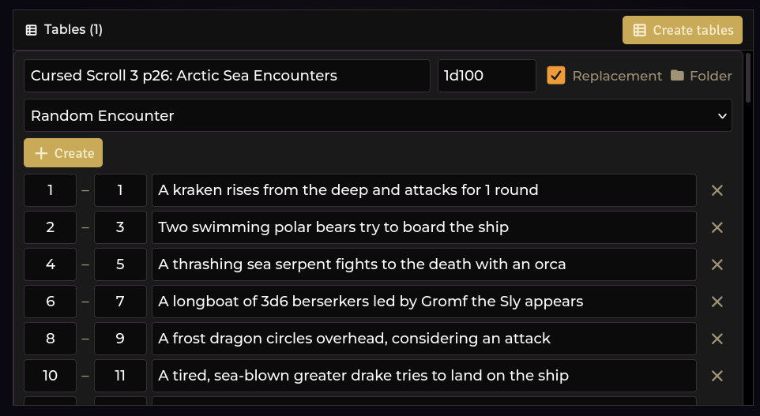
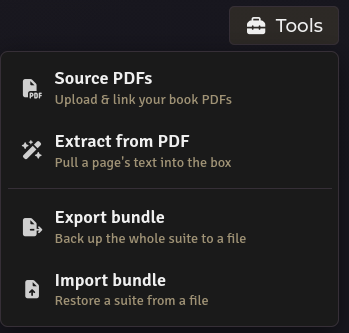
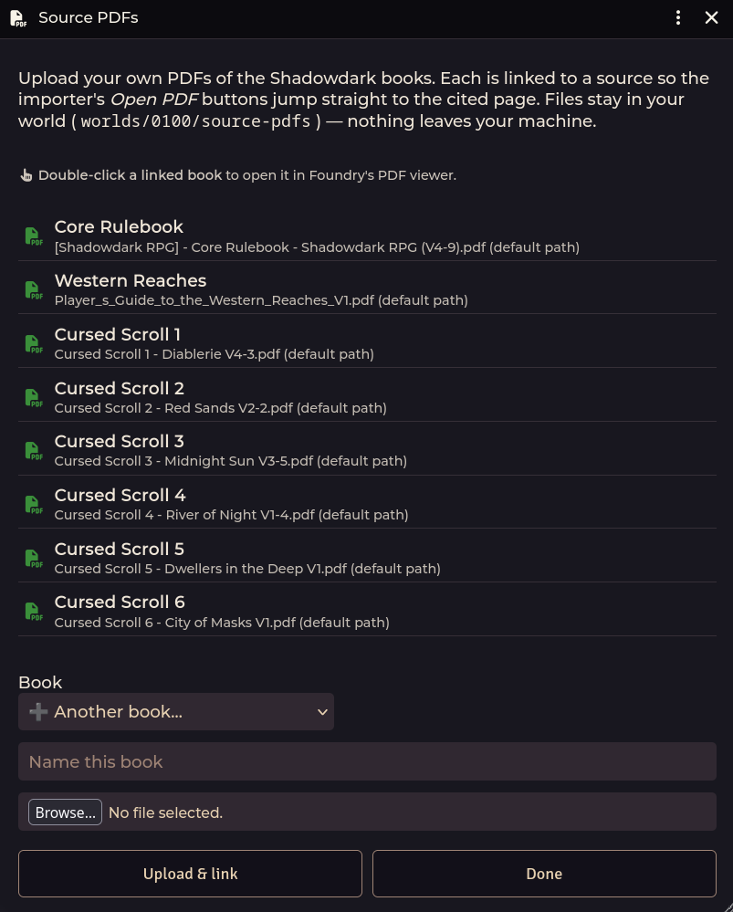

# Importer Hub

[← Wiki home](index.md)

The single front door for getting Shadowdark content into your world.
Upload your official rulebook PDFs, run the one-button batch importer, and
commit cleanly formatted monsters, spells, items, classes, and roll tables into
managed compendium packs.

---

## Quick start: the fast path

If you have your book PDFs ready, you do not need to paste hundreds of entries
by hand.

1. **Upload your PDFs:** Go to **Tools → Source PDFs** and link your PDF copies
   of the Core rules, Cursed Scrolls, or Western Reaches.
2. **Click Import everything:** Expand the **Manage** review tree and click
   **Import everything (N)** (or **Import all N in <folder>** for a specific
   book). The runner grabs pages, parses entries, commits clean records,
   closes background workspaces when finished, and gives you a summary report.
3. **Handle any exceptions:** If a row in the report says *Needs your attention*
   or *Import by hand*, click its **Import** button to review the draft in the
   preview, make any adjustments, and commit it manually.

---

## Bring your own books

**The module ships no sourcebook prose.** It knows the structure of the books
(entry names, citations, dice formulas, and table shapes) but no rules text.
Nothing is encrypted or hidden.

**You supply the text** from your own purchased PDFs. The module applies the
correct parsing recipe, enriches internal `@UUID` links, assigns curated
icons, and files documents into organized world compendiums.

- **Content printed across books** (such as spells reprinted in *Western
  Reaches*) can be imported from whichever PDF you own.
- **Content the base Shadowdark system already ships** (core spells, basic
  bestiary, core gear) is skipped so you never get duplicates.

---

## Opening the Hub

| Route | How |
|---|---|
| **Crawl Bar** | Click the **Importer** button. |
| **API** | `game.shadowdarkEnhancer.tables.openHub()` |

Opening the hub is instant; scanning your world compendiums is lazy and only
runs when you expand the Manage review strip.

---

## The Batch Runner (Import Everything)

Once your source PDFs are registered, click **Import everything** on the Manage
tree toolbar or **Import all N in <folder>** at the top of any folder.

The batch runner executes the same steps you would by hand: it reads cited
pages, runs the appropriate parser, validates the draft, and commits it.

### Batch runner safety rules

Because nobody is supervising every single entry, the batch runner follows
three strict rules:

1. **It never overwrites and never deletes.** Every name collision defaults to
   "keep existing", so running a batch over an already-imported library is safe
   and produces zero duplicates.
2. **It never commits broken data.** Any draft that fails a quality check is
   held in the preview or reported for manual review rather than written to your
   packs.
3. **Every entry is accounted for.** Rows lacking linked PDFs, page citations,
   or automated routes are listed clearly in the final report.

### Workspace cleanup and progress

- **Automatic window management:** The runner opens dedicated workspaces
  (Spell Importer, Class Importer, Item Builder) as needed and **closes them
  automatically when the batch finishes**, leaving only the final report.
- **Progress bar:** A visual indicator displays the current entry, with a
  **Stop** button that safely pauses the run after the active item.
- **End-of-run report:** Results are grouped into *Imported*, *Already in your
  library*, *Needs your attention*, and *Import by hand*.

---

## Manual importing: the step-by-step loop

When you want to import a single item, test a homebrew statblock, or resolve a
row that needs attention:

### 1. Choose a type (or use Auto-detect)

The type selector provides two groups:

- **Universal paste & parse:** `Auto-detect`, `Monsters`, `Items`, `Tables`,
  `Boats`, `Backgrounds`, `Talents`, `Ancestry`, `Compound generator`,
  `Cartesian table`, and `Downtime`.
- **Guided workspaces:** `Spells…` and `Classes…` open dedicated
  [Class & Spell Importers](Class-and-Spell-Importers.md).

`Auto-detect` segments mixed text into typed blocks. Choose an explicit type
when pasting ambiguous text.

> **`Downtime` must be selected explicitly.** Auto-detect will not claim
> downtime tables; selecting Downtime unlocks outcome text into world settings
> for the [Downtime](Downtime.md) sheet.

### 2. Paste or grab text

Paste text directly from your PDF reader, or use **Grab text** if a source PDF
is registered. Any text the parser cannot match lands in a **Skipped** list so
nothing is silently dropped.

### 3. Review the preview

Parsed entries appear in an editable preview card.

- **In-place editing:** Text edits update without re-rendering, so your cursor
  never jumps.
- **Inline review tags:** Any line the parser is uncertain about is highlighted
  with an inline *review* tag; hover over it to view the explanation.

### 4. Commit

Click **Create** (or **Commit All** to process monsters, items, spells, and
tables in sequence).

- **Conflict handling:** If a document with the same name already exists, you
  can choose to *Rename newcomer*, *Replace existing*, or *Skip*.
- **Monster Spell protection:** Generated monster spells are protected. If a
  standard item import shares a name with an existing generated monster spell,
  *Replace* is automatically downgraded to *Keep both* with an explanatory
  warning.

---

## After a commit, automatically

- **Table link sweeps:** Roll table results are automatically enriched with
  `@UUID` links to monsters and items, and dice expressions become inline rolls.
- **Spell ↔ class wiring:** Spells link to their caster classes regardless of
  import order.
- **Art provenance protection:** Custom icons you assign are marked `custom`
  and protected against overwrites. Untouched module-curated icons upgrade
  automatically when new maps ship.
- **Curated item icons:** Mapped weapons, armor, basic gear, and treasure
  receive reviewed Foundry-native icons.
- **Mount & property folders:** Mount actors are organized into a `Mounts`
  folder in `sde-actors`. Canonical Western Reaches weapon properties (*Blast*,
  *Exploding*, and the Lance *Charge*/*Devastating*/*Mounted* triple) are filed
  in `Western Reaches / Weapon Properties`.

---

## The Manage review tree

A collapsible panel comparing what each supported book contains against what is
currently in your world packs.

- Filter by **All**, **Still locked**, or **Imported**.
- Every missing row has an **Import** button that pre-seeds the paste box with
  the correct book, type, and title.
- The **Downtime** node tracks unlocked book tables in world settings, displaying
  `Unlocked (25/25)`, `Partial`, or `Locked`.

---

## Tools menu & Source PDFs

Open the **Tools** dropdown to manage PDFs and world backups:

### Source PDFs

Register uploaded PDF files for Core, Western Reaches, and Cursed Scrolls 1–6.

- **Deep links:** Import buttons jump directly to cited book pages in Foundry's
  PDF viewer.
- **Grab text:** Extracts clean, column-aware page text directly using
  bundled PDF.js.
- **Custom & homebrew books:** Select **➕ Another book…** to register
  third-party supplements or adventure modules.
- All PDF files remain local to your world on your server.

### Bundle export / import

Export your entire managed compendium library to a single JSON file or import a
bundle into a new world. Imports validate data, preserve existing documents, and
rebuild all internal `@UUID` links.

---

## Troubleshooting

**Auto-detect put my text in the wrong bucket.**  
Select the content type explicitly from the dropdown before parsing.

**Half my paste ended up in Skipped.**  
PDF copy-paste often introduces header and footer artifacts. If your PDF is
registered, use **Grab text** instead of copying manually.

**I received a "Column check" warning during text extraction.**  
Advisory notice that a column split was close to text. Check the preview to
confirm no words crossed column boundaries before committing.

**Coin and Gem didn't import with the gear table.**  
Intended behavior. Currency belongs in character purses or loot rather than as
inventory items, so the importer logs them as skipped.

**A description has run on into the next entry.**  
Re-import it. Both gear and spell descriptions used to run past their own entry
— gear into the next item, and the last spell on a page into whatever followed
it, which could be several pages of tables. Both are fixed, so a fresh import
of the same pages gives you clean text.

**Import everything imported nothing.**  
Confirm that your book PDFs are registered under **Tools → Source PDFs**. Check
the report's *Import these by hand* section for entries requiring manual pastes.

**Re-importing created duplicate documents.**  
Check the conflict dialog selection. The default *Rename newcomer* creates a
second copy. Choose *Skip* to leave existing items untouched.

---

**Related:** [Class & Spell Importers](Class-and-Spell-Importers.md) ·
[Table Import & Shapes](Table-Import-and-Shapes.md) ·
[Compendium Packs](Compendium-Packs.md) ·
[Character Builder](Character-Builder.md)
