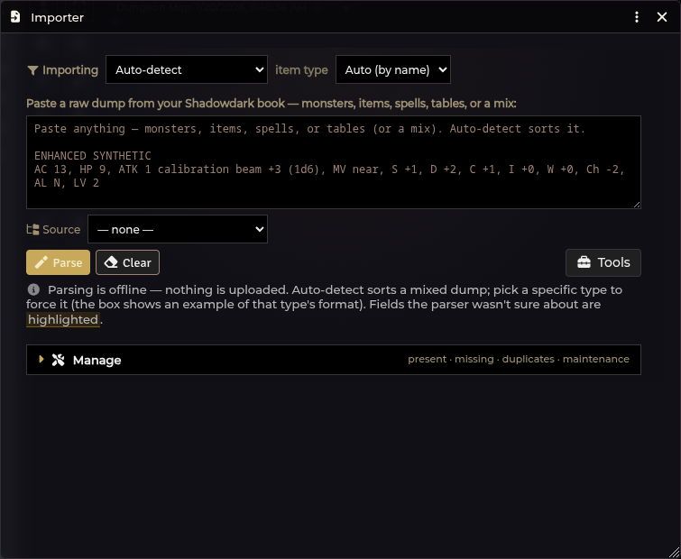
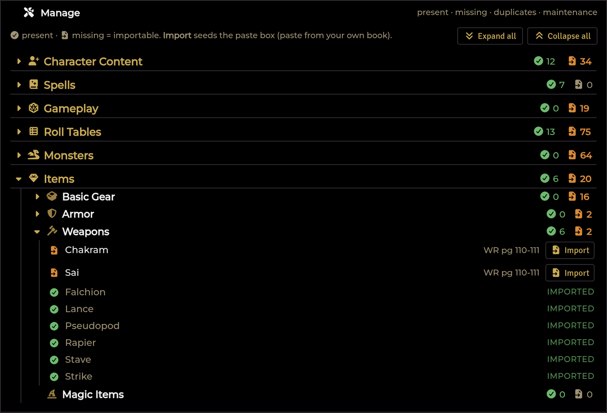

# Importer Hub

[← Wiki home](Home.md)

The single front door for getting Shadowdark content into your world. Paste text
from your own PDF, see what it parsed into, fix anything wrong in place, and
commit it into the managed compendium packs.

---

## Bring your own books

**The module ships no sourcebook prose.** For the *Cursed Scrolls* (CS1–CS6), the
Core rules, and the *Player's Guide to the Western Reaches*, it knows the
**structure** of the content you own (entry names, source and page citations,
dice formulas, and table layout) and nothing else. Nothing is encrypted and
nothing is hidden. There is no text to ship.

**You supply every word** by pasting the matching section from your own PDF. The
module reads what kind of content it is, applies the right recipe, remaps the
links, and files the result where it belongs.

Two consequences worth knowing:

- Content printed in more than one book (the Delver and Wyrdling classes, the
  *Cursed Scroll* spells reprinted in *Western Reaches*) can be imported from
  **either** book's paste.
- Content the Shadowdark **system already ships** (core spells, the base
  bestiary, the legacy Bard) is deliberately skipped. You already have it.

## Opening it

| Route | How |
|---|---|
| **Crawl Bar** | The **Importer** button |
| **API** | `game.shadowdarkEnhancer.tables.openHub()` |

One window, one scrolling view, no tabs. Opening it does **not** scan your world.
The census work is lazy and only runs when you expand the Manage strip.

---

## Importing: the basic loop

### 1. Choose a type (or don't)

The type selector has two groups. **Paste & parse here:**

`Auto-detect` · `Monsters` · `Items` · `Tables` · `Boats` · `Backgrounds` ·
`Talents` · `Ancestry` · `Compound generator` · `Cartesian table` · `Downtime`

**Guided workspaces:** `Spells…` and `Classes…`. Picking either opens the
dedicated [Spell or Class Importer](Class-and-Spell-Importers.md) instead of
parsing in the hub.

Leave it on **Auto-detect** and the paste is run through a segmenter that splits
a mixed dump into typed buckets, or choose a specific type so only that
recogniser runs, which is what you want when auto guesses wrong.

Items can additionally be forced to a specific **item subtype**.

> **`Downtime` is the one type Auto-detect will not find.** It has to be picked
> by hand, or seeded for you from the Manage tree. Under **Auto-detect** a
> downtime page lands in **Skipped**.

### The Downtime type

Downtime is the odd one out, because it doesn't create documents. It unlocks the
outcome text for the [Downtime](Downtime.md) window into a world setting, per
book.

Its preview section adds a **Book** picker above the paste box. Switching books
clears the parse, so pick the book first. Arriving through an **Unlock** button
also auto-fills the paste box from the book's registered source PDF, the same
grab the table rows use, so the usual path is just review then Parse.
**Parse** reports
`Matched 25 of 25 slots.`, lists **Still unfilled:** and **Lines nothing
claimed:** underneath, and **Unlock outcomes** writes it, confirming with
`Downtime (Cursed Scroll 6): 25 of 25 entries unlocked.`

This preview is the only place in the module that prints downtime slot labels,
and only for someone who has the book open in front of them. A second unlock of
the same book replaces that book's stored text. The other book is untouched.

### 2. Paste

Paste the section from your PDF into the box. Anything the parser can't claim
lands in a **Skipped** list instead of being silently dropped, so you can see
what didn't make it.

### 3. Review the preview

Each parsed entry appears as an editable preview. **Field edits apply in place
with no re-render**, so the cursor doesn't jump while you're typing. Structural
changes (adding or removing a row) re-render.

For a table that means the name, the **formula** it rolls on, whether it draws
with **Replacement**, and the **Folder** it will be filed under. Every result
row sits below it as an editable range and text, with **×** to drop one.
Nothing is written until you press **Create** (or **Create tables** for the whole
section).

<!-- TODO screenshot: images/importer-preview-flagged.png — The preview with a flagged row
     How: Paste content the parser is unsure about (e.g. a table with overlapping
     ranges) and Parse; screenshot a row carrying its inline review tag. -->

**Rows the parser is unsure about are marked directly on the row**: highlighted,
with an inline *review* tag and the reason on hover. You are never told "something
in this card needs review" without being shown which line.

### 4. Commit

Commit is **GM-only**. Each type gets a conflict dialog before anything is
written, and the result report tells you what was **created**, **replaced**, and
**skipped**.

| Content | Lands in |
|---|---|
| Monsters | `sde-actors` |
| Items, spells, character content | `sde-items` |
| Tables | `sde-tables` |
| Classes, talents, ancestries, backgrounds | The Character Options packs |
| Downtime outcomes | The `downtimeContent` world setting, not a pack |

**Commit All** runs monsters → items → spells → tables in order.

The **Source** dropdown becomes the per-source folder inside each pack. Its
options are *— none —*, *Core Rulebook*, *Cursed Scroll 1–6*, and
*Western Reaches*.

> **Nothing is ever silently overwritten or deleted.** Re-importing the same
> content is idempotent. The conflict dialog's default is to *rename the
> newcomer*. Choosing *replace* keeps the same document UUID so existing links
> stay valid, and choosing *skip* leaves the existing document byte-identical.

A generated Monster Spell is the one name where **Replace** doesn't replace. The spell is recognised by its `monsterSpell.generated` marker wherever it lives — not by which pack it sits in — so an ordinary item import that lands on the same name has its **Replace existing** downgraded to **Keep both**: the spell stays, your import is kept beside it under a free name, and a warning names the protected document — `"…" is a generated Monster Spell and was not replaced — the imported item was kept as "…". Delete the Monster Spell yourself if you meant to replace it.` The commit report adds `N kept beside a Monster Spell` to its `N created [, N updated][, N replaced][, N skipped]` line. The dialog's three choices are unchanged; only this one class of document takes the downgrade.

### After a commit, automatically

- **Table re-linking.** Imported tables get `@UUID` monster/item links and
  inline roll counts, swept automatically after each commit.
- **Spell ↔ class linking.** Spells find their caster class whichever was
  imported first.
- **Item art provenance.** When replacing an existing item, art is preserved or
  upgraded according to explicit provenance (`flags["shadowdark-enhancer"].art`)
  rather than image path heuristics:
  - `default`: The module's default pick (e.g. type fallback, treasure/spell icon). Upgradeable on re-import.
  - `imported`: The image from the source text draft, untouched since import. Upgradeable on re-import.
  - `curated`: A deliberate module-curated icon pick (A4). Upgradeable on re-import.
  - `custom`: Art edited or replaced by the GM. Preserved and never overwritten on re-import.

  Any divergence between the stored item's image and the recorded witness path is treated as `custom`.
  Legacy unmarked items are classified conservatively (`default` if matching the module's default today or blank; otherwise `custom`). Once a curated map ships, that classification consults the resolver: a legacy unmarked item wearing the map's current `icons/**.webp` path classifies as `default` (upgradeable) rather than being frozen as `custom`; removing a row later reclassifies it as `custom`, which is the safe direction.
  Generated artifacts in `sde-items` (`world.shadowdark-enhancer--items`) remain governed by the replace-always contract (A7/D6).
  *Note:* This provenance system governs the standalone `item-importer` and the class-content re-import path (`Class`/`Talent`/`Class Ability`/overlay `Item`, A3b); monster/token art is managed via Monster Token Art (B9/F4/N6). Class-content art reuses the same `flags["shadowdark-enhancer"].art` witness via `scripts/importer/char-content/class-unit-importer.mjs` — GM-custom art is preserved, untouched module-curated art remains upgradeable, and the witness is backfilled on an otherwise unchanged re-import so a later overlay-art change can still refresh an untouched legacy document. Corrected descriptions/effects remain importer-owned and replace on re-import.
- **Siege weapon property foldering.** When importing Western Reaches siege
  weapons (via dedicated Items commit or *Import everything* / *Commit All*),
  the materialized *Blast* and *Exploding* weapon property items are filed
  under `Western Reaches / Weapon Properties` in the managed Items pack.
  Pre-existing same-name property documents at the pack root are moved into
  the folder in place, keeping their UUIDs, rule text, and GM edits intact
  while avoiding duplicate folders or items on re-import.
- **Curated weapon icons — D1 activation (37 rows).** The weapons curated map (`scripts/shared/curated-icon-maps/weapon-icons.mjs`, A4 discovery seam `scripts/shared/curated-icon-maps/index.mjs`, consulted in `buildItemData`) is active. On creation, any module-managed `Weapon` Item whose final name matches one of the 37 reviewed entries receives its `icons/...webp` icon through `_automaticArt` → `curatedArtFor({name})` and is stamped `curated`. The map is source-agnostic (`curatedNameKey(finalDocument.name)` alone → `bastard sword`; `Bastard Sword` resolves the same regardless of which supported book printed it). Covers the full N3 weapon census: `Bastard sword`, `Blowgun`, `Bolas`, `Boomerang`, `Chakram`, `Club`, `Club (Obsidian)`, `Crossbow`, `Dagger`, `Dagger (Obsidian)`, `Falchion`, `Greataxe`, `Greatsword`, `Handaxe`, `Javelin`, `Lance`, `Longbow`, `Longsword`, `Mace`, `Morningstar`, `Pike`, `Rapier`, `Razor chain`, `Sai`, `Scimitar`, `Shortbow`, `Shortsword`, `Shuriken`, `Sling`, `Spear`, `Spear (Obsidian)`, `Spear-thrower`, `Staff`, `Stave`, `Strikes`, `Warhammer`, `Whip` — with intentional semantic selections for entries that had no distinct native weapon pick: `Lance` → `icons/skills/melee/strike-polearm-light-orange.webp`, `Morningstar` → `icons/skills/melee/strike-morningstar-gray.webp`, `Strikes` → `icons/skills/melee/unarmed-punch-fist-blue.webp` (each grouped with the other skill icons under the same semantic-category selection, not as typos). In the D1 changeset, armor, Basic Gear, and treasure retained their fallback art; each later category activates only with its owning D-ticket, while the generic A4 mechanism stays shared.
- **Curated armor icons — D2 activation (13 rows: 9 canonical + 4 mithral spelling aliases, shared `BARE` space).** The armor curated map (`scripts/shared/curated-icon-maps/armor-icons.mjs`, same A4 discovery/index and consultee `buildItemData` → `_automaticArt` → `curatedArtFor({name})` → `_artStampFor`) is active alongside D1. At the D2 stage, composed coverage was 50 bare rows across weapons + armor, with zero `problems` or cross-map collisions. On creation, any module-managed `Armor` Item whose final name matches one of the 13 reviewed armor display names receives its `icons/...webp` icon and is stamped `curated`. The map is source-agnostic (`curatedNameKey(finalDocument.name)` alone → `leather armor`, `mithral chainmail`; both spellings of a mithral armor resolve to the same reviewed path). Covers the full N3 armor census: 9 canonical — `Leather armor`, `Chainmail`, `Mithral Chainmail`, `Plate mail`, `Mithral Plate Mail`, `Shield`, `Mithral Shield`, `Round shield`, `Mithral Round Shield` — plus 4 deliberate source-spelling aliases that must remain distinct bare keys sharing a path so either book spelling is covered without inflating canonical inventory: `Chainmail, mithral` ↔ `Mithral Chainmail` → `icons/equipment/chest/breastplate-banded-steel-grey.webp`; `Plate mail, mithral` ↔ `Mithral Plate Mail` → `icons/equipment/chest/breastplate-cuirass-steel-blue.webp`; `Shield, mithral` ↔ `Mithral Shield` → `icons/equipment/shield/heater-crystal-blue.webp`; `Round shield, mithral` ↔ `Mithral Round Shield` → `icons/equipment/shield/round-wooden-boss-steel-yellow-blue.webp`. The remaining 5 canonical paths: `Leather armor` → `icons/equipment/chest/breastplate-layered-leather-brown.webp`; `Chainmail` → `icons/commodities/metal/mail-chain-steel.webp`; `Plate mail` → `icons/equipment/chest/breastplate-layered-steel.webp`; `Shield` → `icons/equipment/shield/heater-steel-gray.webp`; `Round shield` → `icons/equipment/shield/shield-round-boss-wood-brown.webp`. All 9 distinct canonical icons plus the 4 alias-shared paths were selected from the matching `icons/equipment/...` or `icons/commodities/...` semantic folder and vetted against the real Foundry icon tree. Armor, weapon, and basic-gear maps share the one `BARE` key space — N3 verified gear names are globally distinct — and bare/alias provenance is case/whitespace/curly-quote normalized (`toLowerCase`, collapsed whitespace, `‘’‚′` → `'`) with punctuation preserved, so only the four deliberate alias pairs intentionally share a path.
- **Curated Basic Gear icons — D3 activation (44 rows: 37 canonical + 7 aliases, shared `BARE` space).** The Basic Gear map (`scripts/shared/curated-icon-maps/gear-icons.mjs`) is registered through the same discovery index and covers source-agnostic final names. The seven deliberate aliases — `Arrows (20)`, `Caltrops (one bag)`, `Candle (3)`, `Crossbow bolts (20)`, `Iron spikes (10)`, `Rope, morzo silk`, and `Rations (3)` — remain distinct keys that share their canonical icon paths. Matches are stamped `curated`; untouched module-owned art can upgrade, GM-custom art survives, and unmapped gear retains the generic `default` fallback. The composed D1+D2+D3 registry is audited directly through `curatedIconRegistry()`: 94 bare rows (37 weapons + 13 armor + 44 Basic Gear), zero sourced rows, duplicate problems, or cross-space collisions. Its structural census always runs in CI; when a Foundry icon inventory is available, the same audit verifies all 94 accepted paths. Treasure remains on fallback art until D4–D6 activate their source-qualified maps.
  - **Weapon icon provenance and upgrade rules (A3 + A4).** A fresh import with no draft art, an item still carrying the module default, an untouched previously imported image, and a prior `curated` pick are all upgradeable — a later weapons-map revision upgrades an untouched curated pick on re-import. Any image the GM has edited diverges from the `flags["shadowdark-enhancer"].art.img` witness and is classified `custom`, preserved and never overwritten. Enabling the map does not reclassify an already stored `imported` Item as a new kind; its stored classification stands until the image itself changes. An unmapped name keeps the generic/type fallback (weapons and armor alike; armor adds the A3-curated upgrade / custom-preservation / world. allowlist — shadowdark.gear byte-stable — and the non-reclassification guarantee) (`default`) and an item outside the module-managed Items surface is unaffected.
  - **Armor icon coverage and drift gate (two-stage, per-category, D2).** Same two-stage contract as weapons: map construction (syntax) plus per-category gate against the real Foundry icon tree. `test/armor-icons.test.mjs` asserts the exact 13-row N3 census (9 canonical + 4 alias), the 9 distinct canonical keys, and the 4 alias pairs; `buildCuratedIconRegistry([ARMOR_ICONS])` reports `{total: 13, bare: 13, perMap: [{label: "armor", space: "bare", entries: 13}], problems: []}` structurally, and `auditCuratedIconRegistry(registry, {pathExists: (p) => foundryIcons.has(p)})` against the recursively indexed `FOUNDRY_ICON_ROOT` inventory (default `/home/patricks/FoundryV14/public/icons`, overrideable via `SHADOWDARK_ENHANCER_FOUNDRY_ICON_ROOT`) proves no `missing-path`; a valid-looking absent armor asset reports `missing-path` through the same predicate. Without the tree only the structural/census/provenance/alias assertions run.
  - **Weapon icon coverage and drift gate (two-stage, per-category).** Map construction enforces native `icons/**.webp` syntax (`^icons/[^\s]+\.webp$`) and structural rules — a duplicate key, blank name, `unknown-space` or `unusable-source` never throws; the row is dropped into `problems` and that item keeps fallback art. Syntax alone does not prove the asset exists on disk. The second stage is D1's weapons gate: `test/weapon-icons.test.mjs` loads the real Foundry icon inventory when available and calls `auditCuratedIconRegistry(registry, { pathExists: (p) => foundryIcons.has(p) })`; a syntactically valid but absent weapon asset then produces the stable `missing-path` finding. `auditCuratedIconRegistry()` without `pathExists` remains structural-only. `problems` empty across both stages is the contract; `crossSpaceNames` is informational (a treasure name that also exists as gear resolves qualified-first). Without the Foundry tree only the structural census/provenance/fallback assertions run and the inventory checks skip — the gate still fails rather than vacuously passes when the inventory is incomplete.
  - **Display-name-derived normalization, semantic category before broad fallback, and `world.` target allowlist (from A4, now observed by D1).** Map keys are derived at load from the display-name string — never hand-written beside it. `curatedNameKey` lowercases with `toLowerCase` (not locale — avoids Turkish `I` → `ı` drift), collapses whitespace, trims, and folds curly quotes (`‘’‚′` → `'`). Punctuation is preserved: commas, apostrophes and parenthesised quantities (`Rope, 60'`, `Miner's putty, jar`, `Arrows` vs `Arrows (20)`) remain distinct keys, because stripping them would collide reviewed rows. Each weapons row's icon was chosen from the matching `icons/weapons/...` or, for the three without a distinct weapon pick, `icons/skills/melee/...` semantic folder first (fallbacks documented in N3). At runtime `_automaticArt` chooses `Spells (Shikashi channel)` → `TYPE_DEFAULT_IMG` for `Background`/`Talent`/`Ancestry`/`Class` → `curatedArtFor({name})` → `pickTreasureIcon(name)`. A curated hit returns `{img, artState: "curated"}` and is stamped via `_artStampFor`; the generic chain remains `default`. Both are upgradeable under A3 while `custom` (human edit) is never overwritten. `isCuratedApplyTarget(packCollection)` allows only `world.` packs — wider than A3's `MANAGED_ITEMS_PACK` (`world.shadowdark-enhancer--items`) and deliberately so — so no document in `shadowdark.gear` or any other system pack is mutated even when its name matches a weapons entry (`shadowdark.gear` remains byte-stable). Discovery remains by import (`registerCuratedIconMap` at module scope, index `scripts/shared/curated-icon-maps/index.mjs` side-effect imported once from `scripts/shadowdark-enhancer.mjs`).
- **Book-only weapon and armour properties.** A property code the core system
  has no entry for — the Lance's *Charge*, *Devastating* and *Mounted*, an
  obsidian weapon's *Obsidian*, barding's *Mount* — can't be attached to the
  item, so it is named in the item's **description** instead: *“Properties with
  no core Shadowdark equivalent: Charge, Devastating, Mounted.”* The preview
  flags each one as it parses. Re-importing refreshes that line without
  disturbing a description you wrote yourself.

There are no manual maintenance buttons to press. This is deliberate: the fix
belongs in the import flow, not in a repair tool you have to remember.

---

## The Manage review tree

**Filter it to what you still need.** The tree's toolbar has **All · Still
locked · Imported**. *Still locked* hides everything already in your library,
along with the folders that are now empty, so what's left is your
to-import list. When there's nothing left it says so outright instead of
showing you an empty panel.

A collapsible `
` strip holding a browsable folder tree that reconciles a
manifest of what each book contains against what your world actually has.

- Every entry is marked **have** or **gap**.
- **Scanning is lazy.** The first expand triggers the scan, so opening the hub
  is always instant.
- Expansion state is tracked per node, so a big tree doesn't collapse on you.
- Every missing entry carries an **Import** button that **seeds the paste box**
  with the right type, source label, and entry name, so you paste and commit
  without configuring anything.

The tree covers monsters, items, and the **character-content unlock** rows:
the classes, talents, spells, backgrounds, and gear from CS4–CS6 and Western
Reaches that the core system doesn't ship. The manifest holds names, types and
sources only. No rules text.

### The Downtime node

One node sits apart from the rest, because it is censused from a world setting
rather than from a pack. **Downtime** holds one row per book, showing the book,
its pages, and a state chip: `Unlocked (25/25)`, `Partial (12/25)` or `Locked`.

Counts and nothing else. The row never says what is in the book, before or after
import. Its button reads **Unlock** instead of Import, and it seeds the paste
flow the same way every other row does. Double-clicking a row that is already
unlocked opens the [Downtime](Downtime.md) window, since there is no document
behind it to reveal.

Character content committed here is stamped with a `system.source.title` slug
(e.g. `western-reaches`), because the character builder filters what it offers on
exactly that field. Import a Western Reaches class and it shows up in the builder.

### Import everything

Once your books are uploaded under **Source PDFs**, you do not have to press
Import → Parse → Create two hundred times. The tree's toolbar carries an
**Import everything (N)** button, and opening any folder puts an **Import all N
in <folder>** button at the top of it — the same run, scoped to that branch.

It changes nothing about *how* content is imported. It presses the same buttons
you would: it seeds each unlock, grabs the cited pages out of your own PDF,
parses them, and commits the preview — entry by entry, through the same parsers
and the same commit paths, including the workspaces that own their own flow
(Class Importer, Spell Importer, Item Builder). What it adds is that it does
them in order, without you.

**What it will not do**, because nobody is watching it:

- **It never overwrites and never deletes.** Every name conflict answers "keep
  what's already there", so a second run over the same library creates nothing
  and duplicates nothing. Re-running it is safe.
- **It never commits something broken.** A table or generator that fails the
  quality check is left in the preview, not written. A class that fails its
  quality check is skipped and named in the report.
- **It never guesses at content you don't have.** A row with no linked source
  PDF, no page citation, or no automated route is reported for you to do by
  hand — never silently skipped.

**Before it runs** it tells you how many entries it will import, split by which
workspace drives each one, and how many rows it can't do unattended. Rows that
one press unlocks together — a whole bestiary spread, the eight boats on WR
p118, a gear price table — count as one entry, so the number is the work, not
the row count. Every *selected* Western Reaches mount (WR pp.116–117) is
likewise one entry: the spread is grabbed once and every requested mount is
parsed and committed through the same Mount importer, rather than once per
mount.

**While it runs** a progress bar shows the entry in flight, with a **Stop**
button that ends the run after the current entry finishes. Toasts are collected
rather than stacking hundreds deep.

**When it finishes** you get a report grouped by outcome: *Imported*, *Nothing
to import*, *Needs your attention*, *Not run (cancelled)*, and *Import these by
hand* — each row with the reason. That report is the thing to read; the summary
toast is just the headline. A mounts batch expands the single WR spread job into
one line **per requested mount** — *created*, *already in your library*, or
*not among the statblocks on those pages* — so a partial parse or a rerun no
longer reports as a single success. The batch toast's denominator counts
**requested entries** (mount names), not jobs.

Content it imported flips from gap to have in the tree straight away — the
censuses are rebuilt once at the end of the run rather than after every entry,
so a long batch doesn't spend its time re-scanning your packs.

---

## The Tools menu

The setup and housekeeping actions live behind **Tools**, out of the way of the
everyday paste-and-commit loop.

Two groups: working with your **book PDFs**, then **backing up the whole suite**.
Each is covered below.

---

## Source PDFs

You can register **your own uploaded PDF** for each book. Once registered:

- **Import buttons deep-link** to the cited page of the cited book, opening in
  Foundry's native PDF viewer.
- **Grab text** pulls the text out of the open page for you, using Foundry's own
  bundled PDF.js. No external tool, and column-aware, so two-column book pages
  come out in reading order instead of interleaved.

Your PDFs stay in your world. **Nothing leaves your machine.**

Manage them from the hub's Tools menu → **Source PDFs**. **Double-click any
linked book there to open it** at page one, for when you just want to read it
instead of jumping to a cite. The rest of the Open-PDF buttons all need a page.

Each row is a book and the file currently linked to it. `(default path)` means
the module's expected filename, checked and found, not something you
uploaded. When that file isn't there the row says **file not found** and asks
you to upload your copy.

### Books that aren't Shadowdark's

The list starts with the Core Rulebook, Western Reaches and Cursed Scroll 1–6,
but you aren't limited to them. Pick **➕ Another book…** in the Book selector,
name it, and upload: a third-party adventure, a homebrew supplement, anything
you want to read or pull text from inside Foundry. Your books appear in the
library alongside the rest, open on double-click, and show up in **Extract from
PDF**.

Re-uploading under the same name replaces that book instead of adding a second
entry. To remove one, delete its page from the **Shadowdark Source PDFs**
journal, which is a real journal on purpose, so the library is yours to edit.

---

## Bundle export / import

Also under Tools. Exports the whole suite (every pack the module manages) as a
single JSON file, and imports it back.

The import **validates, skips anything that already exists, and never
overwrites**. It is a way to move your imported library to another world, not a
sync.

---

## Troubleshooting

**Auto put my content in the wrong bucket.**
Set the type explicitly instead of `auto`. The recogniser order is fixed
(hexcrawl → spell → monster → item → table), so an ambiguous block goes to the
first that claims it.

**Half my paste ended up in Skipped.**
Usually a PDF copy artifact: page headers, footers, or column interleaving mixed
into the text. If you registered a source PDF, use **Grab text** instead of
copying from your PDF reader. It is column-aware.

**I received a "Column check" warning during text extraction.**
Extraction warnings are advisory notices alerting you when a detected column cut
might straddle body words or sit unusually close to text. The layout engine
automatically protects lower full-width tables and handles minor font glyph
metric overhangs without warning, but if a warning does appear, compare the
extracted text in the preview against the PDF page before committing to confirm no
words were transposed across columns.

**A table parsed into nonsense rows.**
Messy PDF tables need a parsing recipe. See
[Table Import & Shapes](Table-Import-and-Shapes.md).

**Coin and Gem didn't import with the rest of the gear table.**
On purpose. Both are currency, not equipment — the gear table prints them with
a *Varies* cost because their worth is whatever you say — so the importer never
makes items of them and `Manage > Items > Basic Gear` never lists them. They
appear in **Skipped** with that reason so you can see they were seen. Track
coin on the character sheet's purse and a gem as treasure or loot instead.
An older import that already created them leaves the items in `sde-items`;
delete them from the compendium if you don't want them.

**A Basic Gear item's description contains the next item's text.**
That was the pre-C1 boundary bug: a `Name. body…` description used to end at the next *anchored* header, so any real record start the anchor list didn't cover — a refused currency row, `Oil flask.` vs the table row `Oil, flask`, or a shared `Rope` variant — was swallowed by the item above it. Page-furniture lines (e.g. `108`) are not record starts; before the fix they could be retained inside a captured description, and are now excised without splitting a record that continues across the page — the actual following header (known or generic) is what ends the prior body. On the active Item Builder path (`splitDescriptionsByNames` → `record-boundary.mjs`) descriptions now end at the next *record start* even when that start is unassigned: a known name plus period (any length on this path, at text start / after a period / after a newline so two records sharing one line still split there) or a line-initial, capitalised, ≤44-char, ≤3-word lead-in that isn't a sentence opener. Trailing prose (`Has a shutter to hide the light.`), wrapped sentences, and lowercase mentions like `iron spikes.` stay with their own record. The fix is parser-only — already-imported Items that bled keep that text until you re-import the Basic Gear descriptions. Two held-out assignment gaps are separate follow-ups outside this rule and still reproduce: a description headed `Oil flask.` is not assigned to `Oil, flask` (name-shape mismatch), and a plain `Rope.` paragraph is left unassigned as ambiguous when both `Rope, 60'` and `Rope, morzo silk` are present (the `Rope, morzo silk.` header still assigns to its exact owner).

**Import everything imported almost nothing.**
It only runs entries it can actually read from a book you uploaded. Open the
report's *Import these by hand* group — if it says a PDF isn't linked, add that
book under **Tools → Source PDFs** and run it again. Rows with no page citation
(item census gaps) are always hand-pastes.

**Import everything skipped things it already imported.**
That is the design. Every conflict answers "keep what's there", so nothing you
already have is replaced or duplicated. Those rows show up under *Nothing to
import*.

**An entry came back as "needs your attention".**
Its parse failed a quality check, so nothing was written. The report names the
reason. Open that entry's own **Import** button and finish it by hand — the
batch deliberately won't force a broken table or a half-parsed class into your
packs.

**The Manage tree still shows a gap after I imported it.**
The census matches on name and source folder. Confirm the source label you
committed with matches the book. Importing a CS1 monster under a blank source
files it under *Custom*, and the CS1 node stays at zero.

**Re-importing created duplicates.**
It shouldn't. Check the conflict dialog choice. The default *rename the
newcomer* creates a second copy on purpose. Choose *skip* to leave the existing
one alone.

**The hub is slow to open.**
It shouldn't be. Nothing scans until you expand Manage. If it is, collapse the
Manage strip and reopen.

**Class import lost the tables I attached.**
Use the dedicated class workspace, not a plain paste. See
[Class & Spell Importers](Class-and-Spell-Importers.md).

---

**Related:** [Class & Spell Importers](Class-and-Spell-Importers.md) · [Table Import & Shapes](Table-Import-and-Shapes.md) · [Compendium Packs](Compendium-Packs.md) · [Character Builder](Character-Builder.md)
