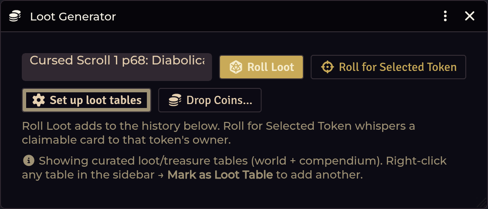

# Loot & Treasure

[← Wiki home](Home.md)

Generate a hoard for a party level, then let the party sort it out — post it as
a chat card players race to claim, or drop the whole result on the map as
pickups. No need to assign it to one player. You can still hand a hoard straight
to a single character when you want to.

---

## Opening it

| Route | How |
|---|---|
| **Crawl Bar** | **Forge & Loot** → **Loot Generator** (the menu opens on either click) |
| **API** | `game.shadowdarkEnhancer.loot.open()` |

---

## Setup: bind your treasure tables

**The module ships no treasure tables.** They are book content — you supply them.
Until you bind some, the generator has nothing to draw from, and you get a
one-time nudge at world load saying so.

Open the generator and click **Set up loot tables**. There are four tiers:

| Tier | Party level |
|---|---|
| Treasure (Levels 0–3) | 0–3 |
| Treasure (Levels 4–6) | 4–6 |
| Treasure (Levels 7–9) | 7–9 |
| Treasure (Levels 10+) | 10 and up |

Bind a RollTable to each. If you have imported the system's own *Treasure 0–3*
table, Loot Setup binds it in one click, enhanced and linked.

You can also add extra tables to the generator's picker. **Right-click a table in
the sidebar → Mark as Loot Table.** Under the hood, world tables get a flag;
compendium tables are recorded in a setting instead, since a pack table can't be
flagged in place.

---

## Generating a hoard

The window is **table-driven**: pick a loot table from the dropdown, then choose
how to deliver the result.

| Control | What it does |
|---|---|
| **Roll Loot** | Roll the selected table and add the result to the history below |
| **Roll for Selected Token** | Roll and **whisper a claimable card to that token's owner** — the fastest way to hand loot to one player |
| **Set up loot tables** | Bind a table per treasure tier (see above) |
| **Drop Coins…** | Drop a coin pile onto the canvas for anyone to pick up |

The dropdown lists **curated loot/treasure tables from both world and
compendium**. To add another, right-click any table in the sidebar and choose
**Mark as Loot Table**.

A hoard yields coins (gp / sp / cp) and items. Every result in the history has
its own delivery controls, and **you are never forced to pick a player** — the
**Give** dropdown defaults to **Party (claim in chat)**, so the whole party
decides who takes what.

| Control | What it does |
|---|---|
| **Post to Chat** | Post the result as a claimable card the party races to claim |
| **Drop on Ground** | Drop the whole result on the canvas — items become pickup-able tokens, coins a pile — for the party to divvy up in person |
| **Give**, dropdown on **Party (claim in chat)** *(the default)* | Posts the claimable card — same as **Post to Chat** |
| **Give**, dropdown on a **character** | Hands the batch straight to that one actor — items created, coins added, no card |

### The claimable chat card

<!-- TODO screenshot: images/loot-card.png — A claimable loot card in chat
     How: Loot Generator -> generate -> Post to chat; screenshot the claimable card. -->

Post the hoard to chat and **the first player to click Claim takes it**.

- Each item is claimed individually and locked to one character.
- Coins are assigned to a single chosen character and added to their
  `system.coins`.
- **First claim wins.** Claims are processed by exactly one GM client, and a
  claim in flight is locked before the write, so two players clicking at the same
  instant can't both walk away with the sword.

### Drop on the ground

**Drop on Ground** puts the whole result on the canvas instead: every item
becomes a pickup-able token and the coins a pile, clustered at your controlled
token (else the view centre). Players walk over and grab what they want from
the token HUD's pick-up button — loot division happens in the fiction, not in
a dialog. It's the same token-HUD pickup players already use for **Drop
Coins…** piles and for items they drag onto the map themselves.

### Direct delivery

Pick a character in the **Give** dropdown and press **Give** to hand the batch
straight to that actor — items created, coins added, no card.

---

## Loot drops on combat end

**Off by default** — turn on **Loot drops on combat end** in the module
settings if you want it. When a combat ends, each **defeated NPC** rolls
percentile dice against the **Loot drop chance (%)** setting (default `50`).
On a success it rolls a loot table — the treasure tier table for its level,
unless you picked a specific table for it — and posts the result as the same
claimable chat card the generator uses, one card per monster that dropped.
Only the active GM client processes the drops, so a second logged-in GM
account never doubles the cards.

**Per-NPC control:** while the feature is on, every NPC sheet gets a GM-only
**Loot** button in its header. It opens a small dialog with two fields — a
loot-table pick and a drop-chance override. Blank fields fall back to the
world settings; a chance of `0` means that monster never drops.

**One card per fight instead:** set **Loot drop mode** to
**Per encounter (one card)**. The whole combat then makes a single chance
roll and posts at most one card, generated at the **highest-level defeated
NPC's** level — and that NPC's per-NPC table/chance overrides still apply,
so a boss with a custom loot table drops from *its* table. The card's
source line lists the defeated monsters.

You can also **drop a coin pile onto the canvas** as a token. Any character can
walk up and take it from the **token HUD**. This is the low-ceremony option when
you don't want a chat card.

---

## Treasure XP

Generated treasure carries a value, and that value maps onto XP through two
thresholds:

| Setting | Default | Meaning |
|---|---|---|
| Treasure XP threshold — normal (gp) | `10` | Minimum gold value to grant normal treasure XP |
| Treasure XP threshold — fabulous (gp) | `150` | Minimum value to count as fabulous (higher XP) |

The resulting value feeds [Party XP](Party-XP.md), where you can drag a loot item
in and award its XP to the whole party.

---

## Troubleshooting

**Monsters never drop loot when combat ends.**
Loot drops are **off by default**. Turn on **Loot drops on combat end** in the
module settings, check **Loot drop chance (%)** isn't `0`, and make sure a
treasure table is bound for the monster's level tier (or pick a table for that
NPC via the **Loot** button on its sheet).

**Generating produces coins but no items.**
No treasure table is bound for that party level's tier, or the bound table has no
item links. Run **Set up loot tables**.

**A table is bound but rolls produce plain text, not items.**
The table's rows aren't linked to compendium items. Tables imported through the
[Importer Hub](Importer-Hub.md) are auto-enriched with `@UUID` links; a
hand-built table needs the links added.

**Two players both claimed the same item.**
They shouldn't be able to. Claims are serialised on a single GM client with an
in-flight lock. If you can reproduce it,
[report it](https://github.com/DimitroffVodka/shadowdark-enhancer/issues).

**A player clicked Claim and nothing happened.**
Claims are relayed to the active GM. If no GM is connected, nothing processes the
request. Check that a GM is online.

**Coins went to the wrong character.**
Coin assignment is a GM choice on the card, separate from item claims — pick the
character before assigning.

**Dragging an item onto the map leaves a second, larger image next to the pickup token.**
That extra image is a *Tile* dropped by another module — Monk's Active Tiles has
a "drop item creates a tile" option that fires on the same drop. The enhancer
now claims item drops before that runs, so only the pickup token appears; reload
your client (Ctrl+Shift+R) after updating. Monk's tile behaviour still applies to
drop types the enhancer doesn't handle.

**The "set up your loot tables" notice keeps appearing.**
It shouldn't — it fires once per world and only when fewer than four tiers are
bound. Once you bind tables and it has shown once, it stays quiet.

---

**Related:** [Magic Item Forge](Magic-Item-Forge.md) · [Party XP](Party-XP.md) · [Merchant Shop](Merchant-Shop.md) · [Importer Hub](Importer-Hub.md)
