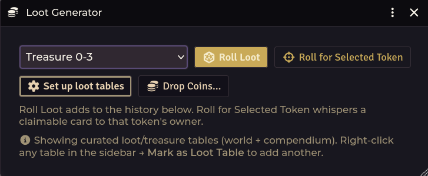
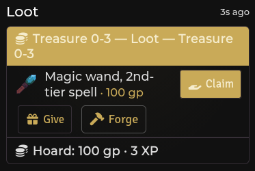

# Loot & Treasure

[← Wiki home](index.md)

Generate a hoard for a party level, then let the party sort it out: post it as
a chat card players race to claim, or drop the whole result on the map as
pickups. No need to assign it to one player. You can still hand a hoard straight
to a single character when you want to.

---

## Opening it

| Route | How |
|---|---|
| **Crawl Bar** | **Forge & Loot** → **Loot Generator** (the menu opens on either click) |
| **API** | `game.shadowdarkEnhancer.loot.open()` |

---

## Setup: bind your treasure tables

**The module ships no treasure tables.** They are book content, so you supply them.
Until you bind some, the generator has nothing to draw from, and you get a
one-time nudge at world load saying so.

Open the generator and click **Set up loot tables**. There are four tiers:

| Tier | Party level |
|---|---|
| Treasure (Levels 0–3) | 0–3 |
| Treasure (Levels 4–6) | 4–6 |
| Treasure (Levels 7–9) | 7–9 |
| Treasure (Levels 10+) | 10 and up |

Bind a RollTable to each. If you have imported the system's own *Treasure 0–3*
table, Loot Setup binds it in one click, enhanced and linked.

You can also add extra tables to the generator's picker. **Right-click a table in
the sidebar → Mark as Loot Table.** World tables get a flag, while compendium
tables are recorded in a setting instead, since a pack table can't be flagged in
place.

---

## Generating a hoard

The window is **table-driven**: pick a loot table from the dropdown, then choose
how to deliver the result.

| Control | What it does |
|---|---|
| **Roll Loot** | Roll the selected table and add the result to the history below |
| **Roll for Selected Token** | Roll and **whisper a claimable card to that token's owner**, the fastest way to hand loot to one player |
| **Set up loot tables** | Bind a table per treasure tier (see above) |
| **Drop Coins…** | Drop a coin pile onto the canvas for anyone to pick up |

The dropdown lists **curated loot/treasure tables from both world and
compendium**, and to add another you right-click any table in the sidebar and
choose **Mark as Loot Table**.

A hoard yields coins (gp / sp / cp) and items, every result in the history has
its own delivery controls, and **you are never forced to pick a player**. The
**Give** dropdown defaults to **Party (claim in chat)**, so the whole party
decides who takes what.

| Control | What it does |
|---|---|
| **Post to Chat** | Post the result as a claimable card the party races to claim |
| **Drop on Ground** | Drop the whole result on the canvas for the party to divvy up in person. Items become pickup-able tokens, coins a pile |
| **Give**, dropdown on **Party (claim in chat)** *(the default)* | Posts the claimable card, same as **Post to Chat** |
| **Give**, dropdown on a **character** | Hands the batch straight to that one actor: items created, coins added, no card |

### The claimable chat card

Post the hoard to chat and **the first player to click Claim takes it**.

- Each item is claimed individually and locked to one character.
- Coins are assigned to a single chosen character and added to their
  `system.coins`.
- **First claim wins.** Claims are processed by exactly one GM client, and a
  claim in flight is locked before the write, so two players clicking at the same
  instant can't both walk away with the sword.

### Drop on the ground

**Drop on Ground** puts the whole result on the canvas instead: every item
becomes a pickup-able token and the coins a pile, clustered at your controlled
token (else the view centre). Players walk over and grab what they want from
the token HUD's pick-up button, so loot division happens in the fiction, not in
a dialog. It's the same token-HUD pickup players already use for **Drop
Coins…** piles and for items they drag onto the map themselves.

### Direct delivery

Pick a character in the **Give** dropdown and press **Give** to hand the batch
straight to that actor: items created, coins added, no card.

---

## How loot rows become Items — precise resolution

A loot table row is prose with a price — `Unopened bottle of exceptionally potent Murgazi wine (25 gp)` — not a bare name. The module resolves that
row to a compendium Item in **two whole-name tiers** and refuses everything
else. This is deliberate: a false positive (`Murgazi wine` → the 1 gp system
`Bottle`) silently hands the player the wrong object, while an unresolved row
keeps its text and can be fabricated or linked by hand.

| Outcome | Meaning | Carries a link? |
|---|---|---|
| `exact` | the priced row, stripped, **is** the Item's name (case/spacing/curly-quote folded) | yes |
| `alias` | it is that name modulo anchored normalizations — a leading article or count, a trailing non-price parenthetical, or the **final word's** plural — which may **compose** (e.g. `2 daggers (steel)`) | yes |
| `ambiguous` | more than one distinct Item answers at the same tier (e.g. `3 bolts (2 gp)` when installed `Bolt` + `Bolts` both match that tier) | no — resolves to nothing |
| `unresolved` | no Item answers at either tier | no |

**Anchored, composable folds.** Each alias normalization is at the start, the end, or the last word — none can shorten the phrase to an interior word, and multiple can apply together. `Unopened bottle of exceptionally potent Murgazi wine` folds to itself, never to `Bottle`; `a flask of exceptionally fine oil` never becomes `Flask`; `2 daggers (steel)` reaches `dagger` via count + parenthetical + plural together. **Loose containment is refused** by design (D4 out of scope) and interior-word hits are structurally unreachable.

**Short names and punctuation are handled.** Installed three-character names (`Axe`, `Net`) resolve at `exact`; price punctuation and `each` are stripped to a fixed point, so `Dagger (1 gp).` is still `exact` and price-plus-punctuation does not need the alias tier. When a priced row itself is coin-like (`Gem shard (10 gp) each`), `classifyEntry` may route it as coin rather than a fabricated Item — **`each` still strips at the resolver**, but an unresolved text row is not guaranteed to fabricate (coins stay text by tier-specific classification).

**Foundry and module packs, system-first.** Candidate Items are loaded from every installed Item pack, filtered to the four loot types (`Weapon`, `Armor`, `Potion`, `Basic`), deduped by lower-cased name with **system packs first** then world/module packs (including `world.shadowdark-enhancer--items`). On a same-name clash a system Item wins — imports fill gaps. The index is session-cached (cleared by `game.shadowdarkEnhancer.linker.invalidate()` after bulk compendium changes or by the importer itself).

For callers: the six internal `findLink` consumers (merchant shop, treasure classification, loot generator, roll-table catalog, table-hub preview, importer-hub paste preview) keep the `null`-or-`{uuid,name,matched}` shape and treat `ambiguous` the same as `unresolved` (no link). The public `game.shadowdarkEnhancer.loot.resolve(text)` return adds `status`, `query`, and for `ambiguous` the `candidates: [{uuid,name}]` list — see [API](https://github.com/DimitroffVodka/shadowdark-enhancer/blob/master/docs/API.md#loot).

---

## Generated treasure Items — stable identity and replace-always reruns

Treasure pipelines (starting with Sea Wolf Plunder in D4) that generate Items
write only into the **managed Items pack** `world.shadowdark-enhancer--items`
(`sde-items`). Inside that pack, a document with **`flags[\"shadowdark-enhancer\"].generated === true` plus a stored `generatedItem` block** is **replace-always**: a rerun replaces the whole document at the same identity — hand edits, including art, are intentionally replaced. That boundary is **structural**: both halves required (`world.shadowdark-enhancer--items` **and** the top-level flag), never inferred from an image path, a folder, a fuzzy name, or document id.

* **Identity is `source + canonical name`.** `FNV-1a/32` over `<canonical source>:<normalized name>` (source via `sourceKey`, name via `curatedNameKey`). Renaming the definition creates a **new identity** — the old Item is not deleted (removing a definition is not a deletion). Blank source or blank name produces no identity.
* **A name collision is a refusal, not a takeover.** Since A1, generated Monster Spells share this pack (`flags[MODULE_ID].monsterSpell.generated`), and their contract is the **opposite** — hand-edited spells are **preserved** as curated conflicts (see [Monster Spell Library](Monster-Spell-Library.md)). A generated treasure definition that would take such a name is refused as `name-collision` with `monsterSpell: true`; the spell is left alone.
* **Ordinary imported Items are not affected.** Outside the pack, or without the top-level generated flag, A3 provenance governs and nothing is replace-always.
* **`folder` is placement, not content.** A rerun does not move the document; the GM's folder choice is left alone.
* **Other packages' flag namespaces survive.** An authoritative rerun restates undeclared top-level flag blocks from the stored document onto the update payload, so e.g. `shadowdark-extras` alignment is preserved through both the in-place and create-then-delete replacement paths. Declared namespaces still win.
* **Unchanged non-empty effects do not churn ids.** Stored ActiveEffects are projected through the Foundry v14 `system.changes` / string-type / JSON-value / default-`priority: 20` canonicalization, so a rerun with nothing changed is `unchanged` with stable embedded ids. An explicit `priority` in the definition is authoritative; omission means `20`.
* **Duplicate / collision rows are reported, not healed.** A 32-bit id hit where the stored `key` differs, or duplicate definitions/documents sharing one id, are returned as `identity-collision` / `duplicate-*` refusals. A pack that somehow holds two documents with one identity is reported as `duplicate-document` on the next plan.

### Sea Wolf Plunder materialization (D4)

When a RollTable is recognized as *Sea Wolf Plunder From Distant Lands* (*Cursed Scroll 3* p68), table linking (`LootCatalog.linkTableItems` or `api.loot.linkTables()`) routes it through the dedicated Sea Wolf materializer (`scripts/loot/sea-wolf-plunder.mjs`) instead of generic system-first search:

* **Source-gated recognition:** An explicit non-CS3 source flag (e.g. `source: "cs1"` or `"cs2"`) always vetoes and rejects. After that veto, an exact supported manifest ID (`cs3-sea-wolf-plunder`, `cs3/sea-wolf-plunder`, `cs3-sea-wolf-plunder-from-distant-lands`) is accepted; otherwise the exact normalized table name `Sea Wolf Plunder From Distant Lands` is required (which may be bare without a source flag, or carry a recognized `CS3` / `Cursed Scroll 3` page or separator prefix). Arbitrary tables carrying only `source: "cs3"` with other names and sourceless or explicit CS1/CS2-prefixed legacy names are refused.
* **20 managed Items:** Materializes the 20 published item phrases into `world.shadowdark-enhancer--items` under `Cursed Scroll 3 / Treasure`.
* **Priced display preserved:** Generated Item names strip only the terminal parenthesized gold value (e.g. `A wavy, silver dagger with a crescent moon pommel` or `A coffer of gold coins stamped with a dead emperor`), but the RollTable's `TableResult` retains the full published phrase with price as its display `name` (`A wavy, silver dagger with a crescent moon pommel (75 gp)`) while referencing the item's `documentUuid`. True currency-only rows (such as `100 gp`) remain `TEXT` results with source text intact.
* **Curated art & provenance:** Items receive their reviewed N3 §5.1 icons from `scripts/shared/curated-icon-maps/sea-wolf-plunder-icons.mjs` (the sourced-space `cs3` curated map) and are stamped `curated` under A3/A4 provenance.
* **Replace-always reruns:** Generated items carry `flags["shadowdark-enhancer"].generated = true` and `generatedItem` identity `cs3:<normalized item name>`. On successful or unchanged reruns, reconciliation provides stable-identity convergence without duplicating items (attempting in-place update, with create-then-delete fallback reporting any failed delete on the next plan for GM cleanup). If a row collides with a generated Monster Spell, it is refused and the spell is preserved. System compendiums (`shadowdark.gear`) are never mutated.
* **Safe TableResult writes & rollback:** TableResult updates are performed in place under stable IDs on Foundry v13/v14 (or create-before-delete on legacy adapters). Original source rows are snapshotted before writing; if an embedded write fails, restoration of the snapshot and cleanup of replacement orphans are attempted and verified. When restoration succeeds, original source rows survive intact for retry; if restoration fails, the result reports `restored: false` with `rollbackErrors`, cannot guarantee source preservation, and warns the GM that manual recovery may be required before retry. Unmapped rows, non-managed packs, unavailable table writers, or write failures where restoration succeeds remain `TEXT` with source phrases preserved.

**Programmatic access** (see [API](https://github.com/DimitroffVodka/shadowdark-enhancer/blob/master/docs/API.md#loot)):

* `game.shadowdarkEnhancer.loot.generated.identity(source, name)` — synchronous `fnv1a32:…` (`fnv1a32:573d24a5` for `CS1` + `Carved Bone`) or `""` for a blank half.
* `game.shadowdarkEnhancer.loot.generated.plan(desired, {source})` — pure, no-write (`item.source` → `{source}` → flag source); `create` / `update` with `definitionMoved`/`documentMoved` / `unchanged` / `refused` + `boundary`; outside the managed pack every definition is `out-of-boundary`; `plan` returns `null` when `findSuitePack("sde-items")` cannot find a pack.
* `game.shadowdarkEnhancer.loot.generated.reconcile(desired, {source})` — GM-only, sequential and **retryable, not transactional**: failed creates, missing targets, and throwing updates are returned in `failures` (`create-failed` / `missing-target` / `update-failed`, each with `error: string|null`) and the rest of the batch continues; a later rerun retries them. One exception is not self-healing: a create-then-delete update whose **delete fails** leaves two documents with one identity, reported next time as `duplicate-document` for GM cleanup. A notification aggregates refused + failed names. An empty pack reconciles and creates; a missing pack is provisioned via `ensureLootPack()`; only a non-GM `reconcile` returns `null`.

---

## Loot drops on combat end

**Off by default.** Turn on **Loot drops on combat end** in the module
settings if you want it. When a combat ends, each **defeated NPC** rolls
percentile dice against the **Loot drop chance (%)** setting (default `50`).
On a success it rolls a loot table (the treasure tier table for its level,
unless you picked a specific table for it) and posts the result as the same
claimable chat card the generator uses, one card per monster that dropped.
Only the active GM client processes the drops, so a second logged-in GM
account never doubles the cards.

**Per-NPC control:** while the feature is on, every NPC sheet gets a GM-only
**Loot** button in its header. It opens a small dialog with two fields, a
loot-table pick and a drop-chance override, where blank fields fall back to the
world settings and a chance of `0` means that monster never drops.

**One card per fight instead:** set **Loot drop mode** to
**Per encounter (one card)**. The whole combat then makes a single chance
roll and posts at most one card, generated at the **highest-level defeated
NPC's** level. That NPC's per-NPC table/chance overrides still apply,
so a boss with a custom loot table drops from *its* table. The card's
source line lists the defeated monsters.

You can also **drop a coin pile onto the canvas** as a token. Any character can
walk up and take it from the **token HUD**. This is the low-ceremony option when
you don't want a chat card.

---

## Treasure XP

Generated treasure carries a value, and that value maps onto XP through two
thresholds:

| Setting | Default | Meaning |
|---|---|---|
| Treasure XP threshold — normal (gp) | `10` | Minimum gold value to grant normal treasure XP |
| Treasure XP threshold — fabulous (gp) | `150` | Minimum value to count as fabulous (higher XP) |

The resulting value feeds [Party XP](Party-XP.md), where you can drag a loot item
in and award its XP to the whole party.

---

## Troubleshooting

**"Your GM's Foundry tab needs a reload before loot claims can land."**
(Or *…before item drops and pickups can land.*) Claiming, dropping and picking
up all happen on the **active GM's** client, and that tab has been open since
before the module was updated, so it is running code that doesn't know about the
action. The module pings the GM and compares versions before sending, so a claim
warns instead of doing nothing at all; the claim button is handed back rather
than left greyed out. Have the GM reload their tab. See
[Troubleshooting](Troubleshooting.md#a-player-action-does-nothing-and-no-error-appears).

**Monsters never drop loot when combat ends.**
Loot drops are **off by default**. Turn on **Loot drops on combat end** in the
module settings, check **Loot drop chance (%)** isn't `0`, and make sure a
treasure table is bound for the monster's level tier (or pick a table for that
NPC via the **Loot** button on its sheet).

**Generating produces coins but no items.**
No treasure table is bound for that party level's tier, or the bound table has no
item links. Run **Set up loot tables**.

**A table is bound but rolls produce plain text, not items.**
The table's rows aren't linked to compendium items. Tables imported through the
[Importer Hub](Importer-Hub.md) are auto-enriched with `@UUID` links. A
hand-built table needs the links added.

A row that prints a whole family of objects at once (`Meteorite 1d4: 1. lute,
2. viol, 3. harp, 4. flute`) is a special case and needs no links: the die is
rolled and you get the one it picked, as a real treasure item (*Meteorite harp*).
A comma before the die makes the option a property instead of the noun, matching
how the books print it: `Mithral Bottle, 1d4: 1. wine…` gives *Mithral Bottle
(wine)*.

**Two players both claimed the same item.**
They shouldn't be able to. Claims are serialised on a single GM client with an
in-flight lock. If you can reproduce it,
[report it](https://github.com/DimitroffVodka/shadowdark-enhancer/issues).

**A player clicked Claim and nothing happened.**
Claims are relayed to the active GM. If no GM is connected, nothing processes the
request. Check that a GM is online.

**Coins went to the wrong character.**
Coin assignment is a GM choice on the card, separate from item claims. Pick the
character before assigning.

**Dragging an item onto the map leaves a second, larger image next to the pickup token.**
That extra image is a *Tile* dropped by another module. Monk's Active Tiles has
a "drop item creates a tile" option that fires on the same drop, and the enhancer
now claims item drops before that runs, so only the pickup token appears. Reload
your client (Ctrl+Shift+R) after updating. Monk's tile behaviour still applies to
drop types the enhancer doesn't handle.

**The "set up your loot tables" notice keeps appearing.**
It shouldn't. It fires once per world and only when fewer than four tiers are
bound. Once you bind tables and it has shown once, it stays quiet.

---

**Related:** [Magic Item Forge](Magic-Item-Forge.md) · [Party XP](Party-XP.md) · [Merchant Shop](Merchant-Shop.md) · [Importer Hub](Importer-Hub.md)
