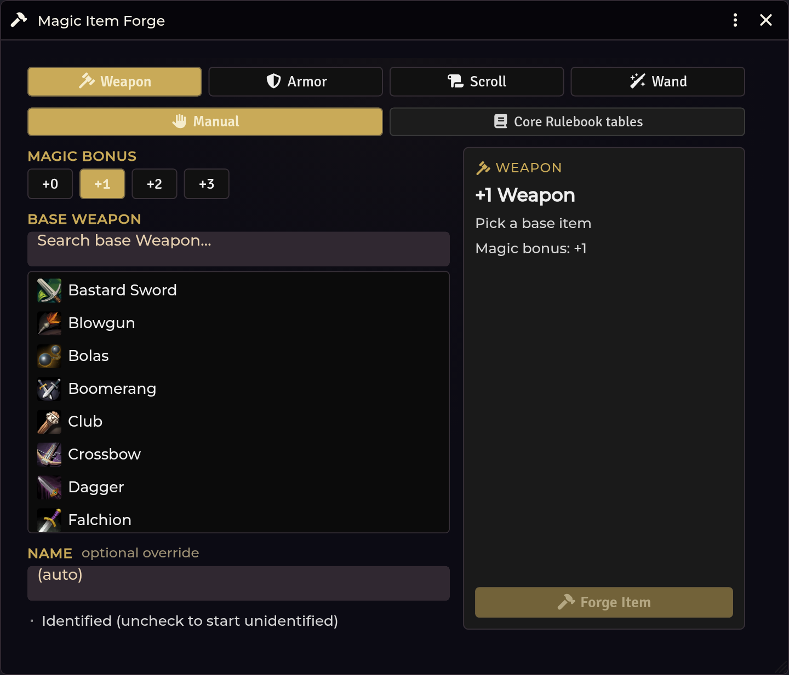

# Magic Item Forge

[← Wiki home](Home.md)

Roll or hand-build a magic item and create it as a real Foundry item.

---

## Opening it

| Route | How |
|---|---|
| **Crawl Bar** | Right-click **Forge & Loot** → **Magic Item Forge** |
| **API** | `game.shadowdarkEnhancer.forge.open()` |

Treasure and loot placeholders hand a **stable type hint** into the Forge, so
clicking through from a rolled hoard arrives with the right kind of item
pre-selected.

---

## Two modes

### Manual mode

Build the item by hand: pick the type, set the bonus (`+0` to `+3`), and compose
benefits, curses, personality, and the name. This mode works out of the box and
needs no imported content.

### Core Rulebook tables mode

Reads **your own imported** Core magic-item tables from the managed pack, and
rolls the item the way the book does.

**Phase 1 covers weapons and armour.** Spell items and other types stay in manual
mode.

Each item type draws on a set of tables:

| Set | Weapon | Armour |
|---|---|---|
| **Base recipe** (Type / Bonus / Feature) | `magic-weapon-base` | `magic-armor-base` |
| **Benefit** | `magic-weapon-benefit` | `magic-armor-benefit` |
| **Curse** | `magic-weapon-curse` | `magic-armor-curse` |
| **Item Virtue / Flaw / Personality** | `magic-personality-detail` | `magic-personality-detail` |

Each set reports its own **readiness**. A set you haven't imported shows what's
missing with a one-click seeded import into the [Importer Hub](Importer-Hub.md).
Benefit and Curse are independent — you can roll one without the other.

Per set you can **roll**, **pick**, **re-roll**, or **clear**.

---

## What becomes a real mechanic

This is the important rule, and it is deliberately conservative:

> **Only a whole-result `+N` becomes a real mechanic.** A weapon gets Active
> Effects; armour gets an AC modifier. **Everything else is escaped descriptive
> text.**

The rolled *Type* is treated as a **hint for choosing the base item**, not as a
mechanical assertion.

Why: rolled table text is prose, and prose interpreted as mechanics produces
wrong numbers silently. Descriptive text you can read at the table is honest
about what it is. If a rolled benefit should have teeth, add the effect yourself
after creating the item.

Creation is **fail-closed** — if the Forge can't produce a valid item it refuses
rather than creating something half-formed.

---

## Unique features

The **Magic item unique-feature chance (%)** setting (default `100`) controls how
often a generated item picks up a unique feature. `100` means always.

---

## Troubleshooting

**Core mode isn't selectable.**
It is Phase-1 weapon/armour only. Selecting a spell item or another type forces
manual mode.

**A set says it isn't ready.**
Its tables aren't imported, or a column is missing or invalid. The panel names
exactly what's wrong; the import button seeds the hub with the right table.

**I rolled a benefit but the item has no bonus.**
Expected — see the rule above. Only a whole-result `+N` becomes a mechanic; the
benefit text is descriptive. Add an Active Effect by hand if you want it to
apply.

**The window's content runs off-screen.**
Fixed in v0.11.x — the Forge root scrolls. If you still see it, hard-reload with
`Ctrl+Shift+R`; your browser is serving a cached stylesheet.

**Create does nothing.**
Creation is fail-closed. Something required is missing — check that a base type
is selected and, in core mode, that the base recipe set has a result.

---

**Related:** [Loot & Treasure](Loot-and-Treasure.md) · [Importer Hub](Importer-Hub.md)
