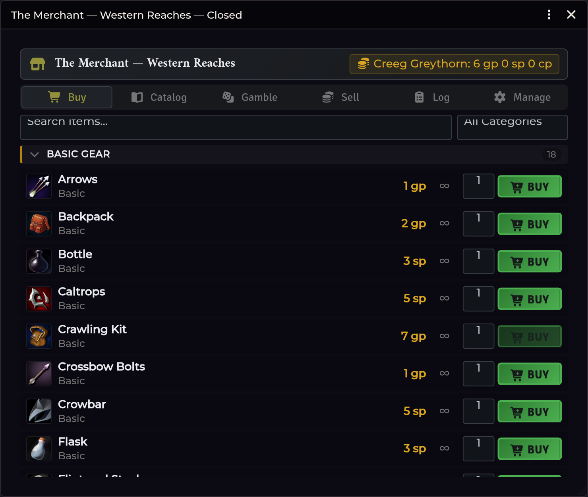

# Merchant Shop

[← Wiki home](Home.md)

A GM-run shop that opens for every player at once. Players buy and sell against
their own `system.coins`, and every transaction is logged.

---

## Opening it

| Route | How |
|---|---|
| **Crawl Bar** | Right-click **Forge & Loot** → **Merchant Shop** |
| **API** | `game.shadowdarkEnhancer.merchant.openLocally()` |

The GM opens the shop; it appears for **all connected players simultaneously**.

### Player opt-in mode

You can also leave the shop **available** rather than forcing it open. Players
then open and close their own shop window at will — from a chat card or the crawl
strip — until you close the shop. This is persisted, so a reload restores it.

Players read a **snapshot** of the inventory taken when you made the shop
available, so opening the window doesn't need a round trip to the GM. The
snapshot refreshes whenever inventory changes.

---

## Two inventory sources

| Source | What it is |
|---|---|
| **Compendium catalog** | A curated list you assemble from compendium items |
| **An NPC's own inventory** | The shop sells what that actor is carrying |

Actor mode is the one to use for "you meet a peddler on the road" — sell them the
peddler's actual goods, and the peddler's stock depletes.

## The buy list

Grouped into collapsible category sections:

**Basic Gear · Weapons · Armor · Scrolls · Wands · Potions · Poisons** — plus an
**Other** bucket for anything uncategorised.

## Buying and selling

- **Buying** deducts from the character's purse and creates the item on them.
  A player who can't afford it is refused, and their coins are untouched.
- **Selling** removes the item and pays out at the **sell ratio** — the
  percentage of an item's value the shop pays back.

| Setting | Default | Range |
|---|---|---|
| Merchant Sell Ratio (%) | `50` | 0–100, in steps of 5 |
| Merchant Shop Name | `The Merchant` | — |

> **These are set in the shop window, not in Configure Settings.** They are
> world settings, but deliberately not listed in Foundry's settings UI — you
> change them where you use them.

There is also a **Buy Markup (%)** (default `100`) for running a sale or a
gouging merchant — the shop window accepts `10`–`500`. (Setting it to `0` for
free goods is possible via the API's `open({ buyMultiplier: 0 })`, not the UI.)

> **Transactions are serialised.** Every buy and sell is queued on a single
> processing client, so two players spending the last of a shared purse — or
> buying the last item in stock — can't both succeed. No double-spending, no
> overselling.

## Saved merchants

The module seeds two saved merchant configurations at world load, idempotently:

| Merchant | Stock |
|---|---|
| **The Merchant - Base** | Core system gear |
| **The Merchant - Western Reaches** | Base gear plus enhancer items (fills in once its item pack exists) |

Save your own configurations alongside them.

## The transaction log

Every purchase and sale is recorded and **exportable to Discord** as markdown.
Transactions also feed the [Session Recap](Session-Recap.md) automatically.

---

## Troubleshooting

**A player says the shop won't open.**
Either the GM hasn't opened it, or it isn't marked available to players. Check
the shop's availability toggle.

**A purchase went through but the player has no item.**
The item is created on the *buying actor* — if a player controls several actors,
check the one they had selected in the shop.

**Quantities are wrong after a purchase.**
The created item's quantity is always overridden to what was bought — it does not
inherit the merchant's stack size. If you see a stack size instead of the bought
quantity, that's a bug worth
[reporting](https://github.com/DimitroffVodka/shadowdark-enhancer/issues).

**Selling paid the wrong amount.**
Check the sell ratio. At the default `50`, a 10 gp item sells back for 5 gp.

**A sale restocked the wrong inventory.**
This was a real bug fixed in v0.11.x: a headless active GM (window closed, or a
second GM relaying for a player) restocked an actor-mode sale into the compendium
inventory. If you are on an older build, update.

**Stock didn't go down after a purchase.**
Compendium-catalog mode sells from an unlimited list by design. Use actor mode if
you want depletion.

---

**Related:** [Loot & Treasure](Loot-and-Treasure.md) · [Session Recap](Session-Recap.md)
