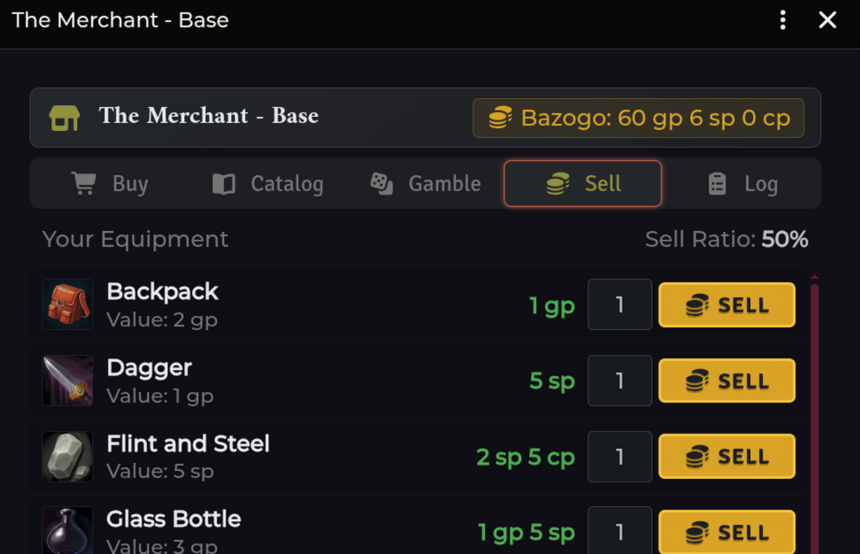
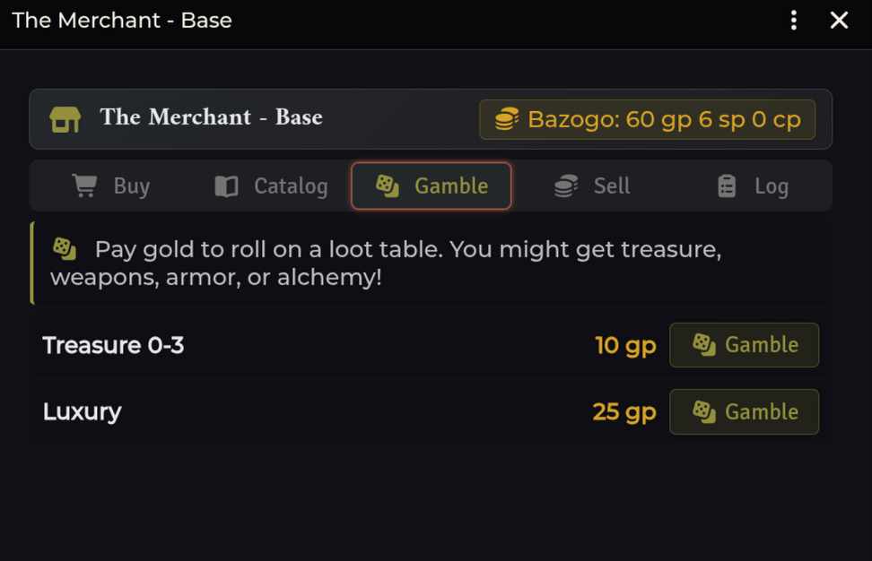
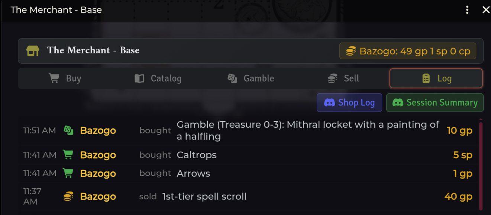

# Merchant Shop

[← Wiki home](index.md)

A GM-managed shop window that opens for all connected players simultaneously.
Players buy and sell items directly using their character coins, and all
transactions are logged automatically.

---

## Opening the Merchant Shop

| Route | How |
|---|---|
| **Crawl Bar** | Right-click **Forge & Loot** → **Merchant Shop** |
| **API** | `game.shadowdarkEnhancer.merchant.openLocally()` |

When opened by the GM, the shop window opens for **all connected players**.

### Player opt-in mode

You can also make the shop **Available** without forcing windows open.
Players can then open and close their shop window at will from the crawl strip
or chat cards until you close the shop.

---

## Two inventory sources

| Source | Description |
|---|---|
| **Compendium catalog** | An unlimited catalog assembled from compendium items |
| **NPC inventory** | Sells items carried directly on an NPC actor's sheet |

Use **NPC inventory mode** for wandering merchants and peddlers: selling goods
depletes the NPC's actual stock.

---

## The buy list

Items are organized into collapsible category sections:

**Basic Gear · Weapons · Armor · Scrolls · Wands · Potions · Poisons · Other**

---

## Buying and selling

- **Buying:** Deducts coin from the character's purse and creates the item in
  their inventory. Purchases are rejected if the character cannot afford the
  price.
- **Selling:** Removes the item from inventory and awards coin based on the
  **Sell Ratio** (the percentage of base item value paid out).

| Shop Setting | Default | Range |
|---|---|---|
| **Merchant Sell Ratio (%)** | `50%` | 0–100% (in 5% increments) |
| **Merchant Shop Name** | `The Merchant` | Custom text |
| **Buy Markup (%)** | `100%` | 10–500% |

These settings are adjusted directly inside the shop window header.

> **Transactions are serialized:** Buys and sells are queued and processed one
> at a time on the host client. Two players attempting to buy the last limited
> item in stock cannot double-buy it.

### The extortion price swing

A character who earned a **25% price swing** via [Downtime](Downtime.md)
extortion automatically applies it to their **next** shop transaction:

- Purchases cost **25% less**.
- Sales pay out **25% more**.

The discount is tracked on that specific character, stacks with current markup,
and is consumed only when a transaction successfully completes.

---

## Saved merchants

The module includes two pre-configured merchant stock templates:

| Preset | Inventory |
|---|---|
| **The Merchant - Base** | Standard Shadowdark core rulebook gear |
| **The Merchant - Western Reaches** | Core gear plus Western Reaches expanded items |

New worlds load **The Merchant - Base** by default. You can switch presets or
save your own custom merchant inventories under **Manage → Saved Merchants**.

---

## Gambling on loot tables

To allow gambling, check **Allow players to gamble on loot tables** on the
Manage tab and add table options with gold costs.

When a player pulls the lever, the cost is deducted and the drawn result converts
to inventory items using standard [Loot Generator](Loot-and-Treasure.md) logic:

| Rolled Result | Item Granted |
|---|---|
| **Linked Item** | Adds the linked document to the character |
| **Nested RollTable** | Evaluates child tables up to 3 levels deep |
| **Currency text** (e.g. `10 cp in pouch`) | Adds coins directly to purse |
| **Sub-roll text** (e.g. `Meteorite 1d4: 1. harp…`) | Rolls sub-item and creates treasure |
| **Mundane item name** (e.g. `Torch`) | Creates matching gear item |
| **Priced treasure text** | Creates treasure item worth that amount |
| **Flavor text** | Printed on the chat card without creating items |

---

## The transaction log

Every purchase, sale, and gamble roll is recorded in the shop's **Log** tab and
mirrors to the [Session Recap](Session-Recap.md).

Click **Shop Log** to copy the shop's transaction history to your clipboard in
clean Discord markdown.

---

## Troubleshooting

**A player cannot open the shop.**  
Verify that the shop is open or that the **Available** toggle is turned on.

**\"Your GM's Foundry tab needs a reload before shop transactions can land.\"**  
The active GM client is running an outdated tab script. Have the GM refresh
their browser tab (`F5` or `Ctrl+R`).

**A purchase completed, but the item is missing.**  
Items are created on the active actor selected in the shop header. If a player
controls multiple characters, check their other sheets.

**Item quantities are incorrect after purchase.**  
Purchased items receive the exact quantity bought, overriding any template
defaults.

**Stock did not deplete after a purchase.**  
Compendium catalog mode provides unlimited stock. Use **NPC inventory mode**
if you want items to deplete as they are sold.

---

**Related:** [Loot & Treasure](Loot-and-Treasure.md) · [Session Recap](Session-Recap.md) · [Downtime](Downtime.md)
