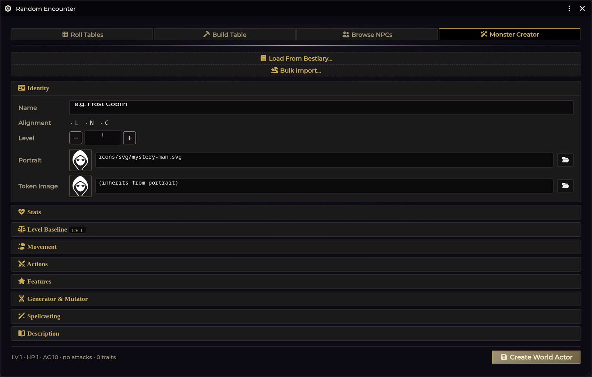

# Monster Creator

[← Wiki home](Home.md)

Build a Shadowdark creature from scratch, remix an existing one, or roll a new
one on your own imported Core Rulebook generator tables — then save it as a real
world Actor.

---

## Opening it

| Route | How |
|---|---|
| **Encounter Roller** | Open the roller (Crawl Bar → **Encounter**) and pick the fourth tab |
| **API** | `game.shadowdarkEnhancer.monsterCreator.open()` |

Your draft persists when you switch tabs, so you can bounce to **Browse NPCs**
to look something up and come back without losing work.

---

## The stat block

Every section is editable:

| Section | Fields |
|---|---|
| **Identity** | Name, alignment (L / N / C), level (with **−** / **+** buttons) |
| **Level Baseline** | What the level's guidelines expect, and a one-click apply |
| **Stats** | HP, AC (with a free-text note), dark-adapted flag, all six ability modifiers |
| **Movement** | The system's move type, plus a free-text note |
| **Spellcasting** | Casting ability, spell bonus, spells per round |
| **Actions** | Attacks and special attacks, as removable rows |
| **Features** | Passive traits, as removable rows |
| **Description** | Free text |

### Quick-pick catalogs

Actions and Features each have a preset catalog. Clicking a preset
**deep-clones** it into your draft, so editing the copy never touches the
catalog. You can always type a custom entry instead.

**Actions (12):** Fist · Bite · Claw · Longsword · Greataxe · Shortbow · Sling ·
Throwing Knife · Gaze · Breath Weapon · Poison · Sting

**Features (14):** Magic Resistance · Mob · Pack Tactics · Petrify · Regenerate ·
Brutal · Ambush · Keen Senses · Dodge · Burrow · Blood Drain · Disease · Poison ·
Undead

### Spells

Attach spells with a debounced compendium search and a tier filter. Matches
appear as removable chips.

### Art

Portrait and token art are set through Foundry's FilePicker. **Leave the token
art empty and it inherits the portrait.**

---

## Level Baseline

<!-- TODO screenshot: images/monster-creator-baseline.png — The Level Baseline section
     How: Monster Creator -> set a level -> expand Level Baseline on a draft whose
     stats differ from the guideline, so the diff table is populated. -->

Answers "is this creature actually a level 6?" while you build. The section
header carries the level it is judging — **LV 6** — and the table diffs your
draft against it:

| Column | Meaning |
|---|---|
| **Stat** | AC, HP, Abilities, Attacks |
| **Now** | what the draft holds |
| **Guideline** | what the level expects |
| **Δ** | the difference |

Rows that already match are dimmed. **Each row has a checkbox**, and
**Apply to draft** writes only the checked ones. Nothing reaches the world until
you save — this is a draft edit, so there is no undo to manage.

If the draft has spells attached, a note reports that they push the creature
above its written level — *Written LV 5 → plays as LV 9* — with a **Use LV 9**
button that adopts that level. The guidelines shown are for the *effective*
level; your written level is never changed behind your back.

HP is applied as **`level × 4.5 + CON`, rounded up**, so ticking **Abilities**
changes what the HP row promises. For the full rules — where the numbers come
from, how ability modifiers are clamped, and how to edit the table — see
[Monster Level Guidelines](Monster-Level-Guidelines.md).

---

## Starting from an existing creature

The **bestiary loader** searches every world and compendium NPC and loads one
into the draft. This is the fast path for variants — load *Goblin*, bump the
level, add a feature, save as *Goblin Chieftain*.

Art is resolved intelligently on load, including community token mappings, so a
loaded creature usually arrives with its art already attached.

### Editing a creature in place

There is a second way in, and it behaves differently. **Open in Creator** on the
token [Quick Adjust](Monster-Level-Guidelines.md) panel loads that creature *and
remembers where it came from*. A banner appears at the top of the Creator:

> **Editing Ogre** *(world actor)*  · **Detach**

The save bar changes to match — **Update Ogre** alongside **Save as New**:

| Button | What it does |
|---|---|
| **Update *name*** | Writes your changes back to that creature. No duplicate is created. |
| **Save as New** | Creates a separate monster and leaves the original untouched. |
| **Detach** | Breaks the link. The save bar returns to **Create World Actor**. |

On an **unlinked token** the banner reads *(this token only)* — you are editing
that token's own copy, not the shared world actor.

Updating reconciles items rather than replacing them wholesale: an attack you did
not touch keeps its identity. Item types the Creator does not author — Effects,
Talents, gear — are left completely alone.

> If the creature had a Quick Adjust restore point, updating **clears** it and
> says so. The restore point described the stats before the adjustment and can no
> longer be trusted once the Creator has rewritten those items.

---

## Generator & Mutator

<!-- TODO screenshot: images/monster-generator.png — The generator and mutator panel
     How: Monster Creator -> expand Generator & Mutator (needs the Core generator tables imported). -->

Two optional panels that read **your own imported** Core Rulebook tables from the
managed pack:

| Panel | Source table | Shape |
|---|---|---|
| **Generator** | *Monster Generator* | `d20` × **4 columns** |
| **Make It Weird** | monster mutations | `d12` × **3 columns** |

Each set **unlocks independently** once all of its columns are imported and
valid. Until then the panel shows exactly what is missing, with a one-click
import that seeds the [Importer Hub](Importer-Hub.md).

Roll or hand-pick a result per column, then either:

- **Apply to the draft** — the results are added as **descriptive NPC Features
  only**, or
- **Spawn a variant copy** — creates a separate mutated creature.

> **Generated results never change mechanics.** Stats, attacks, movement, and
> spellcasting are left exactly as they were. The tables produce flavour, and
> flavour is what gets written. If you want a generated result to have teeth, add
> the mechanic yourself.

Applied results can be removed again per set.

---

## Saving

**Create World Actor** validates the name, then creates a `type: "NPC"` world
Actor with the Attack / Special / Feature / Spell entries embedded as real items.

A live summary sits beside it — `LV 1 · HP 1 · AC 10 · no attacks · 0 traits` —
so you can see the creature's shape without expanding every section.

If the draft was loaded from a live creature, this button reads **Update *name***
instead and writes back to it — see
[Editing a creature in place](#editing-a-creature-in-place) above.

There is also a **Bulk import** shortcut that jumps to the paste-to-create
monster importer for when you have a stack of stat blocks rather than one
creature. See [Importer Hub](Importer-Hub.md).

---

## Troubleshooting

**The Generator panel says a set isn't ready.**
All columns of that set must be imported and valid. The panel lists which ones
are missing, ambiguous, or invalid — click the import button to seed the hub with
the right table.

**Save does nothing.**
The name is empty. It is the only required field.

**A loaded creature came in without art.**
Art resolution is name-based and falls back through aliases and fuzzy matching.
Set it by hand with the FilePicker, or see
[Monster Token Art](Monster-Token-Art.md) for the full art manager.

**My draft vanished.**
Drafts survive tab switches within the roller, but not closing the window. Save
before you close.

**Applied generator results didn't change the creature's stats.**
That is by design — see the note above.

**I saved and got a duplicate instead of updating the original.**
The draft was not linked to a creature. The link only exists when you arrive via
**Open in Creator** from the token Quick Adjust panel — the bestiary loader
deliberately does *not* link, because its job is building variants. Check the save
bar: **Update *name*** means linked, **Create World Actor** means it will make a
new one.

**Save as New made a copy but my next save updated the original.**
It shouldn't — **Save as New** breaks the link, and the button reverts to
**Create World Actor**. If you saw otherwise, the draft was re-linked in between
(re-opening from Quick Adjust does that).

**The Level Baseline section says everything matches, but the creature feels off.**
It only judges AC, HP, ability modifiers and attack items. Features, spells and
special attacks carry a lot of a creature's real weight and are not scored. Spells
at least get a note — see
[Monster Level Guidelines](Monster-Level-Guidelines.md).

**Apply to draft didn't change my ability modifiers.**
They were already inside the level's band, so the guideline had nothing to
correct. Untick nothing and change the level to see them move.

---

**Related:** [Monster Level Guidelines](Monster-Level-Guidelines.md) · [Random Encounters](Random-Encounters.md) · [Monster Token Art](Monster-Token-Art.md) · [Importer Hub](Importer-Hub.md)
