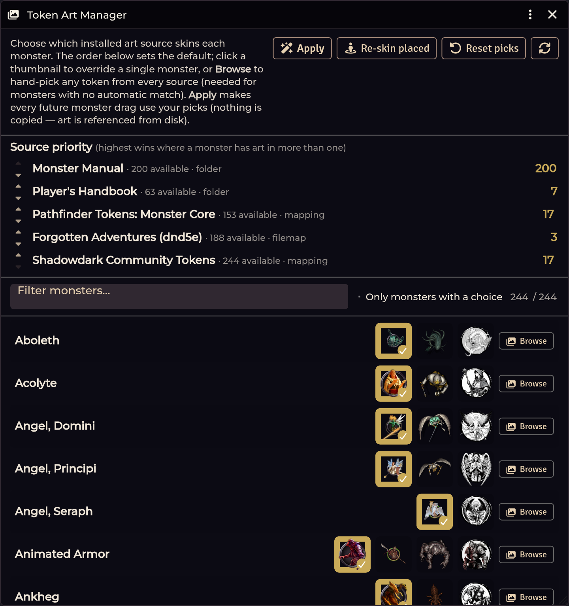

# Monster Token Art

[← Wiki home](Home.md)

Re-skin the Shadowdark bestiary with token art you already own — **referenced by
path, never copied or bundled**.



---

## The licensing position, up front

This tool **redistributes nothing**. It writes a mapping that points Foundry at
image files already sitting in your `Data/modules` folder. If you don't own an
art pack, it doesn't appear in the list and nothing about it is shipped in this
module.

That also means the art follows your install, not your world — a player who
doesn't have the art module sees the default images.

## Opening it

**Actors sidebar → Monster Art** (GM only), or:

```js
game.shadowdarkEnhancer.tokenArt.openManager();
```

---

## Sources

Sources are **auto-discovered from what is installed**. A source you don't have
simply isn't listed. Recognised out of the box:

| Source | Where it looks |
|---|---|
| **Monster Manual** | `modules/dnd-monster-manual` — includes its dynamic ring and per-token scale |
| **Player's Handbook** | `modules/dnd-players-handbook` |
| **Pathfinder: Monster Core** | `modules/pf2e-tokens-monster-core` |
| **Any other `pf2e-tokens-*` module** | Auto-added, including the pf2e **iconic** PC/companion portraits |
| **Forgotten Adventures** | `systems/dnd5e/tokens` — the set bundled with the dnd5e system |
| **Community Tokens** | `modules/shadowdark-community-tokens` |

The art module needs to be **installed**, not necessarily **enabled** — art is
read from disk.

## How art gets matched

In order:

1. **A source's own mapping file**, when it ships one keyed to Shadowdark.
2. **Exact name match** against the source's token files.
3. **Semantic aliases** — Shadowdark renames several D&D creatures to avoid IP.
   The matcher tries the D&D name too, so any source carrying the original
   matches:

   | Shadowdark | Also tried |
   |---|---|
   | Brain Eater | Mind Flayer, Illithid |
   | Stingbat | Stirge |
   | Mushroomfolk | Myconid |
   | Grimlow | Grimlock |
   | Smilodon | Saber-toothed Tiger |
   | Viperian | Yuan-ti, Serpentfolk |
   | Deep One | Kuo-toa |
   | Angel Principi / Domini / Archangel | Deva / Planetar / Solar |
   | Peasant · Soldier | Commoner · Veteran |

   Plus snake and swarm naming variants across packs.
4. **Fuzzy match**, with a configurable minimum score.

Shadowdark-original creatures with no D&D counterpart are pinned to Community art.

---

## Using it

### Source priority

**Drag the sources into the order you want.** The first source with a match wins.

### Per-monster override

Every monster row can be overridden individually. A hand-picked image **always
beats source priority**.

### The image browser

<!-- TODO screenshot: images/token-art-browser.png — The token image browser
     How: Monster Art -> Browse on any monster; screenshot the image grid. -->

**Browse** on any monster opens a searchable grid of *every* installed token
across all sources — typically 2,000+ files. It is:

- **grouped by source** with sticky headers,
- **zoomable** — slider, `Ctrl`+scroll, `Ctrl` `+`/`-`, `Ctrl 0` to reset,
- **filterable as you type**.

This is how you skin a monster whose name matches nothing.

### Applying

| Button | Effect |
|---|---|
| **Apply** | Write the mapping and inject it at runtime — **no world relaunch needed**. Every future monster drag uses your picks. |
| **Re-skin placed** | Update tokens already on your scenes |
| **Reset picks** | Clear your per-monster overrides |

To turn the overlay off entirely and restore the system's default art, use the
API: `game.shadowdarkEnhancer.tokenArt.restoreCompendium()`.

The source list shows, per source, how many tokens it **has** and how many
monsters it is currently **winning** — so you can see at a glance what
re-ordering would change.

### Imported monsters get art too

The overlay skins the module's own imported-monster pack (`sde-actors`) alongside
`shadowdark.monsters` — so Cursed Scroll and Western Reaches monsters you import
through the [Importer Hub](Importer-Hub.md) can carry token art just like the
base bestiary.

### Presentation is inherited

Dynamic ring settings and fill scale come from the source, so large art fills its
footprint and flat art sits correctly. You don't hand-tune scale per monster.

---

## Scripting it

```js
const art = game.shadowdarkEnhancer.tokenArt;

await art.openManager();          // the full manager window
await art.applyToCompendium();    // generate + inject the overlay
await art.apply({ scene, actors, portraits, dryRun, minScore });  // re-skin placed tokens
art.resolve(name, sets, source, minScore);   // pure match → { token, portrait, score } | null
await art.restoreCompendium();    // turn the overlay back off
```

`dryRun` reports what *would* change without writing anything — worth running
first on a big world.

---

## Troubleshooting

**A source I own isn't listed.**
The module must be installed under `Data/modules` with the expected folder
layout. Check that its `assets/tokens` folder exists.

**Art didn't change after Apply.**
Apply injects at runtime, so no relaunch is needed — but already-placed tokens
keep their existing image until you click **Re-skin placed tokens**.

**A monster matched the wrong creature.**
Fuzzy matching is doing its best on a name that isn't distinctive. Use **Browse**
to pick the right image by hand; the override wins permanently.

**Players see the default art.**
They don't have the art module installed. Art is referenced by path, so each
client needs the files locally. This is a consequence of not redistributing
artwork.

**Imported monsters have no art.**
Confirm they landed in `sde-actors` (the module's pack) rather than as loose
world actors. See [Compendium Packs](Compendium-Packs.md).

---

**Related:** [Monster Creator](Monster-Creator.md) · [Compendium Packs](Compendium-Packs.md) · [CREDITS.md](../../CREDITS.md)
