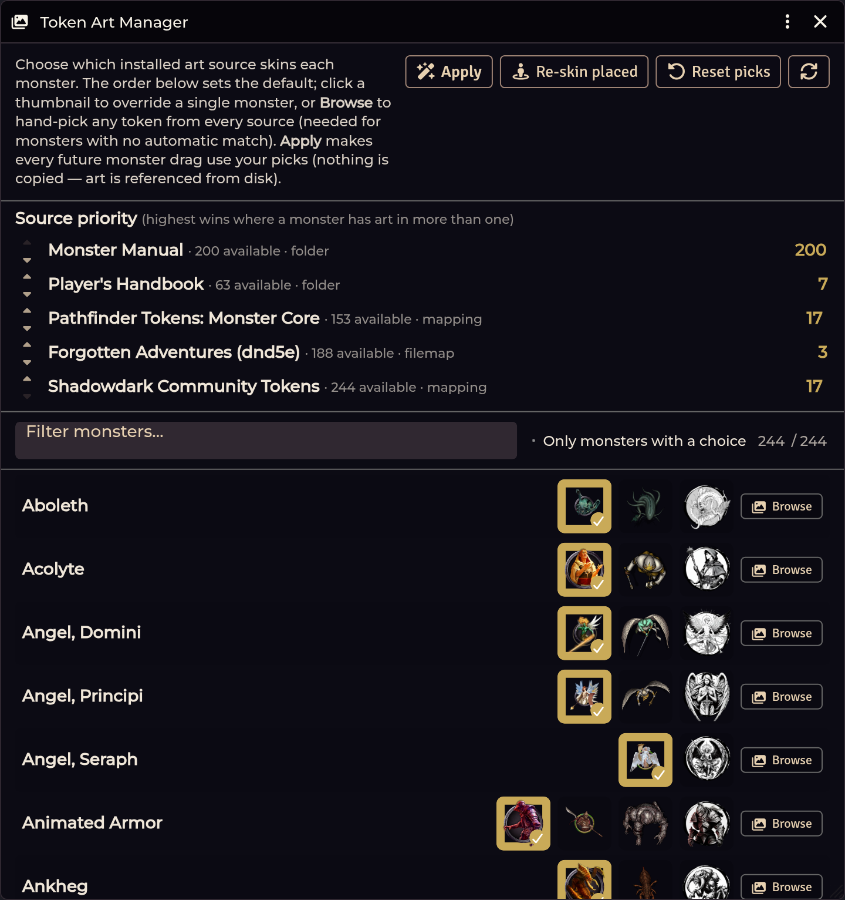

# Monster Token Art

[← Wiki home](index.md)

Re-skin the Shadowdark bestiary with token art you already own, **referenced by
path, never copied or bundled**.



---

## The licensing position, up front

This tool **redistributes nothing**. It writes a mapping that points Foundry at
image files already sitting in your `Data/modules` folder. If you don't own an
art pack, it doesn't appear in the list and nothing about it is shipped in this
module.

That also means the art follows your install, not your world. A player who
doesn't have the art module sees the default images.

## Opening it

**Actors sidebar → Monster Art** (GM only), or:

```js
game.shadowdarkEnhancer.tokenArt.openManager();
```

---

## Sources

Sources are **auto-discovered from what is installed**. A source you don't have
isn't listed. Recognised out of the box:

| Source | Where it looks |
|---|---|
| **Monster Manual** | `modules/dnd-monster-manual`, including its dynamic ring and per-token scale |
| **Player's Handbook** | `modules/dnd-players-handbook` |
| **Pathfinder: Monster Core** | `modules/pf2e-tokens-monster-core` |
| **Pathfinder Tokens: NPC Core** | `modules/pf2e-tokens-npc-core`, humanoid townsfolk/soldier/cultist art with mapped scale and dynamic ring support |
| **Pathfinder: Character Gallery** | `modules/pf2e-tokens-characters`, including token, portrait, and subject art with mapped scale and dynamic ring support |
| **Shadowdark Community Tokens** | `modules/shadowdark-community-tokens`, including both `artwork/` and `monster24/` token trees |
| **Too Many Tokens** | `modules/too-many-tokens-dnd`, 16,000+ token images available in Browse |
| **Forgotten Adventures** | `systems/dnd5e/tokens`, the set bundled with the dnd5e system |
| **Any other `pf2e-tokens-*` module** | Auto-added, including the pf2e **iconic** PC/companion portraits |

The art module needs to be **installed**, not necessarily **enabled**. Art is
read from disk.

## How art gets matched

In order:

1. **A source's own mapping file**, when it ships one keyed to Shadowdark.
2. **Exact name match** against the source's token files.
3. **Semantic aliases.** Shadowdark renames several D&D creatures to avoid IP.
   The matcher tries the D&D name too, so any source carrying the original
   matches:

   | Shadowdark | Also tried |
   |---|---|
   | Brain Eater | Mind Flayer, Illithid |
   | Stingbat | Stirge |
   | Mushroomfolk | Myconid |
   | Grimlow | Grimlock |
   | Smilodon | Saber-toothed Tiger |
   | Viperian | Yuan-ti, Serpentfolk |
   | Deep One | Kuo-toa |
   | Angel Principi / Domini / Archangel | Deva / Planetar / Solar |
   | Peasant · Soldier | Commoner · Veteran |

   Plus snake and swarm naming variants across packs.
4. **Fuzzy match**, with a configurable minimum score.

Shadowdark-original creatures with no D&D counterpart are pinned to Community art.

---

## Using it

### Source priority

**Drag the sources into the order you want.** The first source with a match wins.
The caret buttons remain available for keyboard reordering.

Both the **Source priority** panel and the **How this works** intro blurb fold
away into collapsible `<details>` panels and remember their open or closed state
across re-renders.

### Per-monster override

Every monster row can be overridden individually. A hand-picked image **always
beats source priority**.

### Manual Browse folders

In addition to auto-discovered modules, GMs can register custom token directories
under Foundry's `Data/` directory as named Browse folders.

- **Adding a folder**: In the **Manual Browse folders** section at the top of the
  manager, click **Add folder**, give it a human-readable label (e.g. `My Token Pack`),
  and enter the data folder path (e.g. `modules/my-token-pack/tokens` or
  `worlds/my-world/tokens`).
- **Validation**: Folder paths are checked for readability via Foundry's
  `FilePicker` before saving. Blank inputs, exact duplicate paths, and unreadable
  directories are rejected with an explanatory notification, preventing typos from
  persisting invalid state. Non-GMs cannot add, edit, or remove folders.
- **Browse-only behavior**: Manual folders appear as distinct named source
  sections in the **Browse** modal for manual selection on any monster. They
  **never** participate in automatic name matching, fuzzy matching, or source
  priority ordering — adding a manual folder will never silently override
  automatic catalog suggestions or change default compendium mapping results.
- **Pick retention & folder lifecycle**: Editing a folder's label or path, or
  removing the folder altogether, keeps previously saved concrete monster picks
  intact.
- **Placed token Re-skinning and exact ownership witnesses**: When you click
  **Re-skin placed**, the manager updates placed tokens whose art matches active
  built-in/folder source prefixes or exact historical file paths tracked in the
  `managedPaths` witness ledger. If you pick art from a manual folder and later
  edit the folder path, remove the folder, or change the pick, the previously
  placed image remains recognized as manager-owned and can be replaced on
  subsequent Re-skins. At the same time, because historical witnesses are tracked
  at exact file granularity rather than broad prefixes, arbitrary custom art
  placed under former or sibling directories (e.g. `custom/tokens/handmade.webp`)
  remains strictly protected and will never be overwritten.
- **Reset picks**: Clicking **Reset picks** clears all per-monster overrides,
  manual picks, and resets the `managedPaths` witness ledger, returning placed-art
  recognition to active configured sources.
- **Missing or offline folders**: If a configured manual folder path cannot be
  read on disk (e.g. an unmounted asset path or deleted folder), it is safely
  skipped during Browse without throwing errors or console warnings, and remains
  visible in the manager so you can edit its path or remove it.

### The image browser

<!-- TODO screenshot: images/token-art-browser.png — The token image browser
     How: Monster Art -> Browse on any monster; screenshot the image grid. -->

**Browse** on any monster opens a searchable grid of *every* installed token
across all sources, typically 2,000+ files (or 19,000+ with large packs like Too
Many Tokens). It is:

- **grouped by source** with sticky headers,
- **zoomable**: slider, `Ctrl`+scroll, `Ctrl` `+`/`-`, `Ctrl 0` to reset,
- **filterable as you type**.

This is how you skin a monster whose name matches nothing.

### Hover preview

Hovering any token thumbnail on the main monster list or in Browse pops up an
enlarged 340px preview anchored to the window and clamped into the viewport,
making it easy to compare candidate art at a glance.

### Applying

| Button | Effect |
|---|---|
| **Apply** | Write the mapping and inject it at runtime, with **no world relaunch needed**. Every future monster drag uses your picks. |
| **Re-skin placed** | Update tokens already on your scenes |
| **Reset picks** | Clear your per-monster overrides |

To turn the overlay off entirely and restore the system's default art, use the
API: `game.shadowdarkEnhancer.tokenArt.restoreCompendium()`.

The source list shows, per source, how many tokens it **has** and how many
monsters it is currently **winning**, so you can see at a glance what
re-ordering would change.

### Imported monsters get art too

The overlay skins the module's own imported-monster pack (`sde-actors`) alongside
`shadowdark.monsters`, so Cursed Scroll and Western Reaches monsters you import
through the [Importer Hub](Importer-Hub.md) can carry token art just like the
base bestiary.

- **Census and Actor types**: The managed Enhancer Actor pack (`world.shadowdark-enhancer--actors` / `sde-actors`) admits imported NPCs and mount documents (`Mount` and `shadowdark-enhancer.mount`) into the Token Art Manager catalog and compendium mapping. Boats, Core mounts, loose world Actors, source packs, and third-party packs remain strictly excluded.
- **Curated imported art**: Token Art Manager's **Apply** applies 73 exact, source-qualified reviewed art picks for managed imported NPCs and mounts (such as Western Reaches mounts, Cursed Scroll creatures, and Catfish, Giant). Curated paths carry `origin: "curated"` and are recorded in the manager's `managedPaths` witness ledger.
- **Reviewed-unmatched rows stay Browse-only**: 10 reviewed imported identities are deliberately left unmapped — *Death Slug* and *Wendel*, for instance, are slugs, and no slug art exists in any catalogued source. They stay visible in Browse so you can pick something yourself, and no bare-name guess is made on their behalf.
- **Precedence**: Later manual GM picks and explicit source overrides always take precedence over curated picks. A reviewed-unmatched or unavailable-path row escapes suppression only via a concrete manual pick or an explicit source override that actually has a valid option present in that row; an invalid or missing override suppresses automatic fallback and will not fall through to fuzzy art.
- **Same-name monster isolation**: CS2 and WR same-name creatures (such as CS2 and WR *Horse, War*) are tracked with distinct source-qualified identities (`<SRC>:<name>`) and document IDs, ensuring independent art mapping and zero cross-book collisions.
- **Placed-token resolution**: Re-skinning placed scene tokens by name (`resolveByName`) resolves same-name clashes with a Core-first tiebreak when both have art, falling back to the imported pick when Core has no art configured.

*(Note on Pathfinder art: Sources referencing *Pathfinder Tokens: Character Gallery* carry the approved attribution: "Portrait, token, and subject artwork from the Pathfinder Tokens: Character Gallery." Art is referenced by path from locally installed modules and is never copied or bundled.)*

### Presentation is inherited

Dynamic ring settings and fill scale come from the source, so large art fills its
footprint and flat art sits correctly. You don't hand-tune scale per monster.

---

## Scripting it

```js
const art = game.shadowdarkEnhancer.tokenArt;

await art.openManager();          // the full manager window
await art.applyToCompendium();    // generate + inject the overlay
await art.apply({ scene, actors, portraits, dryRun, minScore });  // re-skin placed tokens
art.resolve(name, sets, source, minScore);   // pure match → { token, portrait, score } | null
await art.restoreCompendium();    // turn the overlay back off
```

`dryRun` reports what *would* change without writing anything. Worth running
first on a big world.

---

## Troubleshooting

**A source I own isn't listed.**
The module must be installed under `Data/modules` with the expected folder
layout. Check that its `assets/tokens` folder exists.

**Art didn't change after Apply.**
Apply injects at runtime, so no relaunch is needed, but already-placed tokens
keep their existing image until you click **Re-skin placed tokens**.

**A monster matched the wrong creature.**
Fuzzy matching is doing its best on a name that isn't distinctive. Use **Browse**
to pick the right image by hand. The override wins permanently.

**Players see the default art.**
They don't have the art module installed. Art is referenced by path, so each
client needs the files locally. This is a consequence of not redistributing
artwork.

**Imported monsters have no art.**
Confirm they landed in `sde-actors` (the module's pack) and not as loose
world actors. See [Compendium Packs](Compendium-Packs.md).

**A manual Browse folder shows an error when adding.**
The path must be a readable folder under Foundry's `Data` directory accessible to
Foundry's FilePicker. Check for typos and verify directory permissions on the host.

**Tokens from a removed or edited manual folder didn't update on Re-skin.**
Re-skinning placed tokens checks active built-in/configured source prefixes and the
module's exact-path witness ledger for art previously assigned through the manager.
If a token's image is outside all active source prefixes and outside the exact
witness ledger (for example, art hand-assigned outside the manager, or art whose
historical witness was cleared by **Reset picks** after its source folder was
removed), it is treated as custom art and preserved. Placed tokens using images
under currently active source roots remain managed and replaceable even after Reset
picks.

---

**Related:** [Monster Creator](Monster-Creator.md) · [Compendium Packs](Compendium-Packs.md) · [CREDITS.md](https://github.com/DimitroffVodka/shadowdark-enhancer/blob/master/CREDITS.md)
