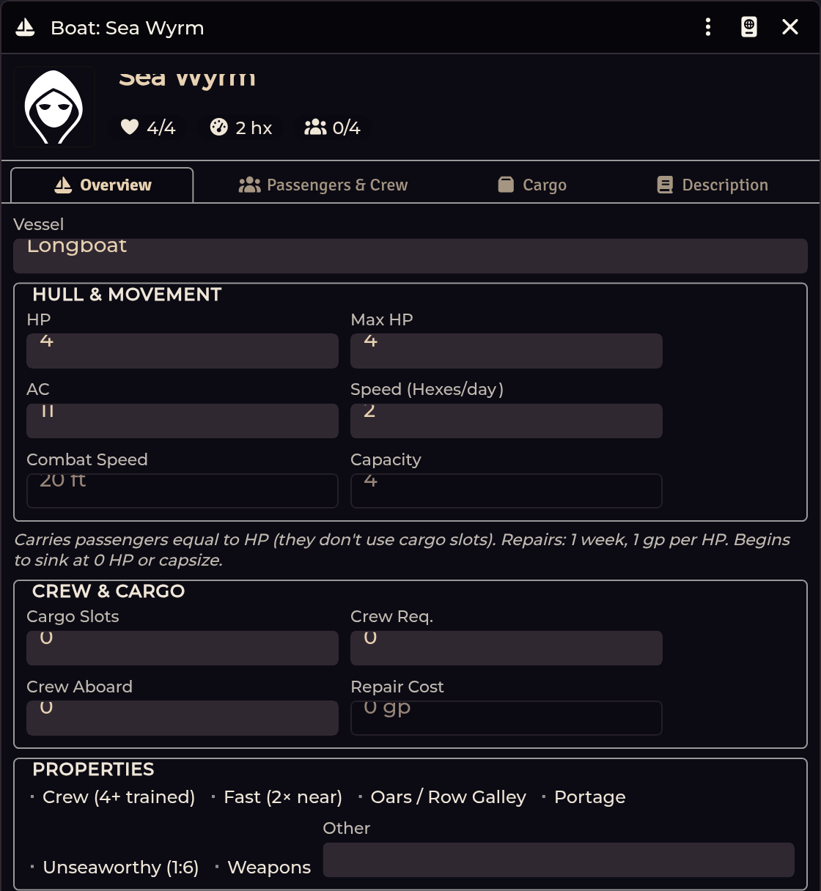

# Mounts & Boats

[← Wiki home](Home.md)

Two Actor sub-types with dedicated sheets, for the *Western Reaches* mounts,
warband units, boats, and siege vehicles.

---

## Creating one

**Actors sidebar → Create Actor**, then pick **Mount** or **Boat** from the type
list. They register at world load alongside the system's own types.

> **A `module.json` change needs a world relaunch, not a browser reload.** If the
> types don't appear after updating the module, relaunch the world.

---

## Mount

The Mount type **reuses the Shadowdark system's own NPC data model and sheet**,
which is the important design decision here: a mount is a creature, so its
Abilities, Description, and Effects tabs are **pixel-identical to a native NPC**,
and NPC Attacks, Features, and Spells plug straight in.

On top of that it adds three tabs:

| Tab | Contents |
|---|---|
| **Riders** | Party-style occupants — drop actors onto it |
| **Inventory** | Physical items only; attacks, features and spells stay on their own tabs |
| **Mount** | The mount-rule fields |

Occupants and the mount-rule fields live in the actor's **flags**, so the shared
occupant machinery works without changing the system's data model.

## Boat

A party-like container with four tabs:

| Tab | Contents |
|---|---|
| **Overview** | Vessel stats, properties, siege weapons, and the sinking countdown |
| **Passengers & Crew** | Occupants — drop actors onto it |
| **Cargo** | Inventory, tracked against cargo slots |
| **Description** | Free text |

### Boat types

Canoe · Galleon · Junk · Longboat · Raft · Rowboat · Sailboat · Sloop · Custom

### Siege weapons

Up to **two** siege weapons, entered as a comma-separated list on the Overview
tab.

### The sinking countdown

Overview carries helpers for a vessel taking on water: **begin sinking**,
**advance the countdown**, **stop sinking**, and a **sink chance** roll.

### Capacity

Passengers are limited by the vessel's **HP-derived capacity**, not by cargo
slots — the sheet reports the remaining headroom separately from cargo slot use.

---

## Troubleshooting

**Mount and Boat aren't in the Create Actor list.**
Relaunch the world. Actor sub-types are declared in `module.json`, and manifest
changes need a server-side relaunch — a browser reload isn't enough.

**A dropped actor didn't become an occupant.**
Drop it onto the **Riders** (mount) or **Passengers & Crew** (boat) tab
specifically, not the Overview tab.

**The mount sheet looks like a plain NPC sheet.**
That's intentional for the shared tabs. The extra Riders / Inventory / Mount tabs
should be alongside them — if they're missing, the system's NPC sheet class
wasn't available when the module registered, which points at a load-order
problem worth reporting.

**Cargo slots and passenger capacity disagree.**
They are separate limits by design — passengers use HP-derived capacity, cargo
uses gear slots.

---

**Related:** [Compendium Packs](Compendium-Packs.md) · [Importer Hub](Importer-Hub.md)
