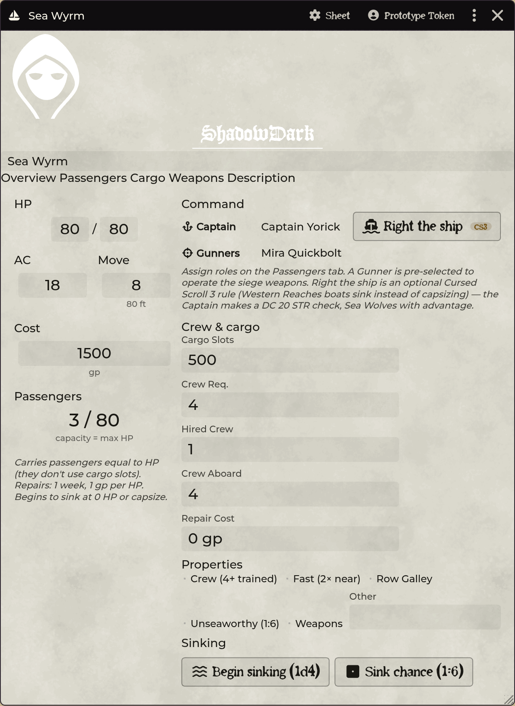

# Mounts & Boats

[← Wiki home](index.md)

Two Actor sub-types with dedicated sheets, for *Western Reaches* mounts,
warband units, boats, and siege vehicles.

---

## Creating one

Go to **Actors sidebar → Create Actor**, then choose **Mount** or **Boat** from
the type dropdown. They register at world load alongside core types.

> **Manifest changes require a world relaunch, not a browser reload.** If the
> actor types do not appear after updating the module, relaunch the world.

---

## Mount

The Mount type **reuses the Shadowdark system's NPC data model and sheet**.
Because a mount is a creature, its Abilities, Description, and Effects tabs are
**pixel-identical to a native NPC**, accepting standard Attacks, Features, and
Spells.

On top of the standard sheet, Mount adds three tabs:

| Tab | Contents |
|---|---|
| **Riders** | Party-style occupants. Drag and drop actors here. |
| **Inventory** | Physical gear. Attacks, features, and spells stay on their own tabs. |
| **Mount** | Dedicated mount-rule fields. |

Occupants and mount fields live in actor **flags**, keeping full compatibility
with the core system data model.

---

## Boat

A party-like vehicle container featuring five tabs:

| Tab | Contents |
|---|---|
| **Overview** | Vessel stats (HP, AC, Speed, Cost, Capacity), Command roster, and sinking tracker. |
| **Passengers & Crew** | Occupant roster with role selectors (Passenger, Captain, Gunner, Crew). |
| **Cargo** | Inventory tracked against cargo slots. |
| **Weapons** | Mounted siege weapons (up to 2) with inline roll buttons. |
| **Description** | Free-form notes rendered on high-contrast parchment. |

### Crew roles

Assign each occupant a role on the **Passengers & Crew** tab. The role displays
as a badge (⚓ Captain, 🎯 Gunner) and enables vehicle actions:

- **Captain:** Controls the vessel. The Overview Command box displays the
  captain and a **Right the ship (CS3)** button. (Righting a capsized vessel is
  an optional Cursed Scroll 3 rule using DC 20 STR; Sea Wolf captains roll with
  advantage automatically).
- **Gunner:** Operates siege weapons. Firing a weapon on the Weapons tab
  pre-selects the assigned gunner.
- **Crew:** Trained hands operating the vessel.

**Crew requirements:** WR's *Crew (C)* property requires 4+ trained crew to
move. The **Crew aboard** counter tallies Captains, Gunners, Crew, and the
**Hired crew** field. Plain Passengers do not count toward crew requirements.

### Boat types

Canoe · Galleon · Junk · Longboat · Raft · Rowboat · Sailboat · Sloop · Custom

### Siege weapons

Mount up to **two** siege weapons (trebuchets restricted to galleons) on the
**Weapons** tab by dragging them from a compendium.

### Sinking countdown

The Overview tab provides controls for taking on water: **begin sinking**,
**advance countdown**, **stop sinking**, and **sink chance** rolls.

### Capacity

Passengers do not consume cargo slots. They are tracked against the vessel's
**HP-derived passenger capacity**, reported separately from cargo slot limits.

### Description

The **Description** tab provides a notes area for vessel lore and port history,
styled on high-contrast parchment for light and dark theme readability.

---

## Importing Western Reaches mounts

Seven *Western Reaches* mounts are not in the core bestiary: Camel (silver),
Donkey, Horse (prized), Horse (war), Pony, Scrag, and Scrag (war). The other
eight on pp. 116–117 ship in `shadowdark.monsters`.

Open **Importer Hub → Manage → Monsters → Mounts** to see the full catalog.
Unimported mounts show an **Import** button (cited to *WR pp. 116–117*).

Clicking Import extracts those pages from your own uploaded WR PDF, parses the
statblocks, and previews the requested mount. Committing saves it directly into
the **`sde-actors` compendium** under the **`Mounts`** folder as a **Mount**
actor with full statblock and custom tabs.

Mount names match both catalog style (*Horse, War*) and book style (*WAR HORSE*).
Mounts already in your library are skipped automatically.

**Bulk import:** Click **Import everything** (or **Import all N in Mounts**) to
process the entire spread in one go. The batch reports each mount as created,
already present, or skipped.

---

## Importing Western Reaches boats

The eight boats from the *Western Reaches* Player's Guide (p. 118: Canoe, Galleon,
Junk, Longboat, Raft, Rowboat, Sailboat, Sloop) import as ready-made Boat actors.

Like all unlocks, no stats are bundled. The importer parses the table from your
own PDF (or a pasted text snippet) and commits Boat actors into `sde-actors`.

**Three ways to open the boat importer:**

- **Importer Hub → Manage → Vehicles → Boats:** Click **Import** on any unowned
  boat to grab the page table.
- **API:** Run `game.shadowdarkEnhancer.actors.importBoats()`.
- **Manual Paste:** In Importer Hub, set type to **Boats**, paste the table, and
  click **Create boats**.

Imported boats include full stat lines: HP, AC, speed, cargo slots, crew
requirements, properties, and purchase costs.

### Siege weapons

The four *Western Reaches* siege weapons (Ballista, Catapult, Crossbow (heavy),
Trebuchet) from p. 119 import into `sde-items` under **Importer Hub → Manage →
Vehicles → Siege Weapons**.

Each weapon includes damage, range, cost, 30-slot bulk, and **Blast** /
**Exploding** properties (created as native Property items), along with
**Siege Weapon Ammunition** (1 gp, 2 slots).

To arm a boat, open its **Weapons** tab and drag a siege weapon from the
compendium onto the sheet.

Each mounted weapon includes **Attack** and **Damage** buttons:
- **Attack:** Selects the operator and roll mode (**Normal / Advantage /
  Disadvantage (untrained)**). Rolls `1d20 +` the operator's ranged attack bonus.
- **Damage:** Rolls the weapon's damage dice (e.g. `5d6` for trebuchet).

---

## Troubleshooting

**Mount and Boat are missing from the Create Actor list.**
Relaunch your world. Manifest sub-types require a server restart rather than a
browser reload.

**A dropped actor did not become an occupant.**
Drop the actor token or sheet directly onto the **Riders** (mount) or
**Passengers & Crew** (boat) tab rather than the Overview tab.

**The mount sheet looks like a plain NPC sheet.**
The extra Riders, Inventory, and Mount tabs appear alongside standard NPC tabs.
If missing, check for module load conflicts.

**Cargo slots and passenger capacity disagree.**
These are separate limits. Passengers track against HP capacity; cargo tracks
against inventory slots.

**The mount import says "No mount statblocks found".**
The extracted PDF page lacked valid `AC … LV` stat lines. Paste pp. 116–117
manually into the text box.

**An imported mount is stored as a Roll Table instead of an Actor.**
Delete the legacy roll table and re-import the mount from the Importer Hub.

**The boat import says "No boats found — paste the table".**
The PDF extractor could not parse the table cleanly. Paste the p. 118 **BOATS**
table directly into the input box.

**An imported boat was not created.**
If a boat with that name already exists in your library, the importer skips it to
prevent overwriting. Rename or delete the existing actor to re-import.

---

**Related:** [Compendium Packs](Compendium-Packs.md) · [Importer Hub](Importer-Hub.md)
