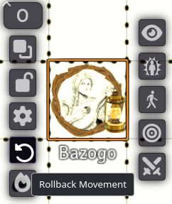

# Movement Budgets

[← Wiki home](index.md)

Track per-turn movement distances with a dynamic colored ruler, optionally
enforce movement caps, and roll back accidental token moves with one click.

---

## What it does

Every tracked token has a **remaining movement** budget. While dragging a token:

- The ruler draws in **green** while the move is within budget.
- The ruler turns **red** once the move exceeds the budget.
- The movement pill on the [Crawl Strip](Crawl-Strip-and-Crawl-Bar.md) card
  counts down remaining feet in real time.

Movement limits are purely visual by default. You can enable hard move refusals
in settings if your table prefers strict enforcement.

---

## Which tokens are tracked

| Mode | Tokens tracked |
|---|---|
| **Crawl** (out of combat) | Tokens added to the crawl roster via **Add Tokens** |
| **Combat** | **All** owned tokens in the active combat encounter |

Movement is not tracked when the crawl is stopped.

---

## Where budgets come from

Because Shadowdark does not use per-character speed attributes on sheets,
budgets are configured via module settings and NPC stat blocks:

| Situation | Movement budget | Default |
|---|---|---|
| **Crawl** (any token) | `Out-of-combat movement budget` | **90 ft** |
| **Combat** (PC token) | `Combat movement default` | **30 ft** |
| **Combat** (NPC token) | NPC's `system.move` stat block entry | See table below |

### NPC movement in combat

NPC movement values map from standard Shadowdark distance keywords:

| Keyword | Distance per turn |
|---|---|
| **None** | 0 ft (immobile) |
| **Close** | 5 ft |
| **Near** | 30 ft |
| **Double near** | 60 ft |
| **Triple near** | 90 ft |
| **Far** | 120 ft |
| **Special** | Falls back to combat default (30 ft) |

Unrecognized or blank values use the combat default.

---

## When budgets reset

Movement budgets refill automatically upon these triggers:

| Event | Result |
|---|---|
| **Next Round** on Crawl Bar | Refills all crawl roster movement budgets |
| **Full cycle of Crawl Order** | Advancing past the last party member resets all budgets |
| **Combat round / turn change** | Active combatant receives a fresh movement budget |
| **Movement Rollback** | Restores the token's turn-start budget and position |

---

## Enforcement settings

Configure strict movement rules under **Configure Settings → Shadowdark Enhancer**:

| Setting | Default | When enabled |
|---|---|---|
| **Enforce out-of-combat movement budget** | Off | Refuses crawl moves exceeding budget |
| **Enforce combat movement budget** | Off | Refuses combat moves exceeding remaining movement |
| **Lock movement out of turn** | Off | Only the token holding the active turn may move |

### How out-of-turn locking works

- **In combat:** Only the active combatant may move.
- **During a crawl:** Only the party member whose turn it is in the
  [Crawl Order](Crawl-Strip-and-Crawl-Bar.md) may move (active once all members
  have rolled initiative).
- **GM override:** GMs can always move any token freely.

With enforcement disabled, remaining movement can drop into negative numbers
(for example, `-10/30 ft`) to show how far past the budget a token moved.

---

## Rolling back a move

The module snapshots each token's position at the beginning of its turn.

To revert a move:

1. **Right-click the token** to open Foundry's token HUD.
2. Click the **Rollback Movement** button (the circular arrow in the left column).

The token instantly snaps back to its turn-start coordinates, its movement
budget is refunded in full, and a notification confirms the rollback.

Players can roll back their own tokens. The action executes on the active GM
client to ensure state consistency.

---

## Troubleshooting

**\"No turn-start position recorded for this token.\"**  
The token was placed after the round started, or combat began before the crawl
was initiated. The position will be recorded automatically at the next turn or
round change.

**Movement is not being deducted.**  
Ensure the crawl session is active (**End** button shown on Crawl Bar) and that
the token has been added to the crawl roster via **Add Tokens**.

**The ruler stays green beyond the budget limit.**  
Remaining movement resets each turn. If a token has not moved yet in the current
turn, cycle the turn or advance the round to ensure fresh state.

**A ghost ruler trail remains on canvas.**  
Selecting another token or clicking the canvas clears lingering ruler lines.

---

## Known limitations

- **Uniform terrain cost:** Grid movement does not calculate difficult terrain
  multipliers.
- **Single movement mode:** Special movement types (fly, swim, burrow, climb)
  use the standard budget.
- **No encumbrance penalty:** Encumbered status does not automatically reduce
  movement budgets.

---

**Related:** [Crawl Strip & Crawl Bar](Crawl-Strip-and-Crawl-Bar.md) · [Settings Reference](Settings-Reference.md)
