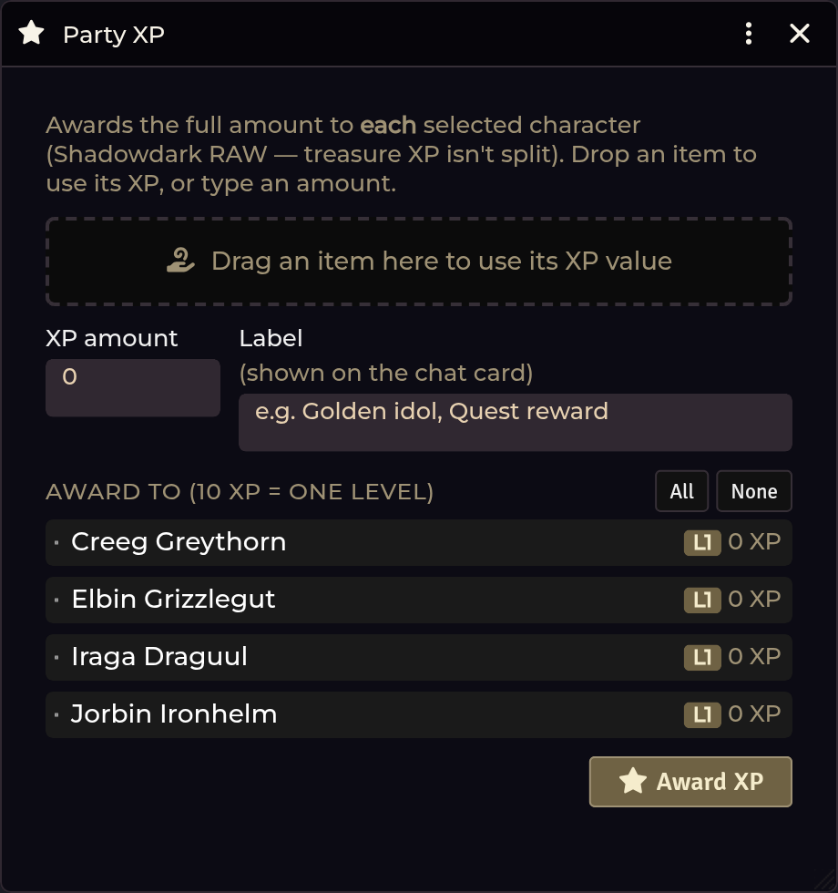

# Party XP

[← Wiki home](Home.md)

Award XP to the whole party in one click, following Shadowdark's treasure-XP
rule.

---

## Opening it

| Route | How |
|---|---|
| **Crawl Bar** | Right-click **Forge & Loot** → **Party XP** |
| **API** | `game.shadowdarkEnhancer.partyXp.open()` |

GM only.

---

## The rule it follows

> **The full amount goes to *each* selected character.** Treasure and quest XP in
> Shadowdark is **not** divided among the party.

If you award 40 XP to four characters, every one of them gains 40.

## Awarding

Two ways to set the amount:

1. **Type it.**
2. **Drag an item in** and use its XP value. The value is resolved in order:
   - an **XP value tagged on the item** wins, if present;
   - otherwise the item's **loot-quality score** is used.

   The window tells you which of the two it used.

You can also **assign an XP value to an item** so future drags use it.

Then pick the characters and award. A chat card summarises the result:

- each character's **old → new XP**
- their level
- a **ready to level up** flag for anyone who has reached the threshold

<!-- TODO screenshot: images/party-xp-card.png — The Party XP chat card
     How: Party XP -> award to the party; screenshot the chat card. -->

## What it writes — and doesn't

It writes **only** `system.level.xp`.

> **It never levels anyone up.** `system.level.value` is untouched. Reaching the
> threshold is *flagged* on the card; performing the level-up stays a deliberate
> act by the player, through the system's own flow.

The level threshold is **10 XP per level** — Shadowdark RAW, and fixed in the
module (it is not a setting).

## Treasure XP values

Loot generated by the [Loot Generator](Loot-and-Treasure.md) carries a value that
maps to XP through two thresholds:

| Setting | Default |
|---|---|
| Treasure XP threshold — normal (gp) | `10` |
| Treasure XP threshold — fabulous (gp) | `150` |

Awards are recorded in the [Session Recap](Session-Recap.md) automatically.

---

## Troubleshooting

**A dragged item shows 0 XP.**
It has no tagged XP value and its loot-quality score is zero — typically ordinary
gear rather than treasure. Type an amount, or assign an XP value to the item.

**"Only a GM can award party XP."**
Exactly what it says. The award is written by the GM authoritatively.

**Nobody was flagged as ready to level up.**
The flag fires at `10` XP — the Shadowdark RAW threshold, hard-coded. If a
character shows `10+` XP without the flag, that's a bug worth
[reporting](https://github.com/DimitroffVodka/shadowdark-enhancer/issues).

**A character levelled up on their own.**
Not from this tool — it never writes `system.level.value`. Something else did.

---

**Related:** [Loot & Treasure](Loot-and-Treasure.md) · [Session Recap](Session-Recap.md)
