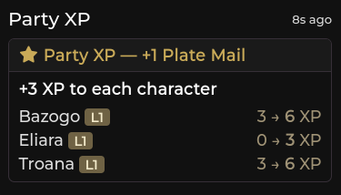

# Party XP

[← Wiki home](index.md)

Award XP to the entire party in a single click, following Shadowdark's
treasure-XP rules.

---

## Opening Party XP

| Route | How |
|---|---|
| **Crawl Bar** | Right-click **Forge & Loot** → **Party XP** |
| **API** | `game.shadowdarkEnhancer.partyXp.open()` |

Party XP is GM-only.

---

## The Shadowdark XP rule

> **The full amount goes to *each* selected character.** Treasure and quest XP
> in Shadowdark is **not** divided among the party.

If you award 3 XP for a magic item to a party of four characters, every selected
character gains 3 XP.

---

## Awarding XP

You can determine the award amount in two ways:

1. **Type a number directly:** Enter the raw XP amount into the input box.
2. **Drag an item in:** Drop an item onto the dialog to calculate its value:
   - Uses an explicit **XP value tagged on the item** if present.
   - Otherwise calculates XP from the item's **loot-quality score**.

You can also assign an XP value to an item directly so future drops remember it.

Select the recipient characters, provide an optional award label (auto-filled
when dragging items), and click **Award XP**.

The summary chat card displays:

- The award label and XP amount granted.
- Each character's **old → new XP** totals.
- A **Level-up ready** indicator for characters reaching the 10 XP threshold.

---

## What it writes

- **Updates `system.level.xp` only:** The tool updates raw XP totals.
- **Never changes character level:** `system.level.value` remains untouched.
  Advancing a level is a deliberate choice made on the character sheet.
- **Fixed threshold:** The level-up threshold is fixed at **10 XP per level**
  per Shadowdark rules.

Awards log to the active [Session Recap](Session-Recap.md) automatically.

---

## Treasure XP thresholds

When evaluating items generated by the [Loot Generator](Loot-and-Treasure.md),
gold values convert to XP using these world settings:

| Setting | Default | Description |
|---|---|---|
| **Treasure XP threshold — normal** | `10 gp` | Minimum value for 1 XP |
| **Treasure XP threshold — fabulous** | `150 gp` | Minimum value for 3 XP |

---

## Troubleshooting

**A dragged item shows 0 XP.**  
The item has no tagged XP value and its loot score is zero (common for basic
mundane gear). Type an amount manually or tag an XP value on the item.

**Nobody is flagged as ready to level up.**  
The level-up indicator appears once a character reaches or exceeds 10 XP.

**A character's level changed on its own.**  
Party XP only writes to `system.level.xp`. Any change to `system.level.value` was
triggered by another sheet or module action.

---

**Related:** [Loot & Treasure](Loot-and-Treasure.md) · [Session Recap](Session-Recap.md)
