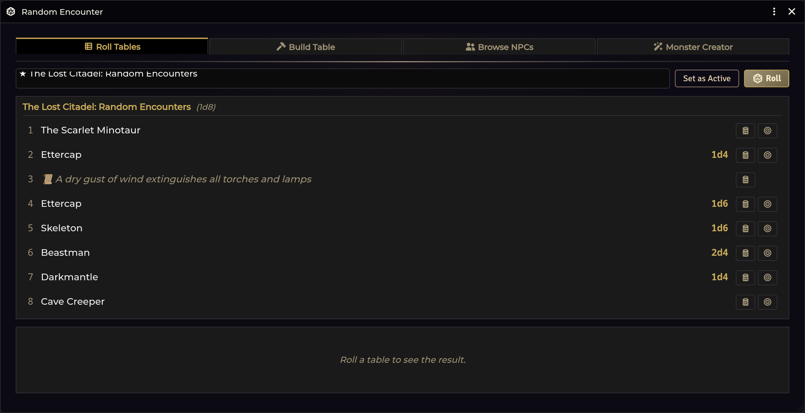
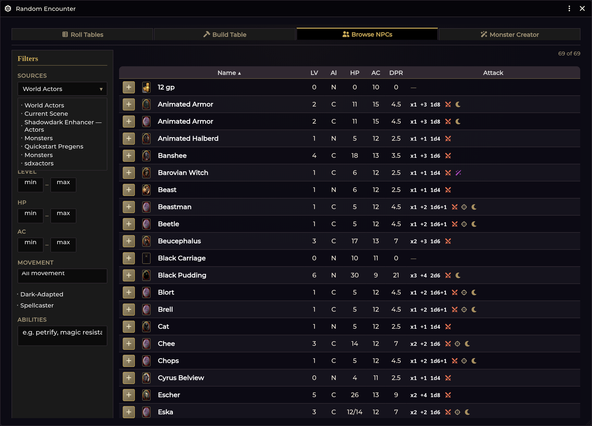

# Random Encounters

[← Wiki home](Home.md)

The `1d6` encounter check, and a four-tab Encounter Roller for turning a hit into
creatures standing on the map.



---

## The encounter check

Right-click the **Encounter** button on the [Crawl Bar](Crawl-Strip-and-Crawl-Bar.md)
and choose **Encounter Check**.

It rolls `1d6` and **hits on a result at or below the threshold**. The roll is
attached to the chat message as a real Foundry `Roll`, so Dice So Nice animates
it, the result is inspectable, and it persists in the log.

<!-- TODO screenshot: images/encounter-check-card.png — The encounter check chat card
     How: Crawl Bar -> right-click Encounter -> Encounter Check; screenshot the chat card. -->

### Setting the threshold

Same right-click menu. Choose **1 in 6** through **5 in 6**. `1 in 6` is the
Shadowdark RAW default and is labelled as such.

### What happens on a hit

Three things, each individually toggleable in
**Configure Settings → Shadowdark Enhancer**:

| Setting | Default | Effect |
|---|---|---|
| Pause game on encounter | on | The game pauses the moment the check hits |
| *(always)* | — | The Encounter Roller opens on the **Roll Tables** tab |
| Auto-roll active table on hit | on | The active table is rolled automatically |
| Roll Encounters as GM-only | on | The check card and roller results are whispered to the GM |

A miss posts a quiet card — *"the dungeon is quiet"* — and does nothing else.
Every check, hit or miss, is recorded in the [Session Recap](Session-Recap.md)
along with the crawl turn it happened on.

### The active table

The roller needs to know which table to draw from. Set it either way:

- **Drag a RollTable from the sidebar onto the Encounter button.**
- Open the roller, select a table, and click **Set as Active**.

The current active table is shown at the bottom of the Encounter right-click
menu, with an **×** to clear it.

---

## The Encounter Roller

Four tabs. Left-click the **Encounter** button to open it, or call
`game.shadowdarkEnhancer.encounter.openRoller()`.

### 1. Roll Tables

Pick a table and roll it. Tables are grouped by folder, and both world tables and
compendium tables are listed — including the module's own `sde-tables` pack.

Selecting a table shows a **preview of its full contents**, with each row's range
label (`1`, `2-3`, `4-6`). Any row can be posted to chat or placed on the map
directly from the preview, without rolling.

### The result card

<!-- TODO screenshot: images/encounter-result.png — An encounter result with its rolled facets
     How: Roll an encounter table in the roller; screenshot the result card with its four facets. -->

A rolled encounter produces a card with four facets, each **individually
re-rollable** via its circular-arrow button:

| Facet | Roll | Results |
|---|---|---|
| **Appearing** | The table row's own `appearing` formula (e.g. `1d4`) | How many show up |
| **Distance** | `1d6` | `1` Close · `2–4` Near · `5–6` Far |
| **Activity** | `2d6` | `2–4` Hunting · `5–6` Eating · `7–8` Building/nesting · `9–10` Socializing/playing · `11` Guarding · `12` Sleeping |
| **Reaction** | `2d6 + CHA` | `≤6` Hostile · `7–8` Suspicious · `9` Neutral · `10–11` Curious · `12+` Friendly |

The **CHA modifier** applied to the reaction roll is adjustable on the card with
up/down arrows — set it to whichever character is doing the talking.

Then:

- **Post** — send the card to chat.
- **Place** — drop the tokens on the canvas. They are grid-snapped; press `ESC`
  to cancel placement.

Rows that are **flavour-only** (an environmental result with no creature) are
recognised as such — they get an *Environmental Result* card with a Post button
and no Place button, because there is nothing to place.

### 2. Build Table

Build an encounter table by hand. Choose a die (`1d4`, `1d6`, `1d8`, `1d10`,
`1d12`, `1d20`, or `2d6`), then fill numbered slots.

- **Drag an NPC onto a slot** to fill it, or type a name.
- Each slot gets an optional **appearing formula** (`1d4`, `2d6`, …) stored with
  the row.
- Mark a slot as **flavour** for a non-creature result — it loses its appearing
  count.
- **Slot ranges are editable**, so a `2d6` table can group its eleven outcomes
  into bands the way published tables do.
- Add, clear, and remove slots freely; post or place any slot to test it.

**Save** writes a real RollTable you can use anywhere in Foundry.

### 3. Browse NPCs



A filterable, sortable browser over every NPC in your installed compendiums and
world. This is the fastest way to find something to drop into a Build Table slot
— each row has a **+** button.

Columns: **Name · LV · Al · HP · AC · DPR · Attack** — including a computed
**DPR** (damage per round), which is the quickest way to gauge whether a creature
suits the party.

Filters, down the left:

| Filter | |
|---|---|
| **Sources** | Multi-select across World Actors, the current scene, `sde-actors`, and every installed monster pack |
| **Level / HP / AC** | min–max ranges |
| **Movement** | By movement type |
| **Dark-Adapted** · **Spellcaster** | Toggles |
| **Abilities** | Free-text search across special abilities (e.g. *petrify*, *magic resistance*) |

The browse only loads when you actually open the tab, so the other tabs stay fast.

### 4. Monster Creator

A full NPC authoring panel. See [Monster Creator](Monster-Creator.md).

---

## Where encounters draw NPCs from

The `Encounter sources` setting controls which packs feed the browser and the
encounter machinery. It defaults to your **world actors** plus
`shadowdark.bestiary`.

> **Known issue on Shadowdark 4.x:** the system renamed its bestiary pack to
> **`shadowdark.monsters`**, so the shipped default's second entry matches
> nothing — out of the box, only world actors feed the browser. Until the
> default is fixed, point the setting at the current pack yourself:

```js
game.settings.set("shadowdark-enhancer", "encounterSources", ["world", "shadowdark.monsters"]);
```

The setting is not exposed in the settings window — the snippet above is the
way to change it.

---

## Troubleshooting

**The check hits but nothing rolls.**
No active table is set. The roller still opens — pick a table and click
**Set as Active** so future hits roll it automatically.

**Players can see my encounter checks.**
Turn on **Roll Encounters as GM-only** (it is on by default). With it on, both
the check card and the roller's results are whispered to GMs.

**"(deleted table)" in the encounter menu.**
The active table was deleted after being bound. Click the **×** to clear it and
bind a new one.

**Place puts tokens in the wrong spot.**
Placement is grid-snapped to the scene's grid. Press `ESC` to cancel and try
again; check that the scene's grid is configured.

**The Browse tab is empty (or shows only world actors).**
Only NPCs in the configured encounter sources are listed — and on Shadowdark
4.x the shipped default points at the old `shadowdark.bestiary` pack id, which
no longer exists (see *Where encounters draw NPCs from* above). Set
`encounterSources` to include `shadowdark.monsters`.

**A table row places nothing.**
The row has no linked actor — it is a name-only or flavour row. Link it to an
actor by re-importing the table (imports auto-link `@UUID` references) or by
rebuilding the row in the Build tab.

---

**Related:** [Monster Creator](Monster-Creator.md) · [Importer Hub](Importer-Hub.md) · [Session Recap](Session-Recap.md)
