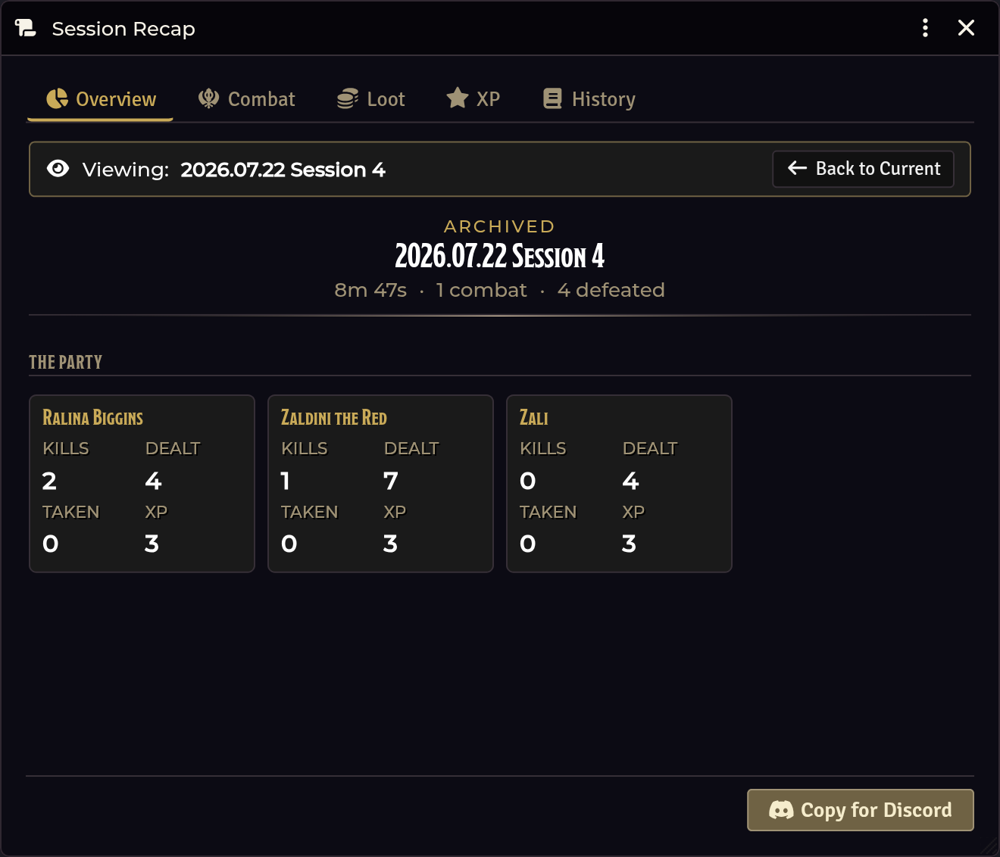

# Session Recap

[← Wiki home](Home.md)

A session log that fills itself in while you play, and exports to Discord as
markdown.

---

## Opening it

| Route | How |
|---|---|
| **Crawl Bar** | Right-click **Forge & Loot** → **Session Recap** |
| **API** | `game.shadowdarkEnhancer.recap.open()` |

---

## It's tied to the crawl

You don't start and stop it separately:

| Crawl action | Recap effect |
|---|---|
| **Start Crawl** | Begins a new session, or continues the current one |
| **End Crawl** | Prompts you to **save**, **pause**, or **discard** |

Saved sessions go to a history you can browse later.

## What it captures — with no extra clicks

| Captured | From |
|---|---|
| **Loot claims** | [Loot & Treasure](Loot-and-Treasure.md) |
| **XP awards** | [Party XP](Party-XP.md) |
| **Merchant purchases and sales** | [Merchant Shop](Merchant-Shop.md) |
| **Encounter checks** | Roll, threshold, hit/miss, and the crawl turn it happened on |
| **Combats** | Start, end, and participants |
| **Per-PC roll statistics** | Every roll each character made |
| **Damage dealt and kills** | Combat tracking |

## The tabs

**Overview · Combat · Loot · XP · History**

## Exporting

**Copy for Discord** produces a markdown recap ready to paste into a channel.

---

## Multi-GM safety

> **In a world with several GMs, only the *active* GM records.** Nothing is
> double-counted, and no two GMs write competing session state.

This is the same single-writer pattern the loot claims, merchant transactions,
and content sweeps use.

---

## Troubleshooting

**Nothing is being recorded.**
No session is active. Start a crawl — the recap begins with it. Every logging
call self-guards on an active session, so it silently does nothing otherwise.

**I ended the crawl and lost the session.**
The end-crawl prompt offers save / pause / discard. Discard throws it away.
Choose **pause** if you want to resume the same session later.

**Two GMs are online and entries look duplicated.**
They shouldn't be — only the active GM records. If you can reproduce this,
[report it](https://github.com/DimitroffVodka/shadowdark-enhancer/issues).

**The Discord export is missing a section.**
Sections with no entries are omitted. If you expected combat data, confirm the
combats ran while the session was active rather than before you started the
crawl.

**Encounter checks aren't showing a turn number.**
The crawl turn is only stamped when the check happens in crawl mode. Checks made
during combat are recorded without one.

---

**Related:** [Crawl Strip & Crawl Bar](Crawl-Strip-and-Crawl-Bar.md) · [Party XP](Party-XP.md) · [Merchant Shop](Merchant-Shop.md)
