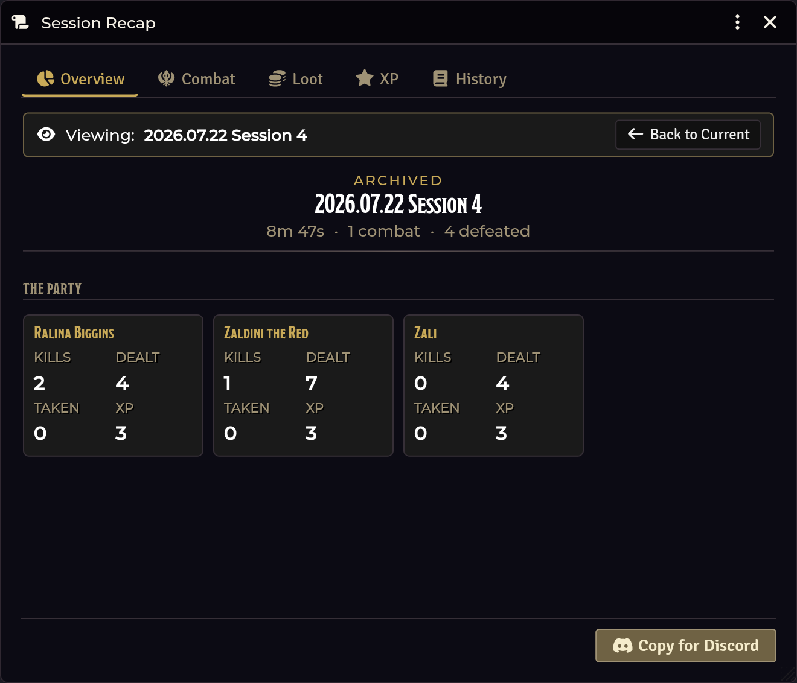

# Session Recap

[← Wiki home](Home.md)

**[▶ Try this in your browser](https://dimitroffvodka.github.io/shadowdark-enhancer/#session-recap)** — click through the tabs. No install needed.

A session log that fills itself in while you play, and exports to Discord as
markdown.

---

## Opening it

| Route | How |
|---|---|
| **Crawl Bar** | Right-click **Forge & Loot** → **Session Recap** |
| **API** | `game.shadowdarkEnhancer.recap.open()` |

---

## It's tied to the crawl

You don't start and stop it separately:

| Crawl action | Recap effect |
|---|---|
| **Start Crawl** | Begins a new session, or continues the current one |
| **End Crawl** | Prompts you to **save**, **pause**, or **discard** |

Saved sessions go to a history you can browse later.

## What it captures, with no extra clicks

| Captured | From |
|---|---|
| **Loot claims** | [Loot & Treasure](Loot-and-Treasure.md) |
| **XP awards** | [Party XP](Party-XP.md) |
| **Merchant purchases and sales** | [Merchant Shop](Merchant-Shop.md) |
| **Downtime attempts** | [Downtime](Downtime.md) |
| **Encounter checks** | Roll, threshold, hit/miss, and the crawl turn it happened on |
| **Combats** | Start, end, and participants |
| **Per-PC roll statistics** | Every roll each character made |
| **Damage dealt and kills** | Combat tracking |

## The tabs

**Overview · Combat · Loot · XP · Downtime · History**

### Downtime

One row per resolved [Downtime](Downtime.md) attempt, grouped by the controlling
player and newest first inside each group. The group header carries a subtotal of
how many landed and what they cost, reading `2/3 · 30 gp`. A row gives the time,
the character, the activity and slot, the check, the verdict and the fee, with
whatever the success actually applied in italics underneath. With nothing
recorded it says `No downtime activity recorded.`

> **A paid attempt is counted twice, deliberately.** The fee also appears under
> the merchant purchases as `Downtime: <slot label>`, because that is the money
> ledger and feeds the spend totals. This tab is the narrative record of what was
> attempted and how it went. Both views need their own copy.

Downtime is also written to a permanent **Downtime Log** journal that outlives
the session. See [Downtime](Downtime.md#the-downtime-log).

## Exporting

**Copy for Discord** produces a markdown recap ready to paste into a channel,
including a **Downtime** section with the same per-player grouping.

---

## Multi-GM safety

> **In a world with several GMs, only the *active* GM records.** Nothing is
> double-counted, and no two GMs write competing session state.

This is the same single-writer pattern the loot claims, merchant transactions,
and content sweeps use.

---

## Troubleshooting

**Nothing is being recorded.**
No session is active. Start a crawl. The recap begins with it. Every logging
call self-guards on an active session, so it silently does nothing otherwise.

**I ended the crawl and lost the session.**
The end-crawl prompt offers save / pause / discard. Discard throws it away.
Choose **pause** if you want to resume the same session later.

**Two GMs are online and entries look duplicated.**
They shouldn't be. Only the active GM records. If you can reproduce this,
[report it](https://github.com/DimitroffVodka/shadowdark-enhancer/issues).

**The Discord export is missing a section.**
Sections with no entries are omitted. If you expected combat data, confirm the
combats ran while the session was active and not before you started the
crawl.

**Encounter checks aren't showing a turn number.**
The crawl turn is only stamped when the check happens in crawl mode. Checks made
during combat are recorded without one.

---

**Related:** [Crawl Strip & Crawl Bar](Crawl-Strip-and-Crawl-Bar.md) · [Party XP](Party-XP.md) · [Merchant Shop](Merchant-Shop.md)
